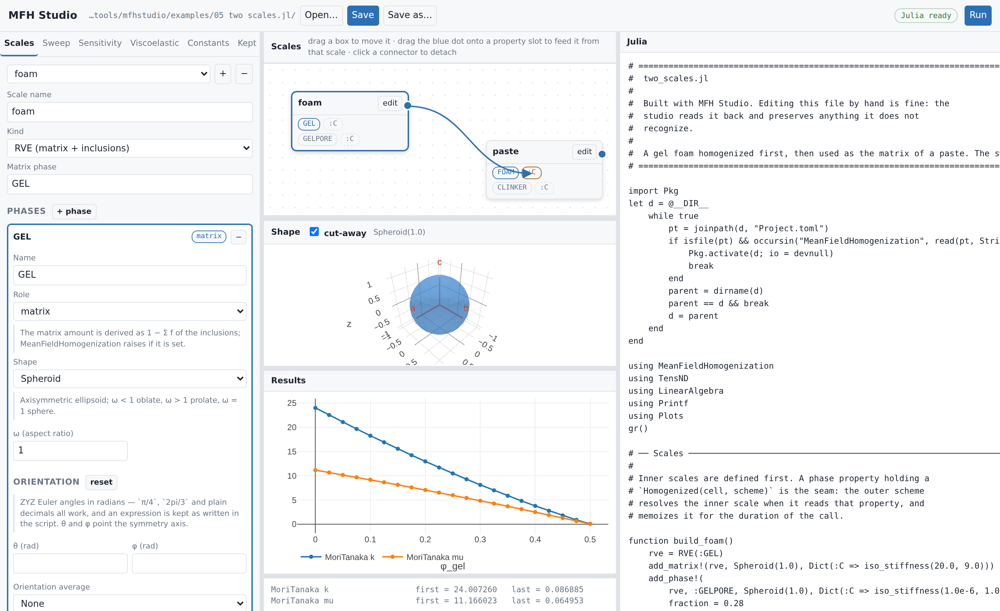

<p align="center">
  
</p>

# MeanFieldHomogenization

[](https://MicroPoroChemoMechanics.github.io/MeanFieldHomogenization.jl/stable/)
[](https://MicroPoroChemoMechanics.github.io/MeanFieldHomogenization.jl/dev/)

[](https://github.com/MicroPoroChemoMechanics/MeanFieldHomogenization.jl/actions/workflows/CI.yml)
[](https://codecov.io/gh/MicroPoroChemoMechanics/MeanFieldHomogenization.jl)

[](https://github.com/MicroPoroChemoMechanics/MeanFieldHomogenization.jl/blob/main/LICENSE)
[](https://github.com/fredrikekre/Runic.jl)

**Try it without installing anything — not even Julia:**

[](https://codespaces.new/MicroPoroChemoMechanics/MeanFieldHomogenization.jl?quickstart=1)

One click opens a machine in your browser with Julia, the package and
[MFH Studio](#mfh-studio--building-models-in-the-browser) already running.

`MeanFieldHomogenization.jl` is a Julia framework for **mean-field homogenization**
of heterogeneous materials: it predicts effective elastic, transport and
viscoelastic properties from the properties, shapes, orientations and
volume fractions of the phases in a microstructure.

It provides Hill polarization tensors for ellipsoidal inclusions and
infinite cylinders (2D/3D, isotropic/anisotropic/TI-coaxial), crack-opening-
displacement tensors with stress and displacement intensity factors for
flat cracks, second-order Hill tensors for transport problems (closed-form
for any matrix anisotropy), composite `n`-layer spheres and confocal
spheroids with imperfect interfaces, ageing linear viscoelasticity, and
the classical mean-field schemes built on top of them (Voigt/Reuss,
dilute, Mori–Tanaka, Maxwell, Ponte Castañeda–Willis, self-consistent,
asymmetric self-consistent, differential) — all under a common
abstraction hierarchy, a shared numerical core, and a central dispatch
mechanism.

The package is geared toward prototyping: forward-mode automatic
differentiation (`ForwardDiff`) and symbolic simplification (`SymPy`,
`Symbolics`) are first-class, not afterthoughts, and every scheme has
`ForwardDiff` sensitivities with respect to fractions, moduli, and
inclusion geometry.

A gallery of full micromechanical models built on the package —
hydrating cement paste, chloride diffusivity, the interfacial transition
zone in concrete, quasi-brittle strength, bituminous mixtures, ageing
creep — lives under [`docs/src/applications/`](docs/src/applications)
and the [Applications](https://MicroPoroChemoMechanics.github.io/MeanFieldHomogenization.jl/stable/applications/cement_paste/)
section of the docs.

## Features

| Sub-module | Responsibility |
| --- | --- |
| `MeanFieldHomogenization.Elliptic` | Type-generic Legendre and Carlson elliptic integrals (`ForwardDiff`/`Sym`-compatible). |
| `MeanFieldHomogenization.Core` | Abstractions, traits, shared numerics (Green / Newton kernels, Masson residue, DECUHR). |
| `MeanFieldHomogenization.Elasticity` | Hill polarization tensor for ellipsoidal inclusions and cylinders (2D / 3D, iso / aniso / TI-coaxial). |
| `MeanFieldHomogenization.Cracks` | COD tensor, compliance contribution, SIF and DIF for elliptic / ribbon cracks. |
| `MeanFieldHomogenization.Conductivity` | 2nd-order Hill tensor for transport problems; closed form for any matrix anisotropy. |
| `MeanFieldHomogenization.LayeredSpheres` | `n`-layer composite spheres, 5 interface types (perfect, spring, membrane, Kapitza, surface-conductive), volume-average and pointwise localization. |
| `MeanFieldHomogenization.LayeredSpheroids` | `n`-layer confocal spheroids, conduction, with Kapitza / surface-conductive interfaces, series or quadrature evaluation. |
| `MeanFieldHomogenization.Laminates` | Periodic **multilayer** cell: parallel layers, no matrix, no Eshelby problem — an *exact* solution in elasticity and transport, with the same 4 imperfect-interface models, per-layer localization and an ageing-viscoelastic twin. |
| `MeanFieldHomogenization.CustomInclusions` | The user-defined inclusion contract: `CustomInclusion` and `check_inclusion_interface`. |
| `MeanFieldHomogenization.FiniteElements` | Inclusions whose response comes out of a finite-element resolution of the Eshelby problem — elliptical crack (3-D) and sphere with an off-centre core (axisymmetric Fourier) — behind a two-backend contract. |
| `MeanFieldHomogenization.NeuralInclusions` | Inclusions whose response comes out of a trained network, with the sampling and fitting machinery; differentiable in the morphology, where a finite-element solve is not. |
| `MeanFieldHomogenization.Schemes` | The cell abstraction (`RVE`, and `Laminate` beside it) and `homogenize`; declarative multiscale chaining (`Homogenized`, `NestedParameter`); bounds, dilute, Mori–Tanaka, self-consistent (+ asymmetric), PCW, Maxwell, differential; exact vs. best-fit symmetrization; `ForwardDiff` sensitivities. |
| `MeanFieldHomogenization.Viscoelasticity` | Ageing linear viscoelasticity via Volterra operators, with structured ISO/TI/orthotropic kernel storage — every scheme, cracks and layered spheres included. |

## Installation

`MeanFieldHomogenization.jl` is registered in Julia's General registry.

In Pkg REPL mode (press `]` in the Julia REPL):

```julia-repl
pkg> add MeanFieldHomogenization
```

Or via the `Pkg` API:

```julia
using Pkg
Pkg.add("MeanFieldHomogenization")
```

No additional registry is required: every dependency (`TensND.jl`,
`OrdinaryDiffEq.jl`, `Elliptic.jl`, `Polynomials.jl`, `PolynomialRoots.jl`,
`QuadGK.jl`, `Tensors.jl`, …) resolves from General as well.

Six package extensions activate on weak dependencies, each optional:

- [`DECUHR.jl`](https://github.com/MicroPoroChemoMechanics/DECUHR.jl) +
  `Integrals.jl` — adaptive cubature backend (`method = :decuhr`); the
  built-in `method = :nestedquadgk` (QuadGK-based, `ForwardDiff`-compatible)
  covers the same cases without it.
- `NonlinearSolve.jl` — lets the self-consistent schemes solve their fixed
  point with any SciML algorithm (`NewtonRaphson`, `TrustRegion`, …)
  instead of the built-in Anderson/Newton iteration, with exact
  `ForwardDiff` sensitivities through the fixed point either way.
- `SymPy.jl` — symbolic closed forms for the elliptic integrals.
- `Ferrite.jl` + `FerriteGmsh.jl` + `Gmsh.jl` — the reference finite-element
  backend, serving both `FEEllipticCrack` and `FEExcenteredSphere`.
- `Gridap.jl` + `GridapGmsh.jl` — a second backend, serving both morphologies
  as well. The two share the mesh and the physics and agree to round-off;
  Ferrite is the faster to run, Gridap states the weak form directly and is the
  easier to adapt.
- `Lux.jl` + `Optimisers.jl` + `Zygote.jl` — the optimizer used to *train* a
  neural surrogate. Loading and evaluating one of the shipped models needs none
  of them: the trained network carries no machine-learning dependency.

Type-generic elliptic integrals themselves are always bundled, as the
`MeanFieldHomogenization.Elliptic` submodule.

## Quick start

```julia
using MeanFieldHomogenization, TensND

# Isotropic matrix, bulk/shear moduli (k, μ) = (30, 10) GPa
C₀ = iso_stiffness(30.0, 10.0)

# Hill polarization for a sphere
P = hill_tensor(Ellipsoid(1.0), C₀)

# Crack opening displacement for a penny-shaped crack
B = cod_tensor(PennyCrack(1.0), C₀)

# Conductivity — second-order Hill tensor
K₀ = TensISO{3}(5.0)
P_cond = hill_tensor(Ellipsoid(1.0), K₀)

# A porous material, 10 % spherical voids, homogenized by Mori-Tanaka
rve = RVE(:M)
add_matrix!(rve, Ellipsoid(1.0), Dict(:C => C₀))
add_phase!(rve, :V, Ellipsoid(1.0), Dict(:C => iso_stiffness(0.01, 0.005)); fraction = 0.1)
k_eff, μ_eff = k_mu(homogenize(rve, MoriTanaka(), :C))
```

Every entry point accepts `method = :auto | :residues | :decuhr` and
the keyword tuple `(abstol, reltol, maxiters)`; every entry point also
differentiates through `ForwardDiff` and accepts symbolic (`SymPy`/
`Symbolics`) coefficients. See the in-line docstrings and the
[Tutorials](https://MicroPoroChemoMechanics.github.io/MeanFieldHomogenization.jl/stable/tutorials/)
for details.

## MFH Studio — building models in the browser

Locally, from a Julia session:

```julia
using MeanFieldHomogenization
mfhstudio()
```

Or with nothing installed at all —
[**open it in GitHub Codespaces**](https://codespaces.new/MicroPoroChemoMechanics/MeanFieldHomogenization.jl?quickstart=1).
The studio starts by itself and a browser tab opens on it; see
[`.devcontainer/`](.devcontainer/) for what that machine contains.



A local web interface for writing the scripts above. Describe each phase in a
form, watch the Julia on the right change as you type, and press **Run**. The
script stays the deliverable — the studio is a way of writing one, not a format
to be locked into: it reads an existing script back and preserves verbatim
anything it does not recognize.

- **RVEs and laminates.** A matrix with inclusions — spheroids, ellipsoids,
  cylinders, cracks, layered spheres and spheroids — or a periodic stack of
  parallel layers, solved exactly rather than estimated.
- **Multiscale by dragging.** Each box is a scale; drag its output dot onto a
  property slot of another and the seam appears as
  `Homogenized(inner, scheme)`, with the builders emitted in topological order.
- **Sweeps, sensitivities, ageing creep.** Several schemes on one figure;
  ForwardDiff derivatives through the whole chain; the effective creep curve.
- **No installation beyond Julia.** Python 3.10+ standard library only, and the
  browser you already have.

Ten [worked examples](tools/mfhstudio/examples/) open with every form filled
in — start with `01_porous_schemes.jl`. The full guide, with screenshots, is in
[the manual](https://MicroPoroChemoMechanics.github.io/MeanFieldHomogenization.jl/stable/tools/mfhstudio/).

## Tests

```shell
julia --project=. -e 'using Pkg; Pkg.test()'
```

## Documentation

Built with Documenter.jl and deployed at the badges above. Six sections,
roughly in reading order:

| Section | Content |
| --- | --- |
| [Theory](https://MicroPoroChemoMechanics.github.io/MeanFieldHomogenization.jl/stable/theory/) | the Eshelby/Hill chain — polarization tensor → localization → schemes — and its specializations (cracks, layered inclusions, viscoelasticity). |
| [Manual](https://MicroPoroChemoMechanics.github.io/MeanFieldHomogenization.jl/stable/manual/installation/) | installation and a topic-by-topic reference for each inclusion family. |
| [Tutorials](https://MicroPoroChemoMechanics.github.io/MeanFieldHomogenization.jl/stable/tutorials/) | worked examples: bounds and schemes, layered spheres/spheroids, viscoelasticity, sensitivities, symbolic computation. |
| [Applications](https://MicroPoroChemoMechanics.github.io/MeanFieldHomogenization.jl/stable/applications/cement_paste/) | full micromechanical models — cement paste, ITZ concrete, bituminous mixtures, strength, ageing creep. |
| [Developer guide](https://MicroPoroChemoMechanics.github.io/MeanFieldHomogenization.jl/stable/developer/architecture/) | architecture, dispatch, and how to add an inclusion / algorithm / scheme. |
| [API reference](https://MicroPoroChemoMechanics.github.io/MeanFieldHomogenization.jl/stable/api/elliptic/) | every public docstring, grouped by sub-module. |

Build locally:

```shell
julia --project=docs -e 'using Pkg; Pkg.develop(path = "."); Pkg.instantiate()'
julia --project=docs docs/make.jl
```

## License

MIT License — see [LICENSE](LICENSE) for details.

## Citation

See [CITATION.cff](CITATION.cff) for citation details.

**BibTeX entry:**

```bibtex
@software{meanfieldhomogenization_jl,
  author = {Barthélémy, Jean-François},
  title  = {MeanFieldHomogenization.jl: Mean-field homogenization of heterogeneous materials},
  url    = {https://github.com/MicroPoroChemoMechanics/MeanFieldHomogenization.jl},
  year   = {2026}
}
```

## Credits and Acknowledgements

Developed by [Jean-François Barthélémy](https://github.com/jfbarthelemy),
researcher at [Cerema](https://www.cerema.fr/en) in the research team
[UMR MCD](https://mcd.univ-gustave-eiffel.fr/).

Parts of this codebase were developed with the assistance of Anthropic's
*Claude Code*, under the author's review and numerical validation.
