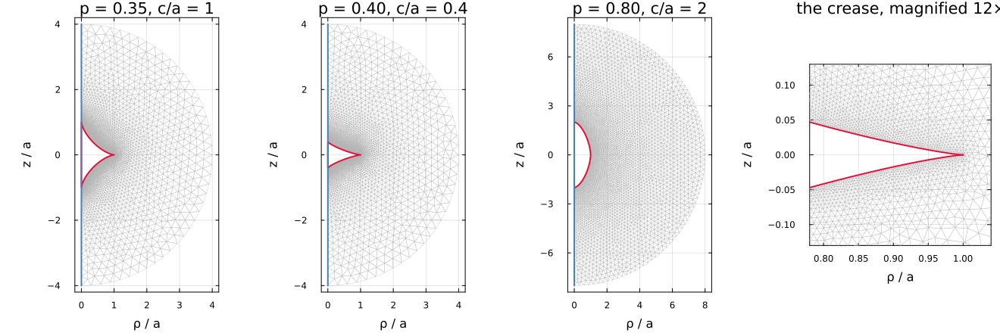
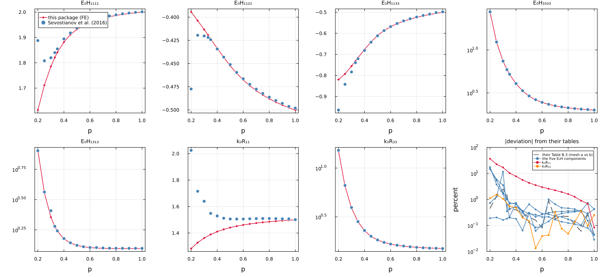

# [Concave pores, and where the literature and this package disagree](@id app-concave-pores)

A **supersphere**

```math
\left|\frac{x}{a}\right|^{2p} + \left|\frac{y}{a}\right|^{2p}
  + \left|\frac{z}{a}\right|^{2p} \le 1
```

is the sphere at ``p = 1``, the octahedron at ``p = 1/2``, and below that a
**concave** body with conical points on the three axes — a reasonable idealization
of the pore shapes that scanning electron microscopy finds in sandstone and in
harzburgite. It has no Eshelby solution, so it is exactly the morphology
[`FESupershapePore`](@ref man-fe-inclusions) exists for.

[chenIJES2015](@cite) studied it by finite elements and condensed the result
into a single scalar. This page reproduces what can be reproduced — and the
agreement is exact where the answer is known — then states two places where it
disagrees: their approximation is isotropic where the shape is cubic, and their
linear fit departs from its own anchors inside the range it claims.

!!! note "This page is static"
    The figures and the numbers are produced once by
    `scripts/fe/make_cell_figures.jl` and committed; the live demonstration is
    `scripts/89_fe_concave_pores.jl`.

## The cell, and why one eighth of it is enough


The three coordinate planes are mirror planes of a supersphere, so the cell is
invariant under a group of order eight and an **octant** carries the whole
answer — see [the pore declination](@ref th-corrected-cell) for the parity
argument and for why the dipole correction survives it. That is not a
convenience here, it is what makes the study possible: at ``p = 0.3`` the whole
cell needs some 360 000 degrees of freedom at level 4 and does not fit on a
16 GB machine, while the octant needs about 70 000 and takes half a minute.

The left panel is the whole cell of a concave shape at ``p = 0.35``, cut away so
the cavity is visible; the right panel is the same cell as an eighth, with the
three flat faces that had to be built in gray.

## Where we agree

**The volume, to machine precision.** Their Eq. (2.7) and the closed form this
package derives independently agree to ``7\times10^{-16}`` over the whole range,
including the two values known exactly: ``4\pi/3`` at the sphere and ``4/3`` at
the octahedron.

**The spherical limit.** At ``p = 1`` the measured resistivity contribution is
``k_0R = 1.499804`` against the exact ``3/2`` — a relative error of
``1.3\times10^{-4}`` at level 3, and ``9.7\times10^{-6}`` at level 4, which the
octant makes affordable. This is the control for everything else on this page.

**Their ``\eta`` near the sphere.** Their fit is anchored there and is exact
there, so the two agree to ``1.3\times10^{-4}`` at ``p = 1`` and to 2 % at
``p = 0.7``.

## Where their fit leaves its own anchors

``\eta(p)`` is a **linear** fit in ``p``, pinned at ``p = 1`` where it is exact
and at ``p = 0.2`` where they take the effect to vanish. Away from those two
points:

| ``p`` | ``k_0 R`` here | their ``\eta(p)`` | difference |
|---:|---:|---:|---:|
| 0.30 | 1.9288 | 3.4589 | −44 % |
| 0.40 | 1.6581 | 2.2392 | −26 % |
| 0.50 | 1.5763 | 1.7671 | −11 % |
| 0.70 | 1.5152 | 1.4853 | +2.0 % |
| **1.00** | **1.4998** | **1.5000** | **−0.013 %** |
| 1.50 | 1.5111 | 1.7923 | −16 % |
| 2.50 | 1.5400 | 2.6065 | −41 % |

The two convex rows are outside what the paper claims — it restricts the fit to
``p < 1`` — but the concave ones are inside it. Two further consequences of
pinning a straight line at ``p = 0.2``: ``\eta`` is **non-monotone** within the
claimed range (zero at ``0.2`` by construction, ``3.46`` just above at ``0.30``),
and **negative** below it, which is not physical for a pore.

## Where we disagree, and it is not numerical

**A supersphere is cubic, and their approximation is isotropic.** Their
Eq. (2.19) writes the compliance contribution on the isotropic basis
``(\mathbb J, \mathbb K)`` — two constants. The octahedral group leaves *three*
invariants for a fourth-order tensor with the minor symmetries, and the third is
not a small correction below ``p = 1/2``. Their own Fig. 4 data carries no
anisotropy either: the ratio ``H_{1111}/H_{1212}`` stays at the isotropic value
to about 1 % across their whole range.

This package measures the three separately, because `TensND.TensCubic` is a
storage class in its own right and the octant makes the cubic structure exact
rather than approximate: the couplings
symmetry forbids come out identically zero instead of as mesh noise at a few
percent of the norm.

| ``p`` | ``H_{1111}`` | ``H_{1122}`` | ``H_{1212}`` | anisotropy |
|---:|---:|---:|---:|---:|
| 0.30 | 3.3167 | −0.7771 | 1.5680 | **+0.2888** |
| 0.40 | 2.5262 | −0.6063 | 1.3265 | +0.1899 |
| 0.50 | 2.2954 | −0.5551 | 1.2566 | +0.1470 |
| 0.70 | 2.0955 | −0.5097 | 1.2289 | +0.0703 |
| **1.00** | 2.0094 | −0.4798 | 1.2444 | **+0.000246** |
| 1.50 | 1.9709 | −0.4513 | 1.2828 | −0.0728 |
| 2.50 | 1.9668 | −0.4246 | 1.3426 | **−0.1493** |

"Anisotropy" is Zener's ratio ``(H_{1111} - H_{1122} - 2H_{1212})/H_{1111}``,
identically zero for an isotropic tensor. **Read the middle row first.** At
``p = 1`` the body is a sphere and the true anisotropy is zero, so
``2.5\times10^{-4}`` is this chain's own spurious anisotropy at this
discretization — on the same mesh generator, element and quadrature as every
other row. The concave signal is **1170 times** larger than that, and the
convex one 600 times. It also **changes sign at the control**, which no
numerical artifact would do: a concave supersphere and a cube-like one are
anisotropic in opposite senses.

**The cost, and what the octant buys.** Same spherical pore, same corrected
condition, both modes:

| level | mode | vector dofs | conduction error | time |
|---:|:--|---:|---:|---:|
| 2 | whole | 12 165 | `2.86e-3` | 8.5 s |
| 2 | octant | 2 604 | `1.05e-3` | 0.1 s |
| 3 | whole | 31 881 | `2.74e-4` | 0.4 s |
| 3 | octant | 5 898 | `1.31e-4` | 0.0 s |
| 4 | octant | 17 508 | `9.73e-6` | 0.2 s |

The octant is not merely cheaper at equal level: it is about **twice as
accurate**, because the parity projection removes couplings that the whole cell
carries as noise. At ``p = 0.35`` it also needs **no** snapping fallback where
the whole cell backs off on 37 nodes.

**Why it cannot be settled from the paper itself.** Their values exist only as
figures, their elements are linear tetrahedra, and their surface integral uses
centroid values on flat triangles. What can be said is on the table above: the
control row bounds this chain's own error, and the signal is three orders of
magnitude above it.

## The axisymmetric companion, and the only tabulated data of the two

[sevostianovIJES2016](@cite) is the same team's study of the **axisymmetric**
concave pore. Its shape, Eq. (1.2),

```math
\frac{(x_1^2+x_2^2)^p}{a^{2p}} + \frac{|x_3|^{2p}}{a^{2p}\gamma^{2p}} = 1 ,
```

is `Superspheroid(a, aγ, p)` without conversion, studied at `a = γ = 1`. Being a
solid of revolution it is transversely isotropic — five constants for ℍ, two for
ℝ — and it is the only one of the two papers to **tabulate** its numbers, which
makes it a target of a different nature from Chen *et al.*'s figures.

!!! warning "Two conventions for `p`"
    On this page `p` is the concavity exponent of the shape, with `2p` the
    exponent of the level set. It is **not** the confocal angular coordinate of
    [the layered spheroid](@ref th-layered-spheroid), nor the mode-1 nodal
    unknown of the axisymmetric solver. Coordinates here are cylindrical
    ``(\rho, \theta, z)`` throughout, and the aspect ratio is written `c/a`.

### It needs a different tool, and gets one

The fields separate into Fourier modes in the azimuth, so each mode is a
**two-dimensional** problem on the meridian half-plane — the same reduction as
for the [recycled aggregate](@ref app-recycled-aggregate), and where the octant
divides the three-dimensional cost by eight this divides it by orders of
magnitude. [`FEAxiSupershapePore`](@ref man-fe-inclusions) is that cell, and the
mode count delivers exactly the five constants: a ``2\times2`` block from mode
0, a scalar from mode 1, a scalar from mode 2.



Being two-dimensional, that picture is the **whole** computational domain rather
than a slice of one, which is the point of showing it. The cavity wall is in
crimson, drawn from the closed-form profile and not from the mesh, and the
revolution axis in blue; nothing is prescribed on the wall, and that is what
makes it a cavity.

The fourth panel is the equatorial **crease**, magnified, and it is there because
uniform elements are not enough. A concave superspheroid closes at the equator as
a wedge: at ``p = 0.4,\ c/a = 0.4`` the half-gap is ``0.0012a`` where a uniform
element is ``0.031a``, so elements straddled a gap twenty-five times thinner than
themselves. The symptom was specific — mode 0's ``R_{33}`` stopped converging
while mode 1's ``R_{11}`` converged cleanly — and the cure is to grade the
element size in the distance to the two corners, for concave profiles only. That
took the refinement increment from ``4\times10^{-3}`` to ``4\times10^{-4}``, and
the ungraded value was **1.2 % wrong** rather than merely unconverged.

Whether some ``p`` is simply too concave to mesh, needing extrapolation instead,
was measured rather than assumed: the minimum mesh angle stays between 33.8° and
39.5° down to ``p = 0.20``, so there is no floor and no degenerate element.

Two of its numbers are statements rather than measurements, and they are what
license reading the rest. **Transverse isotropy holds to ``10^{-16}``** at any
refinement, being structural rather than converged, which checks the three
modes, the azimuthal projections, the boundary integral and the Kelvin
reassembly simultaneously. And **conduction on a sphere is exact to
``5\times10^{-6}``** and does not improve with refinement, a spherical cavity's
exterior perturbation being a pure dipole with no higher multipole left to
truncate.

### The material the paper does not state

No modulus appears anywhere in it. What follows uses `E₀ = 1`, `ν₀ = 1/3`,
`k₀ = 1`, **inferred** from its own `p = 1` row: there the body is an exact
sphere, Eq. (3.9) applies, and `H₁₁₁₁/(−H₁₁₂₂) = (9+5ν₀)/(1+5ν₀)` gives
`ν₀ = 0.330`. With `ν₀ = 1/3` all five components and both resistivities come
back to 0.06 %, which is their own finite-element error. It is an inference and
is presented as one.

### Four corrections to the paper's formulas

Its tables are self-consistent; its closed forms are not, and each of these is
checked on the `p = 1` row where the answer is known.

1. **`V*(p)` in Eqs. (3.10)–(3.11) is the *normalized* volume** `3g(p) =
   V*/(4π/3)`, not the volume of Eq. (1.3). With the true volume,
   `H₃₃₃₃(p=1)` comes out 0.477 instead of 2.001 — a factor `4π/3`.
2. **A factor of four on the shear components.** `H₁₃₁₃` and `H₁₂₁₂` as printed
   in Eq. (3.5) give 5.0 for the sphere instead of 1.25.
3. **A sign.** Eq. (3.5) writes `H₁₂₁₂ ≡ (H₁₁₁₁ + H₁₁₂₂)/2`; it must be a
   difference. On their own Table B.1 at `p = 1`, the minus gives 1.2496 and the
   plus 0.7516.
4. Eq. (3.10) is internally inconsistent between `H₁₂₁₂`, written in tensor
   convention, and `H₁₃₁₃`, written in the other.

None of this touches the tabulated values, which is why the tables are the
target and the formulas are not.

### The two tables, superimposed

All eighteen rows of their Table B.1 and all seventeen of their Table B.4,
plotted as points against this package's Fourier cell as a line. Both are
dimensionless in the form the paper reports them: ``E_0\mathbb H`` for the
compliance contribution and ``k_0\boldsymbol R`` for the resistivity, with
``E_0 = k_0 = 1`` under the inference above, so the plotted numbers are the
tabulated ones. The panel axes carry those factors; the prose below writes
``H`` and ``R`` plainly, this convention being stated once here.

The last panel is the comparison itself — every deviation on one logarithmic
axis — and the only place their **Table B.3** appears: the largest relative
change between *their* two meshes at each ``p``, plotted as its own curve. That
is their published resolution, and it is the yardstick a deviation should be read
against; nothing is drawn on their tabulated values that they did not put there.



**Four of the five compliance components, and the axial resistivity, agree
across the whole range.** ``H_{3333}`` is the demanding one — it runs from
2.00 at the sphere to 27.7 at ``p = 0.20``, a factor of fourteen — and it agrees
to **0.72 % or better everywhere**, 0.19 % at the most concave row. ``k_0R_{33}``
agrees to 1.6 %, ``H_{1313}`` to 0.5 % except at two rows discussed below,
and for ``p \ge 0.33`` the transverse block agrees to 0.75 %, which is at or
below the change between their own two meshes.

That is the agreement, and it is worth stating plainly before the disagreements:
two independent finite-element formulations — theirs three-dimensional on a
million-node mesh, ours two-dimensional on sixty thousand — land on the same
five-constant tensor over a shape family with no closed form.

### Three disagreements, of three different kinds

**One is a trend, not an amplitude.** Their ``k_0R_{11}`` *rises* with concavity
— 1.5012 at the sphere, 1.6400 at ``p = 0.30``, 2.0247 at ``p = 0.20`` — where
ours *falls*: 1.5000, 1.3624, 1.2830. At the most concave row that is a
deviation of 37 %, and no refinement of ours closes it. That was checked before
it was written: across `radius_ratio` from 4 to 10 — a factor 2.5 on the cell
radius — and `nradial` from 20 to 28, ``k_0R_{11}`` at ``p = 0.20`` is
**1.28298 in all eight configurations**, unchanged to six figures, with
``H_{1111}`` stable to ``10^{-5}`` and ``H_{3333}`` to ``4\times10^{-4}``.

Before anything else: **we are solving their body, exactly.** Their Table C.1
gives the dimensionless volume ``3g(p)`` in closed form at four values, and the
package's own closed form matches all four to machine precision — ``1/10`` at
``p = 1/4``, ``8/35`` at ``1/3``, ``1/2`` at ``1/2``, ``1`` at the sphere,
residuals below ``4\times10^{-16}``. Whatever the disagreement is, it is not a
disagreement about the shape.

Nor can it be a normalization. ``\mathbb H`` and ``\boldsymbol R`` are
normalized by the same cavity volume, so an error there would move **every**
component by one common factor — and ``H_{3333}`` and ``k_0R_{33}`` agree with
their tables to 0.7 % and 1.6 %. A factor that leaves those alone while moving
``k_0R_{11}`` by 37 % does not exist.

The physics does not settle this by inspection, which is worth saying rather
than glossing. As ``p \to 0`` with ``c = a`` the body tends to an equatorial
disc pierced by a needle along ``\underline{e}_3``. Under a **transverse**
gradient a disc in its own plane is transparent and contributes 1, while a
needle parallel to ``\underline{e}_3`` is a two-dimensional obstacle and
contributes 2. Our 1.28 and their 2.02 sit either side of that pair, so the
question is which of the two features carries the limit — not which curve is
obviously wrong.

One thing does settle: at ``p = 1`` the body is an exact sphere, where
``k_0R_{11} = 3/2``. We give 1.500000 and they give 1.501244, so their own
control row is 0.08 % off — the size of their finite-element error, and the
same figure their Table B.3 reports.

And one more thing settles it, which is that the package can solve the same
shape **twice, by two routes with nothing in common**: the Fourier cell on a
meridian mesh, and the three-dimensional octant cell of the supersphere
section, on tetrahedra. At ``p = 0.30``:

| | ``H_{1111}`` | ``H_{3333}`` | ``k_0R_{11}`` | ``k_0R_{33}`` |
|:--|--:|--:|--:|--:|
| Fourier axisymmetric, 2-D | 1.78579 | 7.39345 | **1.36238** | 3.89764 |
| octant, 3-D, level 3 | 1.76599 | 6.81044 | 1.35528 | 3.62208 |
| octant, 3-D, level 4 | 1.78023 | 7.07750 | **1.36066** | 3.74200 |
| [sevostianovIJES2016](@cite) | 1.81996 | 7.40550 | **1.64000** | 3.93922 |

The octant gives ``k_0R_{11} = 1.36066``, **0.13 % from the two-dimensional
value** and rising towards it as the level increases. Two independent
discretizations of ours meet; theirs is 17 % from both. And the octant is not a
variant of the Fourier cell: different mesher, different elements, different
assembly, and no azimuthal modes anywhere — so a fault in the mode-1 transport
operator, the one place a ``k_0R_{11}``-only error could hide, would have to be
reproduced by a code that has no modes. That same operator is what the exact
oblate and prolate spheroid gates exercise, since ``R_{11} \ne R_{33}`` there
and both are closed-form.

### What we think, said as a judgment

Their ``k_0R_{11}`` column has a property worth naming: over
``p \in [0.55, 0.95]`` it is **flat to 0.3 %** — 1.5055, 1.5059, 1.5075,
1.5091, 1.5099, 1.5099, 1.5089, 1.5070, 1.5073 — while over the very same rows
their own ``k_0R_{33}`` falls by 14 % and their ``H_{3333}`` by 22 %. It also
sits *above* their sphere value throughout, and wiggles non-monotonically inside
that band. Ours rises smoothly over the same interval, 1.452 to 1.497, and lands
on 1.500000 at the sphere.

A quantity that does not move while its siblings move 20 % looks like one that
was not resolved, with the concave rows at ``p \le 0.35`` being where their mesh
finally reacted. That is our reading, and it is a judgment rather than a proof:
what would settle it beyond this package is a third implementation, and none is
published for this shape family — which is the reason their paper exists.

The same table carries its own counter-check, and that one runs in *their*
favor. On ``H_{3333}`` their 7.4055 is 0.16 % from our two-dimensional value,
while our own octant at level 4 gives 7.0775 — 4 % below, and still climbing.
Three-dimensional meshes converge slowly **from below** on that component; their
million-node mesh got there and our level 4 has not. Which is consistent with
the transverse block being where their mesh has the hardest job, and with the
reversal appearing exactly at ``p \le 0.30``.

**One is a non-monotonicity in their table.** Below ``p = 0.30`` their
transverse block reverses direction: ``H_{1111}`` is 1.8878 at ``p = 0.20``,
falls to 1.8080 at ``p = 0.25``, then rises again to 1.8200 at ``p = 0.30``,
and ``H_{1122}`` and ``H_{1133}`` do the same. Ours is monotone throughout. The
deviation reaches 14.5 %, 17.4 % and 15.0 % at ``p = 0.20``, and it appears
exactly where a three-dimensional mesh has to resolve six conical points that a
meridian mesh resolves as two corners on a curve.

**And one looks like a transcription.** Their ``H_{1313}`` at ``p = 0.65`` is
1.269780 — identical to six decimals to their ``p = 0.60`` row. Their own Table
B.3 flags that same row with 0.91 %, the largest change in that column, and
``p = 0.30``, where we differ by 11.6 %, carries its second largest at 0.83 %.
Both are rows their own mesh study had already marked.

## One limitation, and it belongs to one of the two families

**The three-dimensional cell.** In the concave range the measured tensor departs
from cubic symmetry by about ``10^{-3}``, and **that does not improve with
refinement**: ``9.7\times10^{-4}`` at level 4 against ``1.1\times10^{-3}`` at
level 3. What limits it is the singular field at the conical points, not the mesh
density — the same mechanism that makes the boundary snapping back off there. It
is the accuracy the teacher has, and it sets the tolerance of the supersphere
surrogate's training set.

**The axisymmetric cell has no such limit**, transverse isotropy there being
structural rather than converged, so its residual is round-off at any
refinement. Its own accuracy is bounded by the cell radius instead — truncation,
which the dipole correction reduces from ``R^{-2.85}`` to ``R^{-5}`` but does not
abolish — and by the fit of the two surrogates trained on it, which is where the
graded mesh and the geometric sampling above were spent.

## Reproducing this page

```shell
julia scripts/fe/make_cell_figures.jl        # figures + docs/src/assets/fe/cell_results.md.in
julia scripts/89_fe_concave_pores.jl      # the comparison, live
```

## See also

- [The finite Eshelby cell with a corrected boundary condition](@ref th-corrected-cell)
  — the pore declination, and the octant's parity argument.
- [Finite-element inclusions](@ref man-fe-inclusions) — how to use the type.
- [Neural-surrogate inclusions](@ref man-neural-inclusions) — the trained models
  that replace the solve.

## References

```@bibliography
Pages = ["concave_pores.md"]
Canonical = false
```
