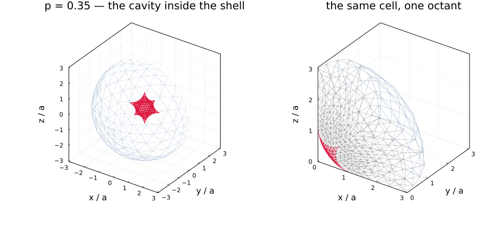

# [Concave pores, and where the literature and this package disagree](@id app-concave-pores)

A **supersphere**

```math
\left|\frac{x}{a}\right|^{2p} + \left|\frac{y}{a}\right|^{2p}
  + \left|\frac{z}{a}\right|^{2p} \le 1
```

is the sphere at ``p = 1``, the octahedron at ``p = 1/2``, and below that a
**concave** body with conical points on the three axes — a reasonable idealization
of the pore shapes that scanning electron microscopy finds in sandstone and in
harzburgite. It has no Eshelby solution, so it is exactly the morphology
[`FESupershapePore`](@ref man-fe-inclusions) exists for.

[chenIJES2015](@cite) studied it by finite elements and condensed the result
into a single scalar. This page reproduces what can be reproduced — and the
agreement is exact where the answer is known — then states two places where it
disagrees: their approximation is isotropic where the shape is cubic, and their
linear fit departs from its own anchors inside the range it claims.

!!! note "This page is static"
    The figures and the numbers are produced once by
    `scripts/fe/make_cell_figures.jl` and committed; the live demonstration is
    `scripts/89_fe_supersphere_pore.jl`.

## The cell, and why one eighth of it is enough



The three coordinate planes are mirror planes of a supersphere, so the cell is
invariant under a group of order eight and an **octant** carries the whole
answer — see [the pore declination](@ref th-corrected-cell) for the parity
argument and for why the dipole correction survives it. That is not a
convenience here, it is what makes the study possible: at ``p = 0.3`` the whole
cell needs some 360 000 degrees of freedom at level 4 and does not fit on a
16 GB machine, while the octant needs about 70 000 and takes half a minute.

The left panel is the whole cell of a concave shape at ``p = 0.35``, cut away so
the cavity is visible; the right panel is the same cell as an eighth, with the
three flat faces that had to be built in gray.

## Where we agree

**The volume, to machine precision.** Their Eq. (2.7) and the closed form this
package derives independently agree to ``7\times10^{-16}`` over the whole range,
including the two values known exactly: ``4\pi/3`` at the sphere and ``4/3`` at
the octahedron.

**The spherical limit.** At ``p = 1`` the measured resistivity contribution is
``k_0R = 1.499804`` against the exact ``3/2`` — a relative error of
``1.3\times10^{-4}`` at level 3, and ``9.7\times10^{-6}`` at level 4, which the
octant makes affordable. This is the control for everything else on this page.

**Their ``\eta`` near the sphere.** Their fit is anchored there and is exact
there, so the two agree to ``1.3\times10^{-4}`` at ``p = 1`` and to 2 % at
``p = 0.7``.

## Where their fit leaves its own anchors

``\eta(p)`` is a **linear** fit in ``p``, pinned at ``p = 1`` where it is exact
and at ``p = 0.2`` where they take the effect to vanish. Away from those two
points:

| ``p`` | ``k_0 R`` here | their ``\eta(p)`` | difference |
|---:|---:|---:|---:|
| 0.30 | 1.9288 | 3.4589 | −44 % |
| 0.40 | 1.6581 | 2.2392 | −26 % |
| 0.50 | 1.5763 | 1.7671 | −11 % |
| 0.70 | 1.5152 | 1.4853 | +2.0 % |
| **1.00** | **1.4998** | **1.5000** | **−0.013 %** |
| 1.50 | 1.5111 | 1.7923 | −16 % |
| 2.50 | 1.5400 | 2.6065 | −41 % |

The two convex rows are outside what the paper claims — it restricts the fit to
``p < 1`` — but the concave ones are inside it. Two further consequences of
pinning a straight line at ``p = 0.2``: ``\eta`` is **non-monotone** within the
claimed range (zero at ``0.2`` by construction, ``3.46`` just above at ``0.30``),
and **negative** below it, which is not physical for a pore.

## Where we disagree, and it is not numerical

**A supersphere is cubic, and their approximation is isotropic.** Their
Eq. (2.19) writes the compliance contribution on the isotropic basis
``(\mathbb J, \mathbb K)`` — two constants. The octahedral group leaves *three*
invariants for a fourth-order tensor with the minor symmetries, and the third is
not a small correction below ``p = 1/2``. Their own Fig. 4 data carries no
anisotropy either: the ratio ``H_{1111}/H_{1212}`` stays at the isotropic value
to about 1 % across their whole range.

This package measures the three separately, because `TensND.TensCubic` is a
storage class in its own right and the octant makes the cubic structure exact
rather than approximate: the couplings
symmetry forbids come out identically zero instead of as mesh noise at a few
percent of the norm.

| ``p`` | ``H_{1111}`` | ``H_{1122}`` | ``H_{1212}`` | anisotropy |
|---:|---:|---:|---:|---:|
| 0.30 | 3.3167 | −0.7771 | 1.5680 | **+0.2888** |
| 0.40 | 2.5262 | −0.6063 | 1.3265 | +0.1899 |
| 0.50 | 2.2954 | −0.5551 | 1.2566 | +0.1470 |
| 0.70 | 2.0955 | −0.5097 | 1.2289 | +0.0703 |
| **1.00** | 2.0094 | −0.4798 | 1.2444 | **+0.000246** |
| 1.50 | 1.9709 | −0.4513 | 1.2828 | −0.0728 |
| 2.50 | 1.9668 | −0.4246 | 1.3426 | **−0.1493** |

"Anisotropy" is Zener's ratio ``(H_{1111} - H_{1122} - 2H_{1212})/H_{1111}``,
identically zero for an isotropic tensor. **Read the middle row first.** At
``p = 1`` the body is a sphere and the true anisotropy is zero, so
``2.5\times10^{-4}`` is this chain's own spurious anisotropy at this
discretization — on the same mesh generator, element and quadrature as every
other row. The concave signal is **1170 times** larger than that, and the
convex one 600 times. It also **changes sign at the control**, which no
numerical artifact would do: a concave supersphere and a cube-like one are
anisotropic in opposite senses.

**The cost, and what the octant buys.** Same spherical pore, same corrected
condition, both modes:

| level | mode | vector dofs | conduction error | time |
|---:|:--|---:|---:|---:|
| 2 | whole | 12 165 | `2.86e-3` | 8.5 s |
| 2 | octant | 2 604 | `1.05e-3` | 0.1 s |
| 3 | whole | 31 881 | `2.74e-4` | 0.4 s |
| 3 | octant | 5 898 | `1.31e-4` | 0.0 s |
| 4 | octant | 17 508 | `9.73e-6` | 0.2 s |

The octant is not merely cheaper at equal level: it is about **twice as
accurate**, because the parity projection removes couplings that the whole cell
carries as noise. At ``p = 0.35`` it also needs **no** snapping fallback where
the whole cell backs off on 37 nodes.

**Why it cannot be settled from the paper itself.** Their values exist only as
figures, their elements are linear tetrahedra, and their surface integral uses
centroid values on flat triangles. What can be said is on the table above: the
control row bounds this chain's own error, and the signal is three orders of
magnitude above it.

## The axisymmetric companion

[sevostianovIJES2016](@cite) is the same team's study of the **axisymmetric**
concave pore — a superspheroid rather than a supersphere, transversely isotropic
rather than cubic — and it is the only one of the two to tabulate its numbers.
Reproducing it needs a different tool: the fields of a solid of revolution
separate into Fourier modes, so five two-dimensional problems replace six
three-dimensional ones, exactly as for the
[recycled aggregate](@ref app-recycled-aggregate). That cell is not built yet,
and this page does not pretend otherwise.

## One limitation, stated

In the concave range the measured tensor departs from its symmetry class by
about ``10^{-3}``, and **that does not improve with refinement**: ``9.7\times
10^{-4}`` at level 4 against ``1.1\times10^{-3}`` at level 3. What limits it is
the singular field at the conical points, not the mesh density — the same
mechanism that makes the boundary snapping back off there. It is the accuracy
the teacher has, and it is what sets the tolerance of the surrogate's training
set.

## Reproducing this page

```shell
julia scripts/fe/make_cell_figures.jl        # figures + docs/src/assets/fe/cell_results.md.in
julia scripts/89_fe_supersphere_pore.jl      # the comparison, live
```

## See also

- [The finite Eshelby cell with a corrected boundary condition](@ref th-corrected-cell)
  — the pore declination, and the octant's parity argument.
- [Finite-element inclusions](@ref man-fe-inclusions) — how to use the type.
- [Neural-surrogate inclusions](@ref man-neural-inclusions) — the trained models
  that replace the solve.

## References

```@bibliography
Pages = ["concave_pores.md"]
Canonical = false
```
