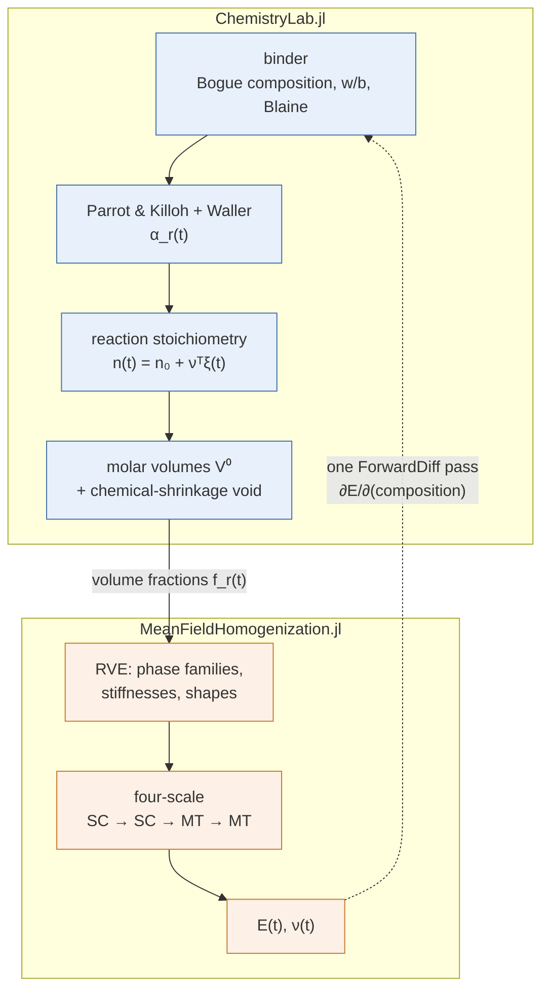
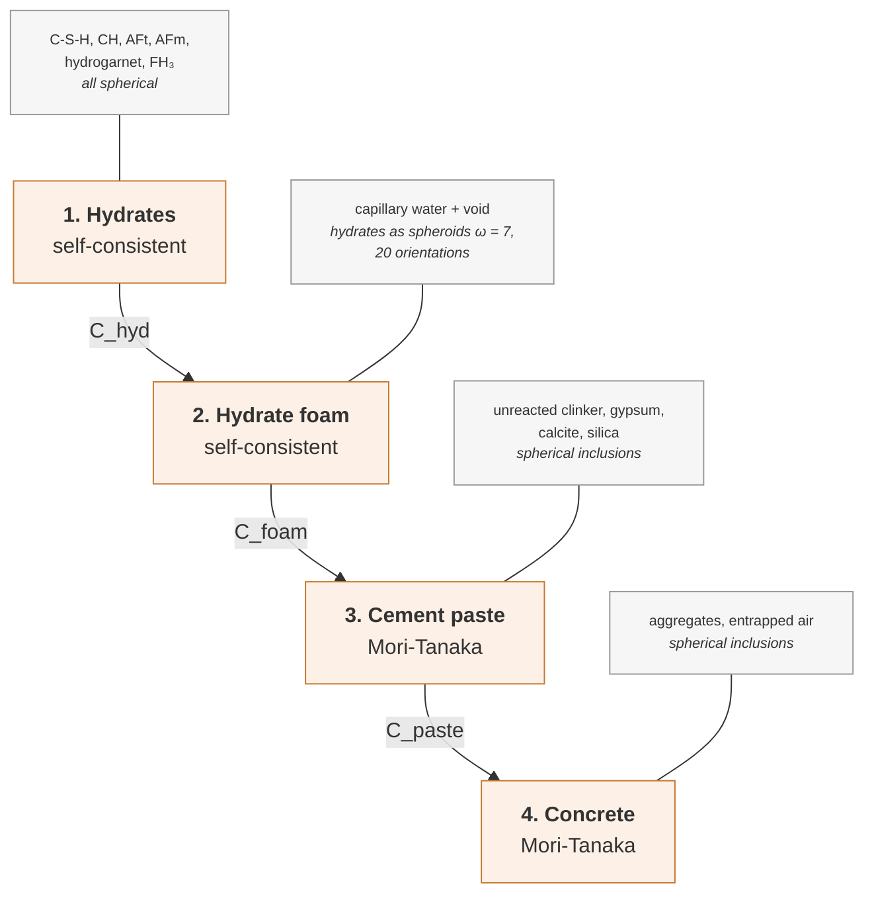

# [A hydrating blended cement paste, coupled to its chemistry](@id app-blended-hydration)

Every other cement chapter of this documentation starts from a **correlation**:
a Powers-type formula turns a water-to-cement ratio and a hydration degree into
volume fractions, and the micromechanics takes it from there. This one does not.
Here the volume fractions are *computed* — by integrating a hydration kinetics
ODE, applying the reaction stoichiometry, and converting moles to volumes
through the molar volumes of a thermodynamic database.

The model is that of [Lavergne2018](@cite), whose micromechanical part is close
to [pichler2011](@cite) — see [Quasi-brittle strength of cement paste and
mortar](@ref app-strength) — but whose volume fractions come from an extended
Parrot & Killoh hydration model rather than from Powers.

The chemistry is carried by
[ChemistryLab.jl](https://github.com/MicroPoroChemoMechanics/ChemistryLab.jl),
a sibling package of this one. Neither package depends on the other: the
coupling lives entirely in this chapter and in
`scripts/common/lavergne_hydration.jl`.



The dotted arrow is not decoration. Both packages are `ForwardDiff`-clean, so
the derivative of an effective modulus with respect to anything the chemistry
depends on is one dual evaluation of the whole chain — no finite differences,
no re-running the ODE. Section [§6](@ref blended-sensitivity) uses it.

## Setup

```@example blended
using MeanFieldHomogenization
using TensND
using ChemistryLab
using DynamicQuantities
using OrdinaryDiffEq
using ForwardDiff
using Printf
using Plots
gr()  # headless backend; GKSwstype is set to "100" in make.jl

const SCRIPTS = joinpath(pkgdir(MeanFieldHomogenization), "scripts")
include(joinpath(SCRIPTS, "common", "lavergne_model.jl"))
include(joinpath(SCRIPTS, "common", "lavergne_hydration.jl"))
nothing # hide
```

## The binder

The reference cement is the CEM I 52.5 N of [Lavergne2018](@cite) (its Table 9):
a clinker of Bogue composition C₃S 65 / C₂S 11 / C₃A 11 / C₄AF 8, with 3.5 %
calcite and 4.6 % gypsum, ground to a Blaine fineness of 380 m²/kg. The blends
follow the paper's naming — `C85L15` substitutes 15 % limestone filler for
cement, `C95SF05` 5 % silica fume.

```@example blended
const CLINKER = (C3S = 0.65, C2S = 0.11, C3A = 0.11, C4AF = 0.08)
const BLAINE  = 380.0u"m^2/kg"

# Orientation bins for the hydrate-foam self-consistent scheme. The paper uses
# 20; this page uses 8, which moves the percolation threshold by well under a
# percent of hydration degree and is what keeps the build tractable — the page
# performs of the order of a hundred four-scale homogenizations, each one a
# self-consistent fixed point over these bins. `scripts/44_*.jl` runs the full 20.
const NTHETA = 8

hydrate(; wb, filler = 0.035, silica = 0.0) = run_hydration(;
    wb, clinker = CLINKER, gypsum = 0.046, filler, silica,
    blaine = BLAINE, tend = 90 * 86400.0,
)

const TIMES = 10 .^ range(log10(0.05 * 86400), log10(90 * 86400); length = 20)
run0 = hydrate(; wb = 0.5)
nothing # hide
```

## Hydration kinetics

Each clinker phase follows Parrot & Killoh in its canonical form
[ParrotKilloh1984](@cite), `α̇ = min(α̇₁, α̇₂, α̇₃)` — an Avrami nucleation-growth
term, a Jander diffusion term and a power law — scaled by the Blaine fineness and
capped by the Powers water-availability limit `α_max = min(1, w/b / 0.42)`. The
silica fume does not follow Parrot & Killoh at all: its pozzolanic reaction
follows the sigmoid of Waller, far more thermo-activated than the clinker.

A signature of the 1984 parameter set, and a useful check that it has been
transcribed correctly: **C₂S has no nucleation-growth stage and C₃S no
diffusion-controlled stage**.

```@example blended
α = degrees_of_hydration(run0.sol, run0.kp; times = TIMES)
ᾱ = mean_degree_of_hydration(run0.sol, run0.kp; times = TIMES)

p_alpha = plot(
    TIMES ./ 86400, [α[k] for k in ("C3S", "C2S", "C3A", "C4AF")];
    xscale = :log10, xlabel = "age [days]", ylabel = "degree of hydration α",
    label = ["C₃S" "C₂S" "C₃A" "C₄AF"], lw = 2, legend = :topleft,
    size = (760, 460), title = "Parrot & Killoh kinetics, w/b = 0.50",
)
plot!(p_alpha, TIMES ./ 86400, ᾱ; lw = 3, color = :black, ls = :dash, label = "ᾱ (mass-weighted)")
```

Alite is largely consumed within a week while belite is still below half at
90 days — the classical ordering.

## From moles to volume fractions

The reactions are **balanced by ChemistryLab**, not written out by hand. This
matters more than it sounds: CEMDATA18 stores Jennite with a rounded Ca:Si of
`1.666667`, so the textbook coefficients `4/3` and `103/30` leave a residual.

```@example blended
cs = build_cement_system()
for r in hydration_reactions(cs; wb = 0.5, blaine = BLAINE)
    println(rpad(String(ChemistryLab.symbol(r)), 24), r)
end
```

Two features of that set are worth pointing out.

**Sulfate sequencing.** C₃A and C₄AF each drive *two* reactions: one consuming
gypsum to form ettringite, one forming hydrogarnet without it. The Parrot &
Killoh rate of the phase is split between them by a smooth switch on the gypsum
still present, reproducing the rule of [Lavergne2018](@cite) — ettringite while
sulfate lasts, then the sulfate-free product — while staying differentiable.

Gypsum is consumed but is not itself a *kinetic* species, so the gate reads an
amount the integrator does not carry directly. That works because the ODE state
holds the reaction extents ξ, from which the residual reconstructs every species
before evaluating the rates. It is worth knowing that this is what makes reaction
sequencing expressible at all: this chapter is the reason ChemistryLab acquired
it. Without it the gate never closes, and an earlier draft formed 0.44 mol of
ettringite out of 0.27 mol of gypsum — expanding the paste and driving the
chemical shrinkage negative, with the solver reporting success throughout.

**Gel water.** CEMDATA18 and [Lavergne2018](@cite) do not draw the boundary of
"C-S-H" in the same place, and ignoring the difference changes the answer by a
factor of two:

| | C-S-H per mole of Si | molar volume | water held inside |
|---|---|---|---|
| CEMDATA18 (Jennite) | (SiO₂)(CaO)₁.₆₆₇(H₂O)₂.₁ | 78.4 cm³/mol | structural only |
| [Lavergne2018](@cite) | C₁.₇SH₄ | 108.3 cm³/mol | structural **+ gel** |

Both conventions are self-consistent; the thermodynamic one is cleaner. But the
paper's micromechanical parameters — `E_CSH = 25` GPa, aspect ratio 7, and the
percolation threshold that follows — were calibrated on the *second* object.
Feeding the first into them counts gel water as capillary porosity, overstates
the porosity by some ten points and halves `E`. So `fraction_history` moves
`GEL_WATER_PER_CSH = 4 − 2.1` moles of water per mole of C-S-H from the aqueous
phase into the hydrate. The chemistry is untouched: this re-partitions a computed
volume, at the one place where the two conventions meet.

```@example blended
_, fs = fraction_history(run0, TIMES)

const PHASE_COLOR = [
    "anhydrous" => :grey35, "C-S-H" => :steelblue, "CH" => :indianred,
    "AFt" => :mediumpurple, "AFm" => :orchid, "hydrogarnet" => :darkorange,
    "FH3" => :sienna, "gypsum" => :gold, "calcite" => :darkkhaki,
    "silica" => :olive, "water" => :lightskyblue, "void" => :white,
]
present = [k for (k, _) in PHASE_COLOR if maximum(get.(fs, k, 0.0)) > 1.0e-3]
cols = [Dict(PHASE_COLOR)[k] for k in present]
Y = cumsum(reduce(hcat, [get.(fs, k, 0.0) for k in present]); dims = 2)

plot(
    TIMES ./ 86400, Y;
    xscale = :log10, xlabel = "age [days]", ylabel = "cumulative volume fraction",
    label = reshape(present, 1, :), lw = 0.5, linecolor = :grey30,
    fillrange = hcat(zeros(length(TIMES)), Y[:, 1:(end - 1)]),
    fillcolor = reshape(cols, 1, :), fillalpha = 0.9,
    legend = :outerright, ylims = (0, 1), size = (760, 460),
    title = "Phase assemblage of the sealed paste, w/b = 0.50",
)
```

This is the classical Powers diagram — anhydrous grains consumed, C-S-H and
portlandite growing, capillary water receding — except that nothing here was
correlated. The white band at the top is the **chemical shrinkage**: under sealed
curing the specimen keeps its volume while the reactions consume some, and the
deficit is an empty, gas-filled porosity. It is a phase of the microstructure,
not a rounding error, and `volume_fractions` returns it explicitly.

```@example blended
f28 = fraction_history(run0, [28 * 86400.0])[2][1]
@printf "sum of fractions = %.6f\n" sum(values(f28))
@printf "chemical shrinkage at 28 d = %.1f %% of the paste volume\n" 100 * f28["void"]
```

## The four scales

[Lavergne2018](@cite) upscales in four steps (its Fig. 2). The first is what
distinguishes this model from [pichler2011](@cite), which collapses every hydrate
into a single stiffness: here the hydrate species are merged first, by a
self-consistent scheme with all phases spherical, and only the *result* is given
the fibrillar morphology at the foam scale.



The aspect ratio ``\omega = 7`` is the paper's own compromise. It is the stage-2
self-consistent scheme that **percolates**: below a critical hydrate fraction the
fixed point returns a vanishing stiffness, which is the setting transition.
Aspect ratios of 21 or 35 would place that threshold at the gel-space ratios of
13 % and 7 % actually measured at setting; 7 was chosen instead for better
agreement on compressive strength, and the paper is explicit about the trade.

Phase stiffnesses are those of its Table 5 — clinker 130 GPa, portlandite
42.3 GPa, ettringite and hydrogarnet 22.4 GPa, calcite 83.8 GPa, and a single
C-S-H at 25 GPa, the median of the high- and low-density values.

```@example blended
E_of(f) = lavergne_paste_moduli(f; N = NTHETA).E
E_hist = [E_of(f) for f in fs]

p_perc = plot(
    ᾱ, E_hist;
    xlabel = "mean degree of hydration ᾱ", ylabel = "E [GPa]",
    lw = 2, legend = false, size = (760, 460), marker = :circle, ms = 2,
    title = "Setting: E against hydration degree, w/b = 0.50",
)
```

The curve leaves zero at a finite hydration degree: that is the percolation
threshold of the hydrate foam, and it is a *prediction* of the self-consistent
scheme, not a fitted setting time.

## Effective Young's modulus

```@example blended
mixes = [
    ("C100, w/b = 0.50",    (wb = 0.5,  filler = 0.035, silica = 0.0)),
    ("C85L15, w/b = 0.50",  (wb = 0.5,  filler = 0.185, silica = 0.0)),
    ("C95SF05, w/b = 0.50", (wb = 0.5,  filler = 0.035, silica = 0.05)),
    ("C100, w/b = 0.32",    (wb = 0.32, filler = 0.035, silica = 0.0)),
]

p_E = plot(;
    xscale = :log10, xlabel = "age [days]", ylabel = "E [GPa]",
    legend = :topleft, size = (760, 460), title = "Effective Young's modulus",
)
E_table = String[]
for (i, (name, m)) in enumerate(mixes)
    # The first mix is the reference paste, already hydrated and already
    # homogenized above — reuse it rather than pay for it twice.
    E = if i == 1
        E_hist
    else
        r = hydrate(; wb = m.wb, filler = m.filler, silica = m.silica)
        [E_of(fi) for fi in fraction_history(r, TIMES)[2]]
    end
    plot!(p_E, TIMES ./ 86400, E; lw = 2, label = name)
    i1  = findmin(abs.(TIMES .- 86400))[2]
    i28 = findmin(abs.(TIMES .- 28 * 86400))[2]
    push!(E_table, @sprintf("| %-20s | %5.1f | %5.1f | %5.1f |", name, E[i1], E[i28], E[end]))
end
p_E
```

```@example blended
println("| mix                  | E(1 d) | E(28 d) | E(90 d) |")
println("|----------------------|--------|---------|---------|")
foreach(println, E_table)
```

Three things the model gets right, and one it does not.

- **The w/b effect** is strong and in the right direction: halving the capillary
  porosity roughly doubles the 28-day modulus.
- **Limestone dilution** lowers `E` at every age, the filler being inert apart
  from a little monocarboaluminate.
- **Silica fume** costs almost nothing at 28 days, its pozzolanic reaction
  replacing the clinker it displaced.
- **The absolute level is low.** A w/b = 0.50 paste measures nearer 18–20 GPa at
  28 days than the ~13 GPa here. The single C-S-H stiffness, with no
  high-/low-density distinction, and the drained convention `K_water = 0` both
  push in that direction; [Lavergne2018](@cite) lists the uniform C-S-H density as
  a limitation of its own §5. The purpose of this chapter is the coupling, not a
  calibration.

## [Sensitivities through the chemistry](@id blended-sensitivity)

Because the whole chain is `ForwardDiff`-clean, the sensitivity of `E` to any
phase fraction is one dual evaluation — including through the self-consistent
fixed points.

```@example blended
sens = [(k, ForwardDiff.derivative(
            x -> lavergne_paste_moduli(merge(f28, Dict(k => x)); N = 6).E, f28[k]))
        for k in keys(f28) if f28[k] > 1.0e-3]
sort!(sens; by = last, rev = true)

bar(
    [k for (k, _) in sens], [v for (_, v) in sens];
    xrotation = 40, ylabel = "∂E / ∂f  [GPa]", legend = false,
    size = (760, 460), title = "Sensitivity of E(28 d) to each phase fraction",
    color = [v > 0 ? :steelblue : :indianred for (_, v) in sens],
)
```

Portlandite and the unreacted clinker are the stiffest things present, so growing
them at constant total volume helps most; water and the shrinkage void hurt most.
The reading is *at fixed total volume* — these are not independent design
variables, since the chemistry ties them together — but the ordering is what a
calibration would exploit, and obtaining it cost no finite differences and no
extra ODE solve.

## What is not here

- **Compressive strength.** The second half of [Lavergne2018](@cite) upscales
  strength from a Von Mises criterion on the hydrate needles, through Kreher's
  lemma over the 20 orientations, plus a statistical treatment of the stress
  fluctuation at the concrete scale — which is how it explains a mortar being
  weaker than its own paste. The ingredient exists here only as script-level code;
  see [Quasi-brittle strength of cement paste and mortar](@ref app-strength).
- **Ageing creep.** [`homogenize_alv`](@ref) takes *constant* volume fractions;
  time dependence is emulated by discretizing a growing phase into layers with
  individual setting times, driven by a postulated law — see
  [Ageing creep of solidifying cementitious materials](@ref app-ageing-creep).
  Feeding it the `f_r(t)` computed above is the natural next step, and needs
  either an API accepting an amount law or a helper inverting an arbitrary
  kinetics into setting times.
- **Thermodynamic equilibrium.** The reaction set here is stoichiometric, as in
  the paper. ChemistryLab can instead solve for the equilibrium phase assemblage;
  that would replace the imposed products by computed ones, at a substantial cost
  in run time, and would not by itself settle the morphology, which stays a model.

## Reproducing this chapter

`scripts/44_lavergne_hydration_micromechanics.jl` runs the same model
standalone, with 20 orientation bins, and writes the figures to
`scripts/figures/`. Unlike the other scripts it activates `docs/` rather than the
repository root, because it needs ChemistryLab and OrdinaryDiffEq:

```
julia --project=docs -e 'using Pkg; Pkg.instantiate()'
julia scripts/44_lavergne_hydration_micromechanics.jl
```
