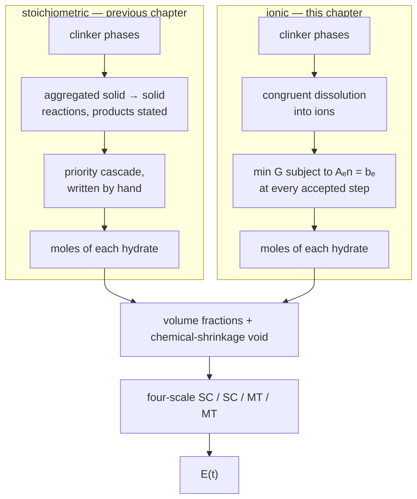

# [Hydration through the pore solution](@id app-ionic-hydration)

The previous chapter, [A hydrating blended cement paste, coupled to its chemistry](@ref app-blended-hydration), computes the elastic
properties of a cement paste from aggregated solid → solid reactions: each
reaction *states* its products, and a hand-written priority cascade decides
which one forms when the co-reactants run short.

This chapter does the same calculation with the chemistry turned inside out.
The clinker only **dissolves**, into Ca²⁺, SiO₂, AlO₂⁻, FeO₂⁻, SO₄²⁻, CO₃²⁻
and H⁺, and a **Gibbs free-energy minimization** at every accepted time step
decides which hydrates are stable and in what amounts. No sequencing rule is
written anywhere.

The micromechanics is identical — the same four-scale model of
[`lavergne_model.jl`](https://github.com/MicroPoroChemoMechanics/MeanFieldHomogenization.jl/blob/main/scripts/common/lavergne_model.jl).
Only the chemistry differs, which is what makes the two chapters comparable
term by term.



What the ionic route buys, and the stoichiometric one cannot give at all:

- the **pore-solution pH** and composition over time;
- the **aluminate sequence as a result** rather than as an input — and, as §4
  shows, a result that changes with the mix without a line of code changing;
- a **setting threshold**: below percolation the self-consistent fixed point
  collapses and the model reports a zero modulus, which is physical.

!!! note "Requires ChemistryLab ≥ 0.7.1"
    Before that release a re-speciation could start outside the feasible set of
    its own equality constraint, and a full ordinary Portland cement returned an
    assemblage demanding 174 % of the sulfate present — while reporting a
    residual of `1.4e-2`, because the residual was normalized by the 34 mol water
    budget and a 0.465 mol violation on 0.27 mol of sulfate disappeared into it.

## 1. Building the chemical system

Everything below is executed when this page is built. The shared model lives in
`scripts/common/ionic_hydration.jl`.

```@example ionic
using MeanFieldHomogenization, TensND, Printf, Plots
gr()

const SCRIPTS = joinpath(dirname(dirname(pathof(MeanFieldHomogenization))), "scripts", "common")
include(joinpath(SCRIPTS, "lavergne_model.jl"))
include(joinpath(SCRIPTS, "lavergne_hydration.jl"))
include(joinpath(SCRIPTS, "ionic_hydration.jl"))

cs = build_ionic_system(:opc)
nothing # hide
```

`build_ionic_system` takes the CEMDATA18 subset: the dissolving phases, the
candidate hydrates, and every aqueous species that `speciation` pulls in from
`CEMDATA_PRIMARIES` — the ones that carry the pore chemistry.

```@example ionic
using ChemistryLab
@printf "%d species, of which %d aqueous and %d crystalline\n" length(cs.species) count(
    s -> aggregate_state(s) == AS_AQUEOUS, cs.species
) count(s -> aggregate_state(s) == AS_CRYSTAL, cs.species)
```

The dissolution reactions are **balanced by ChemistryLab** from the phase and
the primaries, and come out in the expected acid-driven form:

```@example ionic
for r in ionic_reactions(cs; wb = 0.5, blaine = 380.0u"m^2/kg")[1:3]
    println("  ", r.reaction)
end
```

Note the negative H⁺ coefficients: dissolving alite *consumes* six protons per
mole, which is what drives the pore solution to pH 12.5 and above.

## 2. Running the coupling

The formulation is the CEM I 52.5 N of Lavergne et al. (2018), Table 9, so the
numbers can be put beside the previous chapter's: Bogue composition
C₃S 65 / C₂S 11 / C₃A 11 / C₄AF 8, gypsum 4.6 %, calcite 3.5 %, Blaine
380 m²/kg, w/b = 0.50.

```@example ionic
const CLINKER = (C3S = 0.65, C2S = 0.11, C3A = 0.11, C4AF = 0.08)
const TEND = 28 * 86400.0
const TIMES = 10 .^ range(log10(0.05 * 86400), log10(TEND); length = 40)

run_calcite = run_ionic_hydration(;
    wb = 0.5, clinker = CLINKER, gypsum = 0.046, filler = 0.035,
    tend = TEND, system = :opc,
)
@printf "%d accepted steps, retcode = %s\n" length(run_calcite.sol.t) run_calcite.sol.retcode
```

One Gibbs minimization is solved per accepted step, so this is the expensive
part of the chapter.

## 3. The pore solution

`ionic_fraction_history` re-solves `φ(bₑ)` at each requested instant, walking
them in order and carrying the previous speciation as the guess.

```@example ionic
times, fracs, pore_pH, poro = ionic_fraction_history(run_calcite, TIMES)
nothing # hide
```

!!! warning "The sequence is not optional"
    Each solve is warm-started from the previous one, and the guess is first
    clipped to the element budget and projected back into `{Aₑn = bₑ, n ≥ 0}`.
    Both matter: the warm start is the equilibrium of the *previous* `bₑ`, so
    once the sulfate is spent it demands more of it than now exists and the
    interior-point solve starts outside its own feasible set. Solved instead
    from a cold guess, `φ(bₑ)` returns no hydrates at all and a pore solution at
    pH 6, while the run itself computed 2.2 mol of C-S-H.

```@example ionic
p_pH = plot(
    times ./ 86400, pore_pH; xscale = :log10, lw = 2, legend = false,
    xlabel = "time [days]", ylabel = "pore-solution pH",
    title = "Pore solution — unavailable from the stoichiometric model",
    ylims = (11.5, 13.5), size = (760, 380),
)
p_pH
```

The solution sits at pH 12.5–12.6 throughout, which is where a Portland cement
pore solution belongs. This is a *computed* quantity: nothing in the input fixes
it.

## 4. The aluminate sequence, and how to deplete the ettringite

This is the section that justifies the second model. We run **the same paste a
second time with the limestone removed**, changing nothing else — same clinker,
same gypsum, same water, same code path.

```@example ionic
run_nolime = run_ionic_hydration(;
    wb = 0.5, clinker = CLINKER, gypsum = 0.046, filler = 0.0,
    tend = TEND, system = :opc,
)
_, fracs_nl, _, _ = ionic_fraction_history(run_nolime, TIMES)
nothing # hide
```

```@example ionic
td = times ./ 86400
p_seq = plot(;
    xscale = :log10, xlabel = "time [days]", ylabel = "volume fraction",
    title = "Aluminates: a result, not an input", legend = :topleft, size = (760, 420),
)
plot!(p_seq, td, [get(f, "AFt", 0.0) for f in fracs]; lw = 2, color = 1, label = "AFt — with 3.5 % calcite")
plot!(p_seq, td, [get(f, "AFm", 0.0) for f in fracs]; lw = 2, color = 2, label = "AFm — with 3.5 % calcite")
plot!(p_seq, td, [get(f, "AFt", 0.0) for f in fracs_nl]; lw = 2, ls = :dash, color = 1, label = "AFt — no limestone")
plot!(p_seq, td, [get(f, "AFm", 0.0) for f in fracs_nl]; lw = 2, ls = :dash, color = 2, label = "AFm — no limestone")
p_seq
```

```@example ionic
for (lbl, f) in ("with 3.5 % calcite" => fracs, "no limestone" => fracs_nl)
    aft = [get(fi, "AFt", 0.0) for fi in f]
    j = argmax(aft)
    @printf "%-20s  AFt peak %.4f at %5.2f d   AFt(28 d) %.4f   AFm(28 d) %.4f\n" lbl aft[j] (
        times[j] / 86400
    ) aft[end] get(f[end], "AFm", 0.0)
end
```

Two different histories out of one model:

- **With limestone**, the ettringite forms and *survives* to 28 days. The
  carbonate reacts with the aluminate to form monocarboaluminate, so the
  sulfate is never called upon to feed an AFm and the AFt is stabilized. This is
  the well-known limestone effect.
- **Without limestone**, the ettringite peaks at 6 hours and is then **depleted**
  — down to a tenth of its peak by 1.5 days, and to nothing by 28 days. Once the
  gypsum is exhausted the AFt is the only sulfate reservoir left, and the
  remaining aluminate converts it into monosulphate.

Nothing in the code distinguishes the two cases. The free energy does. The
previous chapter has to encode this ordering by hand, as a cascade of priority
gates — and would have to be re-derived for a mix it was not written for.

## 5. Porosity, and what it is referred to

The porosity of a setting binder is not `V_liquid / V_total`: the denominator
shrinks with the reactions, while a sealed specimen keeps the volume it was cast
with, and the empty porosity left by the Le Chatelier contraction is not a
species at all. `ionic_fraction_history` returns the two-argument form, referred
to the fresh paste and counting the chemical shrinkage as void.

```@example ionic
@printf "%6s  %8s  %8s  %8s\n" "t [d]" "φ" "S" "void"
for t in (0.25, 1.0, 3.0, 7.0, 28.0)
    i = argmin(abs.(td .- t))
    @printf "%6.2f  %8.4f  %8.4f  %8.4f\n" td[i] poro[i].total (
        poro[i].liquid / poro[i].total
    ) get(fracs[i], "void", 0.0)
end
```

A sealed paste **desaturates as it hydrates** though no water ever leaves it:
the saturation falls from 0.93 to 0.80 while the chemical shrinkage grows to
7.1 % of the fresh volume — within a tenth of a percent of the 7.2 % the
stoichiometric route gives, by a completely independent path.

## 6. Elastic modulus

The volume fractions go into the same four-scale model as the previous chapter,
unchanged.

```@example ionic
E_ionic = [lavergne_paste_moduli(f; N = NTHETA_LAVERGNE).E for f in fracs]

run_stoich = run_hydration(;
    wb = 0.5, clinker = CLINKER, gypsum = 0.046, filler = 0.035,
    silica = 0.0, tend = TEND,
)
_, fracs_stoich = fraction_history(run_stoich, TIMES)
E_stoich = [lavergne_paste_moduli(f; N = NTHETA_LAVERGNE).E for f in fracs_stoich]

p_E = plot(
    td, E_ionic; xscale = :log10, lw = 2, label = "ionic (this chapter)",
    xlabel = "time [days]", ylabel = "E [GPa]", title = "Young's modulus of the paste",
    legend = :topleft, size = (760, 420),
)
plot!(p_E, td, E_stoich; lw = 2, ls = :dash, label = "stoichiometric (previous chapter)")
p_E
```

```@example ionic
@printf "%6s  %10s  %10s  %8s\n" "t [d]" "E ionic" "E stoich" "Δ"
for t in (1.0, 3.0, 7.0, 28.0)
    i = argmin(abs.(td .- t))
    @printf "%6.2f  %8.2f    %8.2f    %6.1f %%\n" td[i] E_ionic[i] E_stoich[i] (
        100 * (E_ionic[i] - E_stoich[i]) / E_stoich[i]
    )
end
```

The two agree to a few percent at one day and drift apart to some ten percent at
28 days. That gap is the interesting number: same micromechanics, same
formulation, same kinetic calibration — it measures what the hand-written
cascade costs against letting the thermodynamics choose.

The setting threshold appears as a genuine zero:

```@example ionic
i_set = findfirst(>(0.0), E_ionic)
@printf "First non-zero modulus at %.1f h\n" times[i_set] / 3600
```

Below it the self-consistent fixed point of the foam scale collapses: the solid
has not percolated, and the model says so rather than returning a small number.

## Limitations

- The modulus at 28 days, near 16 GPa, is on the low side for a w/b = 0.50 paste,
  where 18–22 GPa is usual. The trend and the ordering are right; the level is
  not calibrated against experiment here.
- The C-S-H is represented by the CEMDATA18 `Jennite` end-member, normalized per
  silicon. A real C-S-H is a solid solution of varying Ca/Si; using the CSHQ
  solid solution in a coupled solve is not exercised by the package's tests.
- The run reports a number of equilibrium solves that stop short of the
  optimizer's tolerance. That count refers to the re-speciation buffer during
  integration, not to the trajectory used here, which is recomputed with the
  guard rails of §3 and whose sulfate and aluminum budgets close on the last
  digit. It is a real diagnostic to tighten, not a silent one to ignore.
- Kinetics are Parrot–Killoh rates applied to the dissolution reactions, with a
  per-phase calibration factor, because no Palandri–Kharaka parameter set is
  published for clinker phases. Inventing one would be a fabrication.
