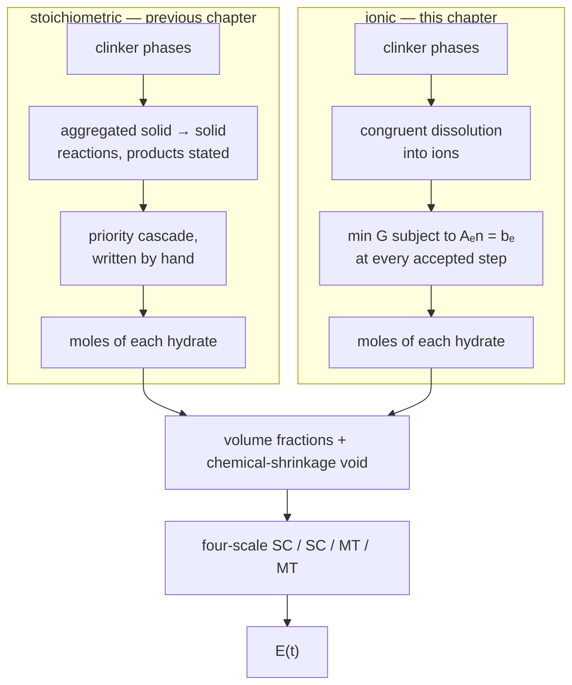

# [Hydration through the pore solution](@id app-ionic-hydration)

The previous chapter, [A hydrating blended cement paste, coupled to its chemistry](@ref app-blended-hydration), computes the elastic
properties of a cement paste from aggregated solid → solid reactions: each
reaction *states* its products, and a hand-written priority cascade decides
which one forms when the co-reactants run short.

This chapter does the same calculation with the chemistry turned inside out.
The clinker only **dissolves**, into Ca²⁺, SiO₂, AlO₂⁻, FeO₂⁻, SO₄²⁻, CO₃²⁻
and H⁺, and a **Gibbs free-energy minimization** at every accepted time step
decides which hydrates are stable and in what amounts. No sequencing rule is
written anywhere.

The micromechanics is identical — the same four-scale model of
[`lavergne_model.jl`](https://github.com/MicroPoroChemoMechanics/MeanFieldHomogenization.jl/blob/main/scripts/common/lavergne_model.jl).
Only the chemistry differs, which is what makes the two chapters comparable
term by term.

!!! note "The chemistry alone, without the mechanics"
    Sections 1 to 6 below are chemistry: the assemblage, the pore solution, the
    calorimetry, the porosity. That part is also published on its own as
    *The full Portland cement, through its pore solution* in
    [ChemistryLab.jl](https://microporochemomechanics.github.io/ChemistryLab.jl/stable/),
    whose `scripts/ionic_hydration.jl` carries the same model. Read that page if
    the elastic modulus of §7 is not what you are after.



What the ionic route buys, and the stoichiometric one cannot give at all:

- the **pore-solution pH** and composition over time;
- the **aluminate sequence as a result** rather than as an input — and, as §4
  shows, a result that changes with the mix without a line of code changing;
- a **setting threshold**: below percolation the self-consistent fixed point
  collapses and the model reports a zero modulus, which is physical.

!!! note "Requires ChemistryLab ≥ 0.9 — and the compositions here are proved optimal"
    `speciated_states` passes every instant to `DualEquilibriumSolver`, which
    solves the KKT system and returns a certificate. The Gibbs problem is convex —
    an ideal mixing entropy plus terms linear in the amounts of the pure phases,
    over a polyhedron — so its minimizer is unique, and stationarity of the
    interior species together with the component balance and undersaturation of
    every absent phase **prove** global optimality. Every instant below is
    certified, with an element balance between 1e-11 and 1e-13 mol.

    The interior-point solver alone would not support that claim: on this
    package's calcite reference it returns pH 6.96 against a certified 9.90, and
    it rarely reports convergence at all, so its return code cannot distinguish
    the two.

## 1. Building the chemical system

Everything below is executed when this page is built. The shared model lives in
`scripts/common/ionic_hydration.jl`.

```@example ionic
using MeanFieldHomogenization, TensND, Printf, Plots
gr()

const SCRIPTS = joinpath(dirname(dirname(pathof(MeanFieldHomogenization))), "scripts", "common")
include(joinpath(SCRIPTS, "lavergne_model.jl"))
include(joinpath(SCRIPTS, "lavergne_hydration.jl"))
include(joinpath(SCRIPTS, "ionic_hydration.jl"))

cs = build_ionic_system(:opc)
nothing # hide
```

`build_ionic_system` takes the CEMDATA18 subset: the dissolving phases, the
candidate hydrates, and every aqueous species that `speciation` pulls in from
`CEMDATA_PRIMARIES` — the ones that carry the pore chemistry.

```@example ionic
using ChemistryLab
@printf "%d species, of which %d aqueous and %d crystalline\n" length(cs.species) count(
    s -> aggregate_state(s) == AS_AQUEOUS, cs.species
) count(s -> aggregate_state(s) == AS_CRYSTAL, cs.species)
```

The dissolution reactions are **balanced by ChemistryLab** from the phase and
the primaries, and come out in the expected acid-driven form:

```@example ionic
for r in ionic_reactions(cs; wb = 0.5, blaine = 380.0u"m^2/kg")[1:3]
    println("  ", r.reaction)
end
```

Note the negative H⁺ coefficients: dissolving alite *consumes* six protons per
mole, which is what drives the pore solution to pH 12.5 and above.

## 2. Running the coupling

The formulation is the CEM I 52.5 N of Lavergne et al. (2018), Table 9, so the
numbers can be put beside the previous chapter's: Bogue composition
C₃S 65 / C₂S 11 / C₃A 11 / C₄AF 8, gypsum 4.6 %, calcite 3.5 %, Blaine
380 m²/kg, w/b = 0.50.

```@example ionic
const CLINKER = (C3S = 0.65, C2S = 0.11, C3A = 0.11, C4AF = 0.08)
const TEND = 28 * 86400.0
const TIMES = 10 .^ range(log10(0.05 * 86400), log10(TEND); length = 40)

run_calcite = run_ionic_hydration(;
    wb = 0.5, clinker = CLINKER, gypsum = 0.046, filler = 0.035,
    tend = TEND, system = :opc,
)
@printf "%d accepted steps, retcode = %s\n" length(run_calcite.sol.t) run_calcite.sol.retcode
```

One Gibbs minimization is solved per accepted step, so this is the expensive
part of the chapter.

## 3. The pore solution

`ionic_fraction_history` re-solves `φ(bₑ)` at each requested instant, walking
them in order and carrying the previous speciation as the guess.

```@example ionic
times, fracs, pore_pH, poro = ionic_fraction_history(run_calcite, TIMES)
nothing # hide
```

!!! warning "The sequence is not optional"
    Each solve is warm-started from the previous one, and the guess is first
    clipped to the element budget and projected back into `{Aₑn = bₑ, n ≥ 0}`.
    Both matter: the warm start is the equilibrium of the *previous* `bₑ`, so
    once the sulfate is spent it demands more of it than now exists and the
    interior-point solve starts outside its own feasible set. Solved instead
    from a cold guess, `φ(bₑ)` returns no hydrates at all and a pore solution at
    pH 6, while the run itself computed 2.2 mol of C-S-H.

    The certifying solve that follows removes the *consequence* of a poor start,
    but not the need for a good one: it too is a Newton method, and it is given
    the interior-point answer as its neighborhood.

```@example ionic
p_pH = plot(
    times ./ 86400, pore_pH; xscale = :log10, lw = 2, legend = false,
    xlabel = "time [days]", ylabel = "pore-solution pH",
    title = "Pore solution — unavailable from the stoichiometric model",
    ylims = (11.5, 13.5), size = (760, 380),
)
p_pH
```

The solution sits at pH 12.5–12.6 throughout, which is where a Portland cement
pore solution belongs. This is a *computed* quantity: nothing in the input fixes
it.

## 4. The aluminate sequence, and how to deplete the ettringite

This is the section that justifies the second model. We run **the same paste a
second time with the limestone removed**, changing nothing else — same clinker,
same gypsum, same water, same code path.

```@example ionic
run_nolime = run_ionic_hydration(;
    wb = 0.5, clinker = CLINKER, gypsum = 0.046, filler = 0.0,
    tend = TEND, system = :opc,
)
_, fracs_nl, _, _ = ionic_fraction_history(run_nolime, TIMES)
nothing # hide
```

```@example ionic
td = times ./ 86400
p_seq = plot(;
    xscale = :log10, xlabel = "time [days]", ylabel = "volume fraction",
    title = "Aluminates: a result, not an input", legend = :topleft, size = (760, 420),
)
plot!(p_seq, td, [get(f, "AFt", 0.0) for f in fracs]; lw = 2, color = 1, label = "AFt — with 3.5 % calcite")
plot!(p_seq, td, [get(f, "AFm", 0.0) for f in fracs]; lw = 2, color = 2, label = "AFm — with 3.5 % calcite")
plot!(p_seq, td, [get(f, "AFt", 0.0) for f in fracs_nl]; lw = 2, ls = :dash, color = 1, label = "AFt — no limestone")
plot!(p_seq, td, [get(f, "AFm", 0.0) for f in fracs_nl]; lw = 2, ls = :dash, color = 2, label = "AFm — no limestone")
p_seq
```

```@example ionic
for (lbl, f) in ("with 3.5 % calcite" => fracs, "no limestone" => fracs_nl)
    aft = [get(fi, "AFt", 0.0) for fi in f]
    j = argmax(aft)
    @printf "%-20s  AFt peak %.4f at %5.2f d   AFt(28 d) %.4f   AFm(28 d) %.4f\n" lbl aft[j] (
        times[j] / 86400
    ) aft[end] get(f[end], "AFm", 0.0)
end
```

Two different histories out of one model:

- **With limestone**, the ettringite forms and *survives* to 28 days. The
  carbonate reacts with the aluminate to form monocarboaluminate, so the
  sulfate is never called upon to feed an AFm and the AFt is stabilized. This is
  the well-known limestone effect.
- **Without limestone**, the ettringite peaks at 6 hours and is then **depleted**
  — down to a tenth of its peak by 1.5 days, and to nothing by 28 days. Once the
  gypsum is exhausted the AFt is the only sulfate reservoir left, and the
  remaining aluminate converts it into monosulphate.

Nothing in the code distinguishes the two cases. The free energy does. The
previous chapter has to encode this ordering by hand, as a cascade of priority
gates — and would have to be re-derived for a mix it was not written for.

## 5. Calorimetry

### What is computed, and why it is not the heat of the reactions

The heat is taken from the **enthalpy of the whole system**, following
Eqs. (17)–(21) of Lavergne et al. (2018): for a quasi-static isobaric process the
released heat balances the change of enthalpy, and the enthalpy of the system is
the sum over species of the molar enthalpies of formation,

```math
-\delta Q \;=\; \mathrm{d}H
\;=\; \Bigl(\sum_i n_i\,C^\circ_{p,i}(T)\Bigr)\mathrm{d}T
\;+\; \sum_i \Delta_f H_i(P,T)\,\mathrm{d}n_i ,
\qquad
\Delta_f H_i(P,T) = \Delta_f H_i(P,T_0) + \int_{T_0}^{T}\!C^\circ_{p,i}\,\mathrm{d}\theta .
```

At fixed temperature this collapses to `Q(t) = H(t_0) - H(t)`. Enthalpy is a
state function, so reactants, ions and hydrates are each counted once and **no
reaction stoichiometry has to be written down** — which matters here, because the
hydrates are not produced by any reaction the model declares.

That last point is the whole difficulty of doing calorimetry on this model, and
it is worth stating plainly. `ChemistryLab.heat_rate` sums `rᵢ(−Δ_r H^\circ_i)`
over the *kinetic* reactions, and that is correct for the previous chapter, whose
reactions produce the hydrates directly. Here the kinetic reactions only dissolve
the clinker into ions; the hydrates are precipitated by the Gibbs minimization,
whose heat that sum cannot see. Driving a semi-adiabatic cell from it put the
temperature rise at 207 K.

Nor can the enthalpy be read from the composition the integrator carries: under
partial equilibrium that composition comes from an in-run, warm-started
minimization which is **not certified**, and a single hydrate is worth hundreds
of kilojoules. Read that way the curve came out at 12.7, 145, 1174, 936 and
631 J/g at 1 h, 6 h, 12 h, 1 d and 2 d — heat that rises and then falls, which no
calorimeter has ever measured. [`ChemistryLab.heat_release`](https://microporochemomechanics.github.io/ChemistryLab.jl/stable/)
therefore reads the **certified** speciations of §3, the same ones every other
figure in this chapter uses.

```@example ionic
# The certified replay is the expensive part, so it is done once and handed to
# both the calorimetry and the semi-adiabatic cell below.
states_c = ChemistryLab.speciated_states(run_calcite.sol, run_calcite.kp; times = TIMES)
states_n = ChemistryLab.speciated_states(run_nolime.sol, run_nolime.kp; times = TIMES)

t_cal, Q_c, qd_c = heat_release(run_calcite.sol, run_calcite.kp; times = TIMES, states = states_c)
_,     Q_n, qd_n = heat_release(run_nolime.sol,  run_nolime.kp;  times = TIMES, states = states_n)
BINDER_G = 1000.0                       # the runs simulate 1 kg of binder
@printf "monotone: calcite %s, no limestone %s\n" all(diff(Q_c) .>= -1e-9) all(diff(Q_n) .>= -1e-9)
```

### Isothermal calorimetry at 20 °C

```@example ionic
p_Q = plot(;
    xscale = :log10, xlabel = "time [days]", ylabel = "Q [J / g of binder]",
    title = "Heat released, isothermal at 20 °C", legend = :topleft, size = (760, 420),
)
plot!(p_Q, t_cal ./ 86400, Q_c ./ BINDER_G; lw = 2, color = 1, label = "with 3.5 % calcite")
plot!(p_Q, t_cal ./ 86400, Q_n ./ BINDER_G; lw = 2, color = 2, ls = :dash, label = "no limestone")
p_Q
```

```@example ionic
p_q = plot(;
    xscale = :log10, xlabel = "time [days]", ylabel = "q̇ [mW / g of binder]",
    title = "Heat rate", legend = :topright, size = (760, 420),
)
plot!(p_q, t_cal ./ 86400, qd_c ./ BINDER_G .* 1000; lw = 2, color = 1, label = "with 3.5 % calcite")
plot!(p_q, t_cal ./ 86400, qd_n ./ BINDER_G .* 1000; lw = 2, color = 2, ls = :dash, label = "no limestone")
p_q
```

```@example ionic
for (lbl, Q, qd) in (("with 3.5 % calcite", Q_c, qd_c), ("no limestone", Q_n, qd_n))
    j = argmax(qd)
    @printf "%-20s  Q: %5.1f (1 d)  %5.1f (3 d)  %5.1f (7 d)  %5.1f (28 d) J/g   peak %.2f mW/g at %.2f h\n" lbl (
        Q[argmin(abs.(t_cal .- 86400))] / BINDER_G
    ) (Q[argmin(abs.(t_cal .- 3 * 86400))] / BINDER_G) (
        Q[argmin(abs.(t_cal .- 7 * 86400))] / BINDER_G
    ) (Q[end] / BINDER_G) (qd[j] / BINDER_G * 1000) (t_cal[j] / 3600)
end
```

The 28-day figures, 420 J/g with limestone against 405 J/g without, are the
ordinary range for a CEM I. The limestone raises the heat slightly rather than
diluting it, because the carbonate is not inert here: it converts the aluminate
to monocarboaluminate and stabilizes the ettringite (§4), and both reactions are
exothermic. Substituting *more* limestone would eventually reverse the sign of
that effect, which is the trade the LC³ literature is about.

### The semi-adiabatic cell

A Langavant test (NF EN 196-9) lets the heat raise the temperature of the sample
against the losses of the vessel. Lavergne et al. (2018) write the loss as their
Eq. (23),

```math
C_{\rm tot}(t)\,\frac{\mathrm{d}T}{\mathrm{d}t} \;=\; \dot q(t) \;-\; \varphi(T-T_{\rm env}),
\qquad
\varphi(\Delta T) \;=\; a\,\Delta T + b\,\Delta T^2 ,
```

and the numbers below are theirs, for the plain-cement mix `C100` of their
Table 11 at w/b = 0.5:

| quantity | value | source |
|---|---|---|
| binder / dry sand / water | 371 g / 1113 g / 196 g | Table 11, `C100` |
| calorimeter vessel `C_vessel` | 380 J/K | §4.1 — see the note below |
| sand heat capacity | 812 J/K | `Qtz` of CEMDATA18, 0.73 J/(g·K) |
| loss coefficient `a` | 75 J/(h·K) = 0.0208 W/K | Eq. (23), NF EN 196-9 calibration |
| loss coefficient `b` | 0.260 J/(h·K²) = 7.22e-5 W/K² | Eq. (23) |

The sand takes no part in the chemistry; it is there, as the paper says, "to
avoid large temperatures", and enters only through its heat capacity. The paste's
own `Σᵢ nᵢ C°_{p,i}(T)` — about 900 J/K at 28 days — comes from the database at
each instant, so it is not counted twice.

!!! note "The vessel heat capacity is read as 380 J/K, not 380 kJ/K"
    The paper prints "about 380 kJ/K", and that cannot be the figure its own
    results correspond to. Its Table 11 mix holds 371 g of binder releasing some
    420 J/g, i.e. about 156 kJ; against 380 kJ/K the temperature would rise by
    0.4 K, where the test reports tens of kelvin. The rest of the setup is
    consistent with joules — sand and water alone contribute roughly 1.6 kJ/K —
    so 380 J/K puts the total near 2.1 kJ/K and the adiabatic rise near 75 K,
    which is the order the measurements show. It is read as 380 J/K here, and
    this note is deliberate: the alternative is to change a published number in
    silence.

```@example ionic
C_VESSEL, C_SAND = 380.0, 812.0                  # J/K
A_LOSS, B_LOSS   = 75.0 / 3600, 0.260 / 3600     # W/K, W/K²
M_BINDER         = 371.0                         # g, Lavergne Table 11 `C100`
φ(ΔT) = A_LOSS * ΔT + B_LOSS * ΔT^2

function langavant(t, qdot_per_g, states; T_env = 293.15)
    T = fill(T_env, length(t))
    for i in 2:length(t)
        # the paste of the C100 mix, from the 1 kg run scaled to 371 g
        C_paste = ustrip(us"J/K", heat_capacity(states[i])) * M_BINDER / 1000
        C_tot = C_VESSEL + C_SAND + C_paste
        q = qdot_per_g[i] * M_BINDER                      # W
        T[i] = T[i - 1] + (t[i] - t[i - 1]) * (q - φ(T[i - 1] - T_env)) / C_tot
    end
    return T
end

T_c = langavant(t_cal, qd_c ./ BINDER_G, states_c)
T_n = langavant(t_cal, qd_n ./ BINDER_G, states_n)
nothing # hide
```

```@example ionic
p_T = plot(;
    xscale = :log10, xlabel = "time [days]", ylabel = "T − T_env [K]",
    title = "Semi-adiabatic cell (NF EN 196-9)", legend = :topleft, size = (760, 420),
)
plot!(p_T, t_cal ./ 86400, T_c .- 293.15; lw = 2, color = 1, label = "with 3.5 % calcite")
plot!(p_T, t_cal ./ 86400, T_n .- 293.15; lw = 2, color = 2, ls = :dash, label = "no limestone")
p_T
```

```@example ionic
for (lbl, T, Q, st) in (("with 3.5 % calcite", T_c, Q_c, states_c),
                        ("no limestone", T_n, Q_n, states_n))
    j = argmax(T)
    C_tot = C_VESSEL + C_SAND + ustrip(us"J/K", heat_capacity(st[end])) * M_BINDER / 1000
    @printf "%-20s  ΔT max %.1f K at %.1f h    adiabatic ΔT(28 d) %.1f K\n" lbl (T[j] - 293.15) (
        t_cal[j] / 3600
    ) (Q[end] / BINDER_G * M_BINDER / C_tot)
end
```

A rise of about 19 K at roughly one day, against an adiabatic 75 K: the sand and
the losses absorb three quarters of the heat, which is what the test is designed
to do.

!!! warning "One approximation, and it is in the direction you would expect"
    The heat rate above is the one measured at 20 °C. The temperature reached in
    the cell accelerates the reactions — Parrot–Killoh carries an Arrhenius
    factor with `Ea` of 42, 21, 54 and 32 kJ/mol for C₃S, C₂S, C₃A and C₄AF — and
    that feedback is **not** included here, so the peak is reached later and is
    lower than a fully coupled calculation would give. Lavergne et al. close the
    loop with an equivalent-age argument. Doing it here needs the heat source
    inside the ODE, which under partial equilibrium requires differentiating the
    equilibrium map; `ChemistryLab` currently refuses that combination with a
    warning rather than returning the 207 K it would otherwise produce.

## 6. Porosity, and what it is referred to

The porosity of a setting binder is not `V_liquid / V_total`: the denominator
shrinks with the reactions, while a sealed specimen keeps the volume it was cast
with, and the empty porosity left by the Le Chatelier contraction is not a
species at all. `ionic_fraction_history` returns the two-argument form, referred
to the fresh paste and counting the chemical shrinkage as void.

```@example ionic
@printf "%6s  %8s  %8s  %8s\n" "t [d]" "φ" "S" "void"
for t in (0.25, 1.0, 3.0, 7.0, 28.0)
    i = argmin(abs.(td .- t))
    @printf "%6.2f  %8.4f  %8.4f  %8.4f\n" td[i] poro[i].total (
        poro[i].liquid / poro[i].total
    ) get(fracs[i], "void", 0.0)
end
```

A sealed paste **desaturates as it hydrates** though no water ever leaves it:
the saturation falls from 0.93 to 0.80 while the chemical shrinkage grows to
7.1 % of the fresh volume — within a tenth of a percent of the 7.2 % the
stoichiometric route gives, by a completely independent path.

## 7. Elastic modulus

The volume fractions go into the same four-scale model as the previous chapter,
unchanged.

```@example ionic
E_ionic = [lavergne_paste_moduli(f; N = NTHETA_LAVERGNE).E for f in fracs]

run_stoich = run_hydration(;
    wb = 0.5, clinker = CLINKER, gypsum = 0.046, filler = 0.035,
    silica = 0.0, tend = TEND,
)
_, fracs_stoich = fraction_history(run_stoich, TIMES)
E_stoich = [lavergne_paste_moduli(f; N = NTHETA_LAVERGNE).E for f in fracs_stoich]

p_E = plot(
    td, E_ionic; xscale = :log10, lw = 2, label = "ionic (this chapter)",
    xlabel = "time [days]", ylabel = "E [GPa]", title = "Young's modulus of the paste",
    legend = :topleft, size = (760, 420),
)
plot!(p_E, td, E_stoich; lw = 2, ls = :dash, label = "stoichiometric (previous chapter)")
p_E
```

```@example ionic
@printf "%6s  %10s  %10s  %8s\n" "t [d]" "E ionic" "E stoich" "Δ"
for t in (1.0, 3.0, 7.0, 28.0)
    i = argmin(abs.(td .- t))
    @printf "%6.2f  %8.2f    %8.2f    %6.1f %%\n" td[i] E_ionic[i] E_stoich[i] (
        100 * (E_ionic[i] - E_stoich[i]) / E_stoich[i]
    )
end
```

The two agree to a few percent at one day and drift apart to some ten percent at
28 days. That gap is the interesting number: same micromechanics, same
formulation, same kinetic calibration — it measures what the hand-written
cascade costs against letting the thermodynamics choose.

The setting threshold appears as a genuine zero:

```@example ionic
i_set = findfirst(>(0.0), E_ionic)
@printf "First non-zero modulus at %.1f h\n" times[i_set] / 3600
```

Below it the self-consistent fixed point of the foam scale collapses: the solid
has not percolated, and the model says so rather than returning a small number.

## Limitations

- The modulus at 28 days, near 16 GPa, sits at the low end of the published
  range for a w/b = 0.50 paste. It is not an artifact of the chemistry: the mean
  degree of hydration comes out at 0.833 at 28 days, and the pore space of the
  RVE — capillary water 0.177 plus the chemical-shrinkage void 0.071, i.e.
  0.2476 — agrees with the Powers estimate `(w/c − 0.36ᾱ)/(w/c + 0.32) = 0.244`
  to 1.5 %. What is not calibrated here is the micromechanical level: the phase
  moduli of Table 5 and the four-scale morphology, against measured stiffness.
- The C-S-H is represented by the CEMDATA18 `Jennite` end-member, normalized per
  silicon. A real C-S-H is a solid solution of varying Ca/Si; using the CSHQ
  solid solution in a coupled solve is not exercised by the package's tests.
- The run reports a number of equilibrium solves that stop short of the
  optimizer's tolerance. That count refers to the re-speciation buffer during
  integration, not to the trajectory used here, which is recomputed with the
  guard rails of §3 and whose sulfate and aluminum budgets close on the last
  digit. It is a real diagnostic to tighten, not a silent one to ignore.
- Kinetics are Parrot–Killoh rates applied to the dissolution reactions, with a
  per-phase calibration factor, because no Palandri–Kharaka parameter set is
  published for clinker phases. Inventing one would be a fabrication.
