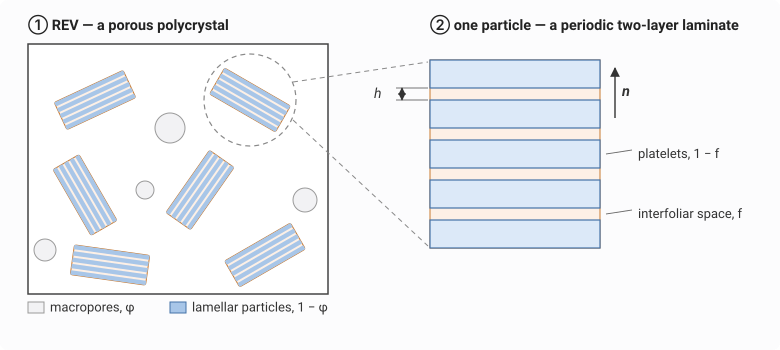
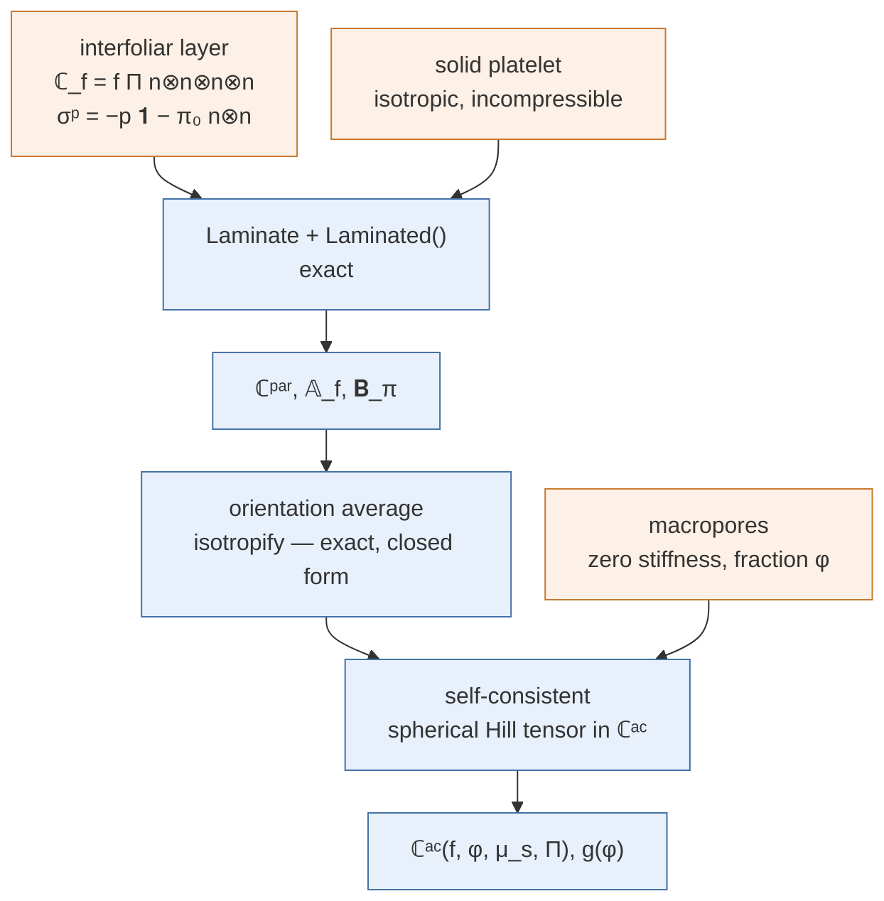
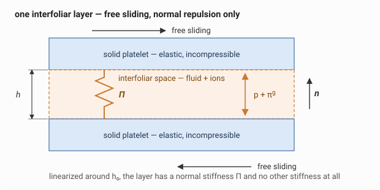

# [A lamellar porous material: swelling clays and C-S-H](@id app-lamellar)

Smectite clays and the calcium silicate hydrates that hold a cement paste
together share a morphology: the solid is not a continuum but a stack of
**parallel platelets**, a few nanometers apart, with water and ions in between.
Two things follow, and neither is a detail.

The platelets **slide freely** on the interfoliar fluid — nothing transmits a
tangential traction from one to the next. And they **repel each other**: the
platelet faces carry negative charges, the counter-ions in the interfoliar
water screen them imperfectly, and the resulting electrical field pushes the
platelets apart with an overpressure that grows as they come closer. The
macroscopic stiffness of such a material therefore has almost nothing to do
with the stiffness of the solid, and almost everything to do with an
electrical interaction. That is the model of
[dormieux2006feuillets](@cite), and this chapter derives it.

It is also the most complete example in this documentation of what the package
does **symbolically**: not a single number is entered. Every modulus, every
volume fraction is a `SymPy` symbol, the two scales are chained on symbols, two
degenerate limits are taken with `tlimit`, and the closed
forms come out of `solve`.

!!! note "This chapter derives; the script also checks"
    [`scripts/46_lamellar_porous_swelling.jl`](https://github.com/MicroPoroChemoMechanics/MeanFieldHomogenization.jl/blob/main/scripts/46_lamellar_porous_swelling.jl)
    runs the same derivation and then compares **every** intermediate result
    with the corresponding published equation, each comparison a `simplify`
    that must return exactly zero, plus a numerical cross-check against
    [`SelfConsistent`](@ref). Here we only derive, so the page stays readable.

!!! tip "Running it yourself"
    Every code block below is executed when this documentation is built, in
    **one** session and in the order shown, so pasting them one after another
    into a REPL reproduces the page exactly. You need
    `MeanFieldHomogenization`, `TensND`, `SymPy`, `Printf` and `Plots`; `SymPy`
    in turn needs a working Python `sympy`, which the repository's
    `docs/Project.toml` already provides.

## The microstructure, and the two scales



Two porosities, nested:

| | Scale | What it contains | Homogenization |
|:-:|:------|:-----------------|:---------------|
| ② | one **particle** | solid platelets (``1-f``) + interfoliar space (``f``), all normal to ``\underline{n}`` | exact — it is a laminate |
| ① | the **REV** | particles of every orientation (``1-\varphi``) + macropores (``\varphi``) | self-consistent — no phase is a matrix |

The separation of scales is what makes this legitimate: the macropores are of
the order of the particles themselves, far larger than the interfoliar
distance.



## The interfoliar layer



Everything the model needs about the electrochemistry is packed into **one
scalar function**. Let ``p`` be the pressure in the macropores and ``h`` the
distance between two platelets. The interfoliar fluid, in equilibrium with the
macropores, acts on the platelet faces as if its pressure were ``p + \pi^g``,
where the *swelling overpressure* ``\pi^g(h, n_M)`` depends on ``h`` and on the
ion concentration ``n_M`` in the macropores. The interfoliar stress is
therefore purely normal-plus-hydrostatic,

```math
\underline{\underline{\sigma}}_f
   = -p\,\mathbf{1} - \pi^g\,\underline{n} \otimes \underline{n} ,
```

and there is no tangential term at all: that *is* the free sliding.

Linearizing ``\pi^g`` around the reference distance ``h_o`` is the only
approximation of this step. With ``\varepsilon = \underline{n}\otimes
\underline{n} : \underline{\underline{\varepsilon}}_f = (h - h_o)/h_o`` the
only strain measure the layer feels,

```@example lamellar
using MeanFieldHomogenization
using TensND
using SymPy
using Printf

# h₀ = reference interfoliar distance      dπ = ∂π^g/∂h at h₀
# π₀ = π^g_o, the swelling overpressure in the reference configuration
# f  = interfoliar volume fraction          p = pressure in the macropores
@syms h₀::positive dπ::real p::real π₀::real f::positive
@syms μs::positive ks::positive Π::positive    # platelet shear and bulk moduli, Π
@syms ε::real                                  # ε = n⊗n : ε_f = (h − h₀)/h₀

πg = π₀ + h₀ * dπ * ε                          # first-order expansion of π^g
σ_nn = -p - πg                                 # the n⊗n component of σ_f
```

An affine function of the strain is a linear elastic law with an initial
stress, and reading the two parts off costs one derivative and one
substitution:

```@example lamellar
@printf "prestress   σᵖ_nn = %s\n" string(tsubs(σ_nn, ε => 0))
@printf "stiffness  C_nnnn = %s\n" string(tdiff(σ_nn, ε))
```

So the interfoliar layer behaves as a material with a **single non-zero
stiffness component**,

```math
\mathbb{C}_f = f\,\Pi\;
   \underline{n}\otimes\underline{n}\otimes\underline{n}\otimes\underline{n},
\qquad
\Pi = -\frac{h_o}{f}\,\frac{\partial \pi^g}{\partial h} \;>\; 0 ,
```

positive because the swelling pressure decreases as the platelets move apart,
and a prestress ``\underline{\underline{\sigma}}^p = -p\,\mathbf{1} - \pi^g_o\,
\underline{n}\otimes\underline{n}``. No shear stiffness, no in-plane stiffness:
a spring, and nothing else.

## Scale ②: the particle is a laminate

`Laminate` is the one cell in the package solved **exactly** — no reference
medium, no Eshelby problem — so the particle needs no approximation beyond the
one already made.

Written as it stands, though, ``\mathbb{C}_f`` is *singular*: its out-of-plane
block cannot be inverted, and the laminate kernel needs that inverse. The fix
is the honest one — regularize with an isotropic ``(\kappa_w, \mu_w)``, then
send it to zero. The platelets being incompressible adds a second limit,
``k_s \to \infty``. Both are genuine limit passages, taken with `tlimit`,
which acts on the few canonical coefficients of a structured tensor and gives
back the same type.

```@example lamellar
@syms κw::positive μw::positive                # the regularization, sent to 0

n̂ = (0, 0, 1)
𝟏 = TensISO{3}(one(Π))                         # second-order identity
nn = TensTI{2}(zero(Π), one(Π), n̂)             # n⊗n
W₁ = TensTI{4}(one(Π), zero(Π), zero(Π), zero(Π), zero(Π), n̂)   # n⊗n⊗n⊗n

C_platelet    = TensISO{3}(3ks, 2μs)
C_interfoliar = TensISO{3}(3κw, 2μw) + f * Π * W₁

particle = Laminate(; normal = n̂)
add_layer!(particle, :PLATELET,    Dict(:C => C_platelet);    fraction = 1 - f)
add_layer!(particle, :INTERFOLIAR, Dict(:C => C_interfoliar); fraction = f)
```

``\underline{n}\otimes\underline{n}\otimes\underline{n}\otimes\underline{n}``
is exactly the first Walpole tensor, which is why one coefficient describes
``\mathbb{C}_f`` completely.

Solving the cell and localizing into the interfoliar layer, then taking the two
limits:

```@example lamellar
phys(t) = tsimplify(tlimit(tlimit(tlimit(t, μw, 0), κw, 0), ks, oo))

Cpar = phys(homogenize(particle, Laminated(), :C))
A_f = phys(strain_strain_loc(particle, :INTERFOLIAR))

println(typeof(Cpar), "   ← exactly TI about n, and major-symmetric (N = 5)")
println(typeof(A_f), "   ← TI too, but a concentration tensor has no major symmetry (N = 6)")
```

Both come back as **exact** transversely isotropic tensors about the platelet
normal — six Walpole coefficients rather than 81 components, which is what
keeps the rest of the page symbolically tractable. Here is the whole particle
stiffness, in Kelvin-Mandel form:

```@example lamellar
KM(Cpar)
```

Everything the model says about a particle is in that matrix.
``\mathbb{C}^{par}_{3333} = \Pi``: the normal
stiffness of the particle **is** the interfoliar spring, and it does not depend
on ``f``. The rows and columns 4 and 5 are identically zero: no shear stiffness
on any plane containing ``\underline{n}`` — the free sliding survives
homogenization untouched. What is left is the in-plane block, carried by the
platelets (the ``\mu_s`` terms), plus the rank-one contribution of the spring.
Those are exactly the same components read off the tensor one at a time:

```@example lamellar
@printf "ℂᵖᵃʳ_nnnn = %s\n" string(tsimplify(Cpar[3, 3, 3, 3]))
@printf "ℂᵖᵃʳ_ntnt = %s\n" string(tsimplify(Cpar[2, 3, 2, 3]))
```

The interfoliar localization tensor is just as compact — its six Walpole
coefficients, in the order ``(\ell_1, \ldots, \ell_6)``:

```@example lamellar
get_data(A_f)
```

### The tensor ``\mathbf{B}_\pi``, and Levin

The prestress does not average trivially, and what it averages to is the
tensor that carries the deviation from Terzaghi's effective stress all the way
up. It is built from the interfoliar localization tensor:

```@example lamellar
Bπ = tsimplify(f * (nn ⊡ A_f))
get_data(Bπ)          # (transverse, axial) coefficients of  a nT + b n⊗n
```

that is ``\mathbf{B}_\pi = (1-f)\,\mathbf{1} + f\,\underline{n}\otimes
\underline{n}`` — the axial coefficient is 1 and the transverse one is
``1 - f``. Levin's theorem then gives the particle's state equation; only the
interfoliar layer is prestressed, so a single term survives:

```@example lamellar
σp = -p * 𝟏 - π₀ * nn                    # only the interfoliar layer is prestressed
Σ_pre = tsimplify(f * (σp ⊡ A_f))
a, b = get_data(Σ_pre)                   # transverse and axial coefficients
@printf "f σᵖ : 𝔸_f = (%s) (𝟏 − n⊗n) + (%s) n⊗n\n" string(sympy.collect(a, π₀)) string(sympy.collect(b, π₀))
```

Transverse ``-p - (1-f)\pi^g_o``, axial ``-p - \pi^g_o``: that is exactly
``-p\,\mathbf{1} - \pi^g_o\,\mathbf{B}_\pi``, and the particle's state
equation reads

```math
\underline{\underline{\Sigma}}
  = \mathbb{C}^{par} : \underline{\underline{E}}
  \;-\; p\,\mathbf{1} \;-\; \pi^g_o\,\mathbf{B}_\pi .
```

## Scale ①: the porous polycrystal

The REV has no matrix — particles of every orientation and macropores of zero
stiffness, all of them spherical in shape — so the **self-consistent** scheme
is the natural closure, with the Hill tensor of a sphere in the running
isotropic estimate ``\mathbb{C}^{ac} = 3k^{ac}\mathbb{J} + 2\mu^{ac}\mathbb{K}``.

The orientation average is the part usually done by quadrature. It does not
have to be: the average of a tensor over SO(3) is a closed-form linear map on
its Walpole coefficients, and that is precisely what `isotropify` computes —
the very routine the package runs behind `symmetrize = :iso`. Nothing is
discretized here.

```@example lamellar
@syms κ::positive μ::positive φ::positive

C_ac = TensISO{3}(3κ, 2μ)
sphere = Ellipsoid(1.0)
A_par = strain_strain_loc(sphere, Cpar, C_ac)    # (𝕀 + ℙ:(ℂᵖᵃʳ − ℂᵃᶜ))⁻¹

# The macropores have zero stiffness: they contribute nothing to ⟨ℂ:𝔸⟩, so the
# self-consistent condition ℂᵃᶜ = ⟨ℂ:𝔸⟩ reads
CA = isotropify(Cpar ⊡ A_par)          # the exact SO(3) average — a TensISO
residual = get_data(C_ac - (1 - φ) * CA)   # two scalars: the 𝕁 and 𝕂 parts
println(typeof(CA), " ⇒ ", length(residual), " scalar equations in (κ, μ)")
```

The same average, applied to ``\mathbf{B}_\pi : \mathbb{A}^{par}``, gives the
macroscopic Terzaghi deviation ``g``, which is isotropic and hence a single
number:

```@example lamellar
g_expr = (1 - φ) * get_data(isotropify(Bπ ⊡ A_par))[1]
typeof(g_expr)        # one scalar, still a function of κ, μ, φ, f, μs and Π
```

## The leading order in ``\Pi/\mu_s``

Osmotic swelling puts ``\Pi`` orders of magnitude below the elasticity of the
solid, so the interesting regime is ``\Pi/\mu_s \ll 1``. Rather than send a
modulus to infinity inside a large rational fraction, nondimensionalize:
``\mu_s = \Pi/t`` with ``t \to 0^+``, then ``\kappa = \Pi x`` and
``\mu = \Pi y``. Both ``\Pi`` and ``f`` then leave the equations of their own
accord.

```@example lamellar
@syms t::positive x::positive y::positive

reduce_lead(z) = tsimplify(
    sympy.cancel(
        sympy.limit(
            sympy.cancel(sympy.together(tsubs(z, κ => Π * x, μ => Π * y, μs => Π / t))),
            t, 0, "+",
        )
    )
)

eq1 = tsimplify(sympy.cancel(reduce_lead(residual[1]) / Π))
eq2 = tsimplify(sympy.cancel(reduce_lead(residual[2]) / Π))
gA = reduce_lead(g_expr)

println("free symbols of the reduced system : ", eq1.free_symbols ∪ eq2.free_symbols)
```

There they are, in full — two rational equations in ``(x, y)`` with ``\varphi``
as the only parameter:

```@example lamellar
eq1
```

```@example lamellar
eq2
```

`Π` has canceled and `f` is nowhere to be seen. That is the physical content
of the model: at leading order the macroscopic elasticity depends on **neither
the platelet elasticity nor the interfoliar porosity** — only on the repulsive
interaction, through ``\Pi``, and on how much room the macropores leave.

`solve` takes them from here. The system has several roots; the physical one
is the branch with a positive shear modulus:

```@example lamellar
branches = sympy.solve([eq1, eq2], [x, y]; dict = true)
sol = first(
    b for b in branches
        if (v = Float64(tsubs(tsimplify(b[y]), φ => Sym(1) / 10)); isfinite(v) && v > 0)
)
xs, ys = tsimplify(sol[x]), tsimplify(sol[y])
sympy.factor(ys)
```

so that

```@example lamellar
ν_ac = tsimplify((3xs - 2ys) / (2 * (3xs + ys)))
g_ac = tsimplify(sympy.factor(tsubs(gA, x => xs, y => ys)))

@printf "μᵃᶜ / Π = %s\n" string(sympy.factor(ys))
@printf "νᵃᶜ     = %s\n" string(sympy.factor(ν_ac))
@printf "g(φ)    = %s\n" string(g_ac)
@printf "roots of μᵃᶜ : %s\n" string(sympy.solve(sympy.numer(sympy.cancel(ys)), φ))
```

The macroscopic state equation is then

```math
\underline{\underline{\Sigma}}
  = \mathbb{C}^{ac}\!\left(f, \varphi, \mu_s, \Pi\right) : \underline{\underline{E}}
  \;-\; p\,\mathbf{1} \;-\; g(\varphi)\,\pi^g_o\,\mathbf{1},
```

the last term being the departure from Terzaghi's principle — a macroscopic
stress that exists with no macroscopic strain and no pore pressure, produced
entirely by the repulsion between platelets at the nanometer scale.

## Reading the result

```@example lamellar
using Plots
gr()  # headless backend; GKSwstype is set to "100" in make.jl

φs = range(0.004, 0.2495; length = 200)
μ̂(v) = Float64(tsubs(ys, φ => Sym(v)))
ĝ(v) = Float64(tsubs(g_ac, φ => Sym(v)))

p1 = plot(φs, μ̂.(φs); lw = 2, label = "", ylims = (0, 8),
          xlabel = "macroporosity  φ", ylabel = "μᵃᶜ / Π")
vline!(p1, [0.25]; ls = :dash, lc = :gray, label = "percolation, φ = 1/4")
p2 = plot(φs, ĝ.(φs); lw = 2, label = "",
          xlabel = "macroporosity  φ", ylabel = "g")
vline!(p2, [0.25]; ls = :dash, lc = :gray, label = "percolation, φ = 1/4")
plot(p1, p2; layout = (1, 2), size = (900, 340),
     left_margin = 6Plots.mm, bottom_margin = 6Plots.mm, top_margin = 3Plots.mm)
```

Three things are worth stating plainly.

- **The macroscopic shear modulus is set by an electrical interaction.** It
  carries a factor ``\Pi`` and nothing of ``\mu_s``. Shearing one particle
  parallel to its platelets costs nothing on its own — the platelets simply
  slide — so the only resistance comes from the *normal* stiffness of the
  neighboring particles, whose platelets are not aligned with it. The material
  is stiff because it is disordered.
- **``\mu^{ac}`` decreases with ``\varphi`` and vanishes at ``\varphi = 1/4``,**
  the percolation threshold of the self-consistent scheme, and the coefficient
  ``g`` vanishes there too: past that porosity the particles no longer form a
  connected skeleton and the assembly carries no deviatoric stress at all. The
  value ``1/4`` is the scheme's, not nature's, and should be read as indicative.
- **``g \neq 1`` is a measurable departure from Terzaghi.** An effective stress
  ``\underline{\underline{\Sigma}} + p\,\mathbf{1}`` still contains
  ``-g\,\pi^g_o\,\mathbf{1}``: a swelling clay left to itself, at constant pore
  pressure, is under stress.
