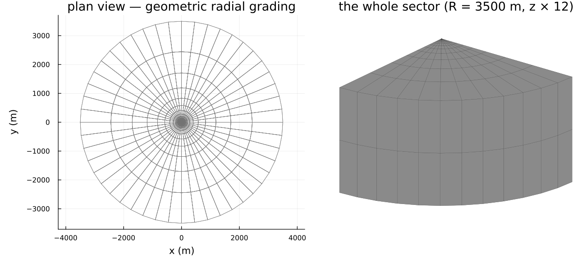
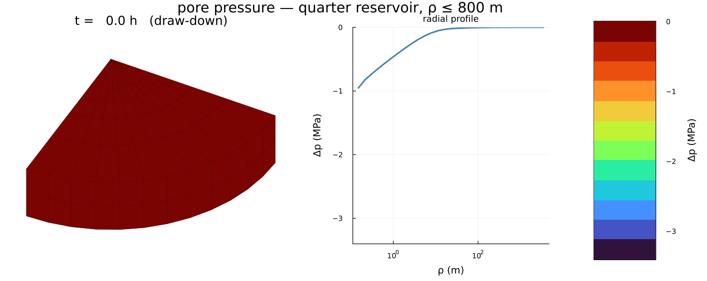
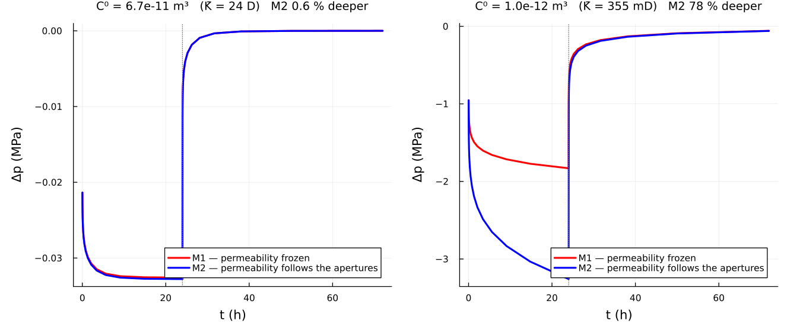
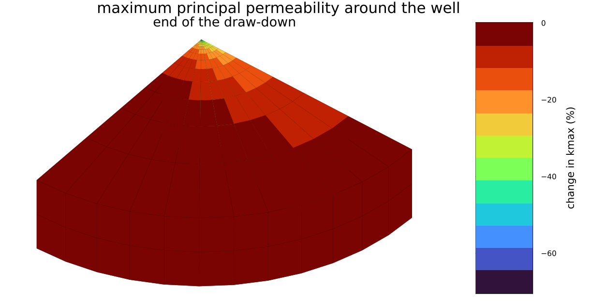

# [A fractured-reservoir well test](@id fe-arma2011)

A synthetic fractured reservoir produced by a vertical well, in which the
fracture apertures follow the effective stress and the permeability follows the
apertures. The model, the microstructure and the two comparison cases are those
of [barthelemyARMA2011](@cite), § 3.2.

Everything here is three-dimensional and **anisotropic**: two vertical fracture
families make the reservoir conduct six times better along ``\underline{e}_2``
than along ``\underline{e}_1``, in a problem whose geometry and loading are both
axisymmetric.

!!! note "This page is static"
    Figures come from `scripts/fe/arma2011_welltest.jl`, run by hand and
    committed. A documentation build never runs a coupled reservoir simulation.

## The microstructure

Solid phase ``E = 30`` GPa, ``\nu = 0.3``; matrix permeability
``10^{-18}\ \mathrm{m}^2``, so **the fractures carry the flow**.

| family | dip | dip azimuth | radius | aperture | conductivity | density |
|:--|:--|:--|:--|:--|:--|:--|
| 1 | 90° | 22.5° | 1 m | 10⁻³ m | 6.7·10⁻¹¹ m³ | 0.37 |
| 2 | 90° | 157.5° | 1 m | 10⁻³ m | 6.7·10⁻¹¹ m³ | 0.37 |

```julia
props = Dict(:C => C_SOLID, :K => TensISO{3}(1.0e-18))
rve = RVE(:M)
add_matrix!(rve, Ellipsoid(1.0), props)
for φ in (π/8, 7π/8)                       # dip 90° ⇒ the normal is horizontal
    add_phase!(rve, gensym(), ConductiveCrack(1.0; conductivity = 6.7e-11,
               euler_angles = (π/2, φ)), props; density = 0.37)
end
mat = FracturedPoroelasticRock(rve, SelfConsistent(); ω₀ = (5.0e-4, 5.0e-4),
                               k_matrix = 1.0e-18)
```

One microstructure, every coefficient the coupled problem needs:

```text
ℂʰᵒᵐ₃₃₃₃ = 3.189·10⁴ MPa
𝐁       = diag(0.9157, 0.7212, 0.4911)             anisotropic Biot tensor
1/M     = 2.837·10⁻⁵ MPa⁻¹
𝐊       = diag(9.66·10⁻¹², 5.63·10⁻¹¹, 5.81·10⁻¹¹) m²
```

Both families are vertical, so ``\underline{e}_3`` lies in *both* fracture
planes and conducts most; ``\underline{e}_1`` bisects the two normals and
conducts least. A density of 0.37 per family is **past the percolation
threshold** of this network, which is why ``\boldsymbol{K}`` is set by the
fracture conductivity and not by the matrix.

## Geometry, mesh, and why a quarter is enough

A cylinder of radius 3500 m and height 200 m, produced along its axis. A
fracture normal is defined up to a sign, so reflecting about ``\underline{e}_1``
maps the 22.5° family onto the 157.5° one, and so does reflecting about
``\underline{e}_2``: the microstructure has both symmetry planes and a quarter
model with rolling conditions is exact.

The radial layers are **geometric** ([`cylinder_sector_grid`](@ref fe-backends)):
the pressure drop is logarithmic in ``\rho``, so uniform layers would resolve
nothing at the well and waste every element far from it.



| | |
|:--|:--|
| 672 hexahedra, 4524 dofs | ``\mathbb{Q}_1/\mathbb{Q}_1`` for ``(\underline{u}, p)`` |
| ``\rho`` from 0.15 m to 3500 m | 28 geometric layers |
| draw-down 24 h at ``5\cdot 10^{-4}\ \mathrm{m^3/s}`` per meter of well | then shut in for 48 h |

Prescribed flow rate on the well wall, no flow through the top and bottom faces,
``p = 0`` on the outer boundary; rolling on the bottom and lateral boundaries,
free top face.

## The solve

The weak form, its backward-Euler discretization and the four tangent blocks are
on [the coupled poroelastic problem](@ref fe-poro-coupling); the driver is
thirty lines around [`mfh_poro_element!`](@ref fe-backends) and knows nothing
about fractures.

```julia
EXT.mfh_poro_element!(
    Ke, re, cvu, cvp, material, xe[URANGE], xe[PRANGE],
    states[cellid(cell)], states_old[cellid(cell)], Δt, mob[cellid(cell)];
    u_range = URANGE, p_range = PRANGE, cache = cache
)
```

Two models are compared, as in the reference:

| | |
|:--|:--|
| **M1** | the homogenized properties are computed once and frozen |
| **M2** | apertures follow the Terzaghi effective stress, conductivities follow the cubic law, ``\boldsymbol{K}`` follows |

Both share the same mechanics: for flat cracks ``\mathbb{H}`` is the
``\omega \to 0`` limit and carries no aperture, so as long as no family closes,
``\mathbb{C}^{\rm hom}``, ``\boldsymbol{B}`` and ``M`` are identical in M1 and
M2. **The two models differ through the permeability alone** — which makes the
comparison a clean measurement of the hydromechanical coupling.

## The pressure field



The isobars are **elongated along** ``\underline{e}_2``, the direction the
fracture network conducts best: an anisotropic microstructure printing itself on
an axisymmetric problem.

## Well pressure



Pressure falls during the draw-down and recovers after the well is shut in; M2
draws down **deeper than M1**, because the pressure drop closes the fractures a
little, the cubic law turns that into a conductivity drop, and a less permeable
reservoir needs a larger draw-down to deliver the same rate. The build-up is far
less sensitive.

### Two cases, and why

Taking the table above literally, the permeability estimate used here gives a
**23-darcy** reservoir, a draw-down of 33 kPa and a 0.6 % gap between the two
models — the left panel, which looks flat because it *is* flat. The published
figures are an order of magnitude away: −1.8 MPa for M1 and a 33 % gap.

Steady radial flow gives ``\Delta p = q\mu\ln(R/\rho_w)/(2\pi\bar{K})``, so
−1.8 MPa implies ``\bar{K} \approx 4.6\cdot10^{-13}\ \mathrm{m^2}`` — about
470 mD, consistent with the published permeability map. The estimate here
returns ``2.3\cdot10^{-11}\ \mathrm{m^2}``, **≈ 55 times larger**, and that one
number propagates linearly through the whole chain:

```math
\Delta p \propto \frac{1}{\bar{K}},
\qquad
\Delta\omega_i = \underline{n}_i\cdot(\mathbb{S}_i : \Delta\boldsymbol{\Sigma}')\cdot\underline{n}_i
   \propto \Delta p ,
\qquad
\frac{\Delta C_i}{C_i} = 3\,\frac{\Delta\omega_i}{\omega_i} .
```

The right panel tests that reading directly: the fracture conductivity is
calibrated to ``\bar{K} = 350`` mD — the knob § 1.3 of the reference leaves
open, since ``C^0`` may differ from the Poiseuille value "to account for
tortuosity due to the roughness of fracture lips or to the fracture filling" —
and nothing else is touched. Then

| | M1 draw-down at 24 h | M2 vs M1 | ``k_{\max}`` at the well face |
|:--|:--|:--|:--|
| here, calibrated | **−1.83 MPa** | +78 % | −70 % |
| published | −1.8 MPa | +33 % | ≈ −50 % |

M1 lands on the published value, and the draw-down is still declining at 24 h
rather than stabilized, as published — the diffusion time scales as
``1/\bar{K}`` too. The *coupling* comes out about twice too strong: calibrating
the conductivity fixes the permeability **level**, but not its **sensitivity**,
and past percolation this estimate is very nearly proportional to ``C_i``,
whereas the reference damps that response. Same mechanisms, same
signs, an amplitude a factor two apart.



The permeability is reduced near the well, where the pressure variation is most
negative, and the reduction is itself anisotropic — the isovalue bands are not
circular.

## [What this reproduces, and what it does not](@id fe-arma2011-scope)

- **Reproduced**: the microstructure, the joint poroelastic and hydraulic
  upscaling from one RVE, the Terzaghi-driven aperture update, the cubic law,
  the coupled *u–p* simulation and both models — with the published draw-down
  magnitude once the permeability level is matched, and every qualitative
  conclusion of § 3.2.
- **Not reproduced**: the reference's self-consistent permeability, which
  carries a matrix concentration factor built on the order-2 Hill tensor of the
  effective medium. The estimate here reads each family's saturated contribution
  in the effective medium *without* that factor
  ([`fracture_permeability`](@ref MeanFieldHomogenization.Schemes.fracture_permeability)),
  so the two agree in structure — same percolation mechanism, same saturation —
  but differ by ≈ 55 on the level and ≈ 2 on the sensitivity. It is not
  transcribed here because the equations that define it are, in the copy at
  hand, not legible with enough confidence to implement without guessing.
- **Not shipped**: the consolidation column of § 3.1, models M1/M2/M3 — the case
  where a family actually *closes* during the loading. Everything it needs is
  here; see the [roadmap](@ref dev-roadmap).
