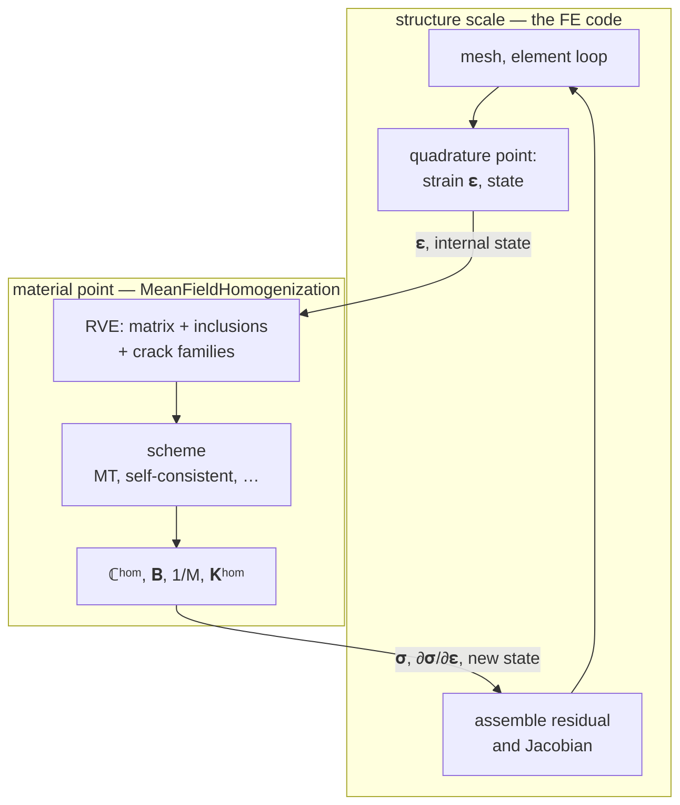

# [Finite-element coupling](@id fe-coupling)

MeanFieldHomogenization used **as a constitutive law inside a structural
finite-element computation** — the role an MFront behavior or an Abaqus UMAT
plays. One microstructure stands for one material point: the FE code hands over
a strain, the package hands back a stress and a consistent tangent.

!!! warning "Two opposite couplings — this is not [`fe_inclusions`](@ref man-fe-inclusions)"
    | | who calls whom | what it produces |
    |:--|:--|:--|
    | [Finite-element inclusions](@ref man-fe-inclusions) | **MFH calls** the FE solver | one inclusion's response, when no closed form exists |
    | This section | **the FE code calls MFH** | a material law at every Gauss point |

## Why bother

A closed-form law is written once and fitted to data. A homogenized law is
*derived* from the microstructure, so the same computation also tells you what
each phase is doing — and lets the microstructure evolve. That is what makes the
fractured-reservoir model of [barthelemyARMA2011](@cite) possible: fracture
apertures follow the effective stress, and the permeability follows the
apertures.

## Reading order

| Page | |
|:--|:--|
| [Scale transition](@ref fe-scale-transition) | the equations: incremental format, consistent tangent, tangent blocks |
| [Materials](@ref fe-materials) | the Gauss-point contract, in code |
| [Fractured permeability](@ref fe-permeability) | flowing cracks and the effective conductivity of a fracture network |
| [Ferrite backend](@ref fe-backends) | the three helpers a Ferrite driver needs |
| [Thick-walled cylinder](@ref fe-thick-cylinder) | worked model, checked against Lamé, then with closing cracks |

The Biot machinery the poroelastic coupling builds on is a property of a
microstructure rather than of the coupling, so it lives on its own page:
[Poromechanics](@ref manual-poromechanics).
