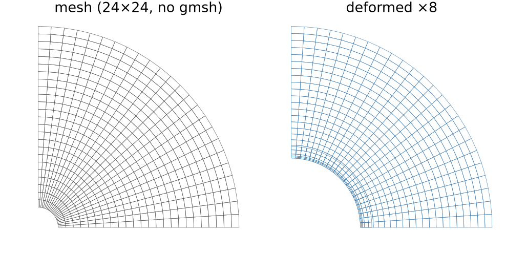
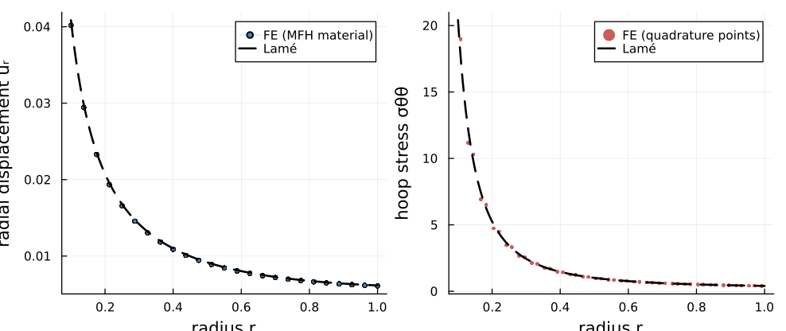
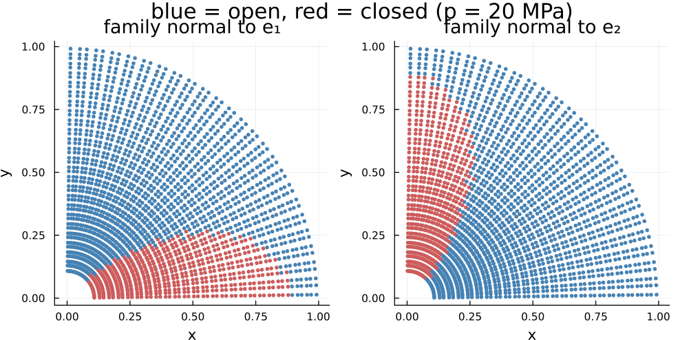
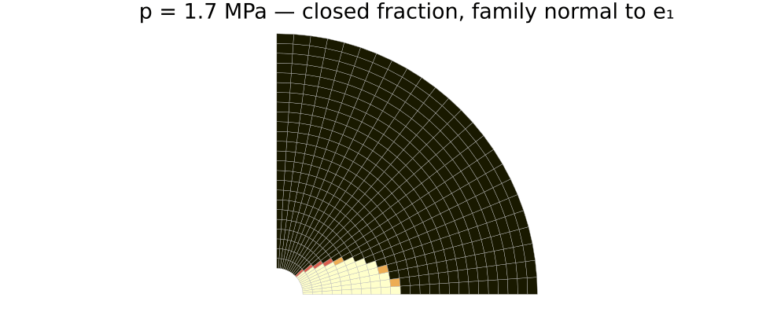

# [Thick-walled cylinder](@id fe-thick-cylinder)

The canonical MFront/FEniCS coupling demonstration, run the other way round:
every Gauss point carries a **microstructure**, and the scheme that upscales it
supplies the stress and the tangent.

Quarter annulus, plane strain, internal pressure ``p = 20`` MPa:

```math
\sigma_{rr}(R_i) = -p, \qquad \sigma_{rr}(R_o) = 0,
\qquad u_\theta = 0 \ \text{ on } \ \theta = 0,\ \tfrac{\pi}{2}.
```



The mesh is a structured rectangle bent into ``(\rho, \theta)`` —
[`annulus_grid`](@ref fe-backends) — so no gmsh is involved.

!!! note "This page is static"
    Figures come from `scripts/fe/make_thick_cylinder_figures.jl`, run by hand
    and committed, so no documentation build re-runs a finite-element solve. The
    model itself is `scripts/88_fe_thick_cylinder.jl`.

## Step 1 — a linear composite, against Lamé

A matrix with 25 % stiff spherical inclusions is isotropic, so the closed form
applies with the *homogenized* moduli:

```math
u_r(r) = \frac{(1+\nu)\,p\,R_i^2}{E\,(R_o^2-R_i^2)}
         \left[(1-2\nu)\,r + \frac{R_o^2}{r}\right],
\qquad
\sigma_{\theta\theta}(r) = \frac{p\,R_i^2}{R_o^2-R_i^2}\left(1+\frac{R_o^2}{r^2}\right).
```

```julia
rve = RVE()
add_phase!(rve, :M, Ellipsoid(1.0), Dict(:C => TensISO{3}(3 * 30.0, 2 * 18.0)); fraction = :rest)
add_phase!(rve, :I, Ellipsoid(1.0), Dict(:C => TensISO{3}(3 * 120.0, 2 * 80.0));
           fraction = 0.25)

mat = HomogenizedElastic(rve, MoriTanaka())      # E = 61.76 GPa, ν = 0.2427
```



The error converges at the expected second order for Q1 elements, which is what
validates the coupling — any defect in the plumbing would show up here:

| mesh | 24×24 | 48×48 | 96×96 |
|:--|:--|:--|:--|
| ``\max\lvert u_r - u_r^{\rm Lam\acute{e}}\rvert / \max\lvert u_r^{\rm Lam\acute{e}}\rvert`` | 1.6·10⁻² | 4.3·10⁻³ | 1.1·10⁻³ |

## Step 2 — cracks that close

Two crack families, normals ``\underline{e}_1`` and ``\underline{e}_2``, replace the
inclusions. Nothing else in the driver changes:

```julia
add_phase!(rve, :Fx, PennyCrack(1.0; euler_angles = (π/2, 0.0)), props; density = 0.15)
add_phase!(rve, :Fy, PennyCrack(1.0; euler_angles = (π/2, π/2)), props; density = 0.15)

mat = MicrocrackedMaterial(rve, MoriTanaka(); ω₀ = (2.0e-3, 2.0e-3))
```

A family closes where the traction normal to its plane turns compressive. In a
pressurized cylinder ``\sigma_{rr} < 0`` and ``\sigma_{\theta\theta} > 0``, and a
crack of normal ``\underline{e}_1`` sees

```math
\sigma_{11} = \sigma_{rr}\cos^2\theta + \sigma_{\theta\theta}\sin^2\theta ,
```

so it closes near ``\theta = 0`` and stays open near ``\theta = \pi/2`` — while
the ``\underline{e}_2`` family does the mirror image. The result is an anisotropy
that varies **with position and with the load**, which no fitted law reproduces:





## What it costs

```
cracked run: 4 scheme solves for 2304 quadrature points
```

The homogenized stiffness depends on the state only through the *discrete*
open/closed set — for a flat crack ``\mathbb{H}`` is the ``\omega \to 0`` limit
and carries no aperture — so a [`MaterialCache`](@ref) reduces 12 load steps ×
Newton iterations × 2304 points to **four** Mori-Tanaka solves.

The tangent is exact on every branch, so Newton keeps quadratic convergence
without any algorithmic tangent being derived: see
[scale transition](@ref fe-scale-transition).
