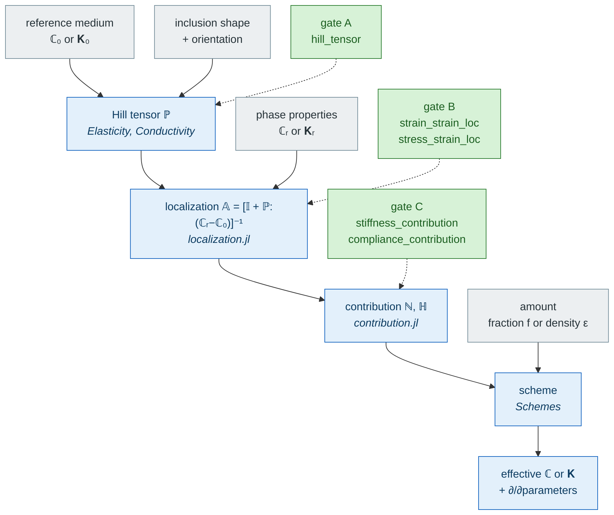

# MeanFieldHomogenization.jl

Julia framework for **mean-field homogenization** of heterogeneous materials:
predict the effective elastic, transport and viscoelastic properties of a
microstructure from the properties, shapes, orientations and volume fractions
of its phases.

Given a reference medium and an inclusion shape, `MeanFieldHomogenization` builds the
Hill polarization tensor ``\mathbb{P}`` (Eshelby's result), derives the
localization tensor for each phase, and assembles a **homogenization scheme**
— dilute, Mori–Tanaka, self-consistent, differential, PCW, or the classical
bounds — into an effective stiffness or conductivity. The same machinery
handles flat cracks (opening-displacement and intensity factors), composite
`n`-layer spheres and confocal spheroids with imperfect interfaces, periodic
laminates, and ageing linear viscoelasticity, all under one abstraction
hierarchy, a shared numerical core, and forward-mode automatic differentiation
throughout.

Two directions go beyond that one-site picture, and each has a section of its
own:

- **N-body schemes.** Given the *positions* of the inclusions, the cluster model
  and the equivalent inclusion method resolve the pairwise interaction instead of
  averaging it, and both collapse exactly onto Mori–Tanaka when it is switched
  off — see [Particle assemblies](@ref man-assemblies).
- **Homogenization as a constitutive law.** One microstructure per Gauss point,
  handing a structural finite-element code a stress, a consistent tangent and the
  Biot coefficients of an evolving microstructure — see
  [Finite-element coupling](@ref fe-coupling).

`MeanFieldHomogenization` is a pure-Julia reimplementation of the Eshelby/Hill machinery
of the [Echoes](https://jfbarthelemy.github.io/echoes/) C++/Python
codebase; see [From Echoes to MeanFieldHomogenization](@ref tools-from-echoes) for the translation guide
and [Theory — reading path](theory/index.md) for the shared conventions and
bibliography.

## The chain, in one picture

Everything the package does is one pipeline, read top to bottom. The **gray**
boxes are what you supply — each entering at the stage that needs it — the
**blue** ones what the package computes, and the **green** ones on the right
the three places where you can plug in your own physics without touching the
library.



**The three green gates are the extension mechanism.** A morphology
`MeanFieldHomogenization` knows nothing about becomes a first-class citizen of *every*
scheme by answering one of them — implement the lowest you can reach and the
package derives the rest algebraically. Four routes already use them:

| Route | Gate | Where the answer comes from |
| :--- | :---: | :--- |
| ellipsoids, cylinders, cracks | A | closed forms, quadrature or residues |
| [composite spheres and spheroids](@ref MeanFieldHomogenization.LayeredSpheres) | B | the Hervé–Zaoui recurrences — a layered pattern has no Hill tensor |
| [finite elements](@ref man-fe-inclusions) | B / COD | a `Ferrite` or `Gridap` solve of the Eshelby problem |
| [neural surrogates](@ref man-neural-inclusions) | A / B | a trained network, differentiable in the morphology |
| [your own](@ref man-custom-inclusions) | A, B or C | a formula, a solver, a table — anything callable |

Cracks and flat objects follow the same chain with ``\mathbb H`` in place of
``\mathbb N`` and a density in place of a volume fraction; transport is the same
picture at tensor order 2, and ageing viscoelasticity the same picture with
Volterra products in place of tensor products. The contract is written up in
[Adding a new inclusion](@ref dev-adding-inclusion).

## Installation

`MeanFieldHomogenization` is registered in Julia's General registry.

```julia
julia> import Pkg; Pkg.add("MeanFieldHomogenization")
```

Seven optional package extensions cover the cubature backend, the SciML
fixed-point solvers, symbolic closed forms, the two finite-element backends, the
Ferrite material interface of the [finite-element coupling](@ref fe-coupling) and
neural-surrogate training — see [Installation](@ref man-installation).

## Citation

If you use MeanFieldHomogenization.jl in your work, please cite the following:

```bibtex
@software{meanfieldhomogenization_jl,
  author = {Barthélémy, Jean-François},
  title  = {MeanFieldHomogenization.jl: Mean-field homogenization of heterogeneous materials},
  doi    = {10.5281/zenodo.21884243},
  url    = {https://doi.org/10.5281/zenodo.21884243},
}
```

`CITATION.cff` in the repository root carries the same metadata in a
machine-readable form.

## Where to start

| If you want to… | Go to |
| :--- | :--- |
| understand the theory before using the code | [Theory](theory/index.md) — the Eshelby/Hill chain, in the order it is built |
| install the package and run the first example | [Installation](manual/installation.md) |
| learn the API by worked example, topic by topic | [Tutorials](tutorials/index.md) |
| see full micromechanical models of real materials | [Applications](applications/cement_paste.md) — cement paste, concrete, bituminous mixtures |
| use a microstructure as a material law in an FE code | [Finite-element coupling](@ref fe-coupling) |
| build a model in a browser, or port one from Echoes | [Tools and migration](tools/from_echoes.md) — the translation guide, the converter, MFH Studio |
| look up a function's docstring | [API reference](api/elliptic.md) |
| extend the package (new inclusion, algorithm, scheme) | [Developer guide](developer/architecture.md) |

## Sub-modules

| Module | Responsibility |
| :--- | :--- |
| [`MeanFieldHomogenization.Elliptic`](@ref) | Type-generic Legendre and Carlson elliptic integrals (`ForwardDiff`/`Sym` compatible). |
| [`MeanFieldHomogenization.Core`](@ref) | Abstractions, traits, shared numerics (Green/Newton kernels, Masson residue algorithm, DECUHR seam). |
| [`MeanFieldHomogenization.Elasticity`](@ref) | Hill polarization tensor for ellipsoidal inclusions and infinite cylinders (2D/3D, iso/aniso/TI-coaxial). |
| [`MeanFieldHomogenization.Cracks`](@ref) | Crack-opening-displacement (COD) tensor, compliance contribution, stress/displacement intensity factors. |
| [`MeanFieldHomogenization.Conductivity`](@ref) | Second-order Hill tensor for transport problems (diffusion, conduction, Darcy flow), closed form for any matrix anisotropy. |
| [`MeanFieldHomogenization.LayeredSpheres`](@ref) | `n`-layer composite spheres (Hervé–Zaoui, Christensen–Lo), five interface types, volume-average and pointwise localization. |
| [`MeanFieldHomogenization.LayeredSpheroids`](@ref) | `n`-layer confocal spheroids, conduction, Kapitza / surface-conductive interfaces, series or quadrature evaluation. |
| [`MeanFieldHomogenization.Laminates`](@ref) | Periodic multilayer cell: no matrix, no Eshelby problem — an *exact* solution in elasticity and transport, same imperfect interfaces, per-layer localization. |
| [`MeanFieldHomogenization.Schemes`](@ref) | RVE container and `homogenize`; Voigt, Reuss, Dilute, Mori–Tanaka, Maxwell, PCW, self-consistent, asymmetric SC, differential, cluster model, equivalent inclusion; exact vs. best-fit symmetrization; `ForwardDiff` sensitivities. |
| [`MeanFieldHomogenization.Interactions`](@ref) | Two-inclusion interaction tensor ``\mathbb{T}^{ab}`` and the Green operator of the reference — closed forms for balls and disks, cubature for the anisotropic case. |
| [`MeanFieldHomogenization.Assemblies`](@ref) | `ParticleAssembly`: the cell that carries positions, its generators and boundary treatments — what the two N-body schemes act on. |
| [`MeanFieldHomogenization.Poromechanics`](@ref) | Biot coefficient tensor and skeleton modulus of a porous or cracked microstructure, for saturated and drained responses. |
| [`MeanFieldHomogenization.Constitutive`](@ref) | The Gauss-point contract: a microstructure exposed to a finite-element code as a material law returning stress, tangent and updated state. |
| [`MeanFieldHomogenization.Viscoelasticity`](@ref) | Ageing linear viscoelasticity via Volterra operators — every scheme, cracks and layered spheres included. |
| [`MeanFieldHomogenization.CustomInclusions`](@ref) | The user-defined inclusion contract: `CustomInclusion` (callback-driven) and `check_inclusion_interface`. |
| [`MeanFieldHomogenization.FiniteElements`](@ref) | Inclusions whose response comes out of a finite-element solve of the Eshelby problem, behind a backend contract (`Ferrite` or `Gridap`). |
| [`MeanFieldHomogenization.NeuralInclusions`](@ref) | Inclusions whose response comes out of a trained network, with the sampling and fitting machinery; differentiable in the morphology. |

## Quick example

```julia
using MeanFieldHomogenization, TensND

# Isotropic matrix, bulk/shear moduli (k, μ) = (30, 10) GPa
C₀ = iso_stiffness(30.0, 10.0)

# Hill polarization tensor for a spherical inclusion
P = hill_tensor(Ellipsoid(1.0), C₀)

# A porous material, 10 % spherical voids, homogenized by Mori-Tanaka
rve = RVE(:M)
add_matrix!(rve, Ellipsoid(1.0), Dict(:C => C₀))
add_phase!(rve, :V, Ellipsoid(1.0), Dict(:C => iso_stiffness(0.01, 0.005)); fraction = 0.1)
k_eff, μ_eff = k_mu(homogenize(rve, MoriTanaka(), :C))
```

Every entry point differentiates through `ForwardDiff` and accepts symbolic
(`SymPy`/`Symbolics`) coefficients out of the box — see
[Derivatives and sensitivities](tutorials/sensitivities.md) and
[Symbolic spheres](tutorials/symbolic_spheres.md).
