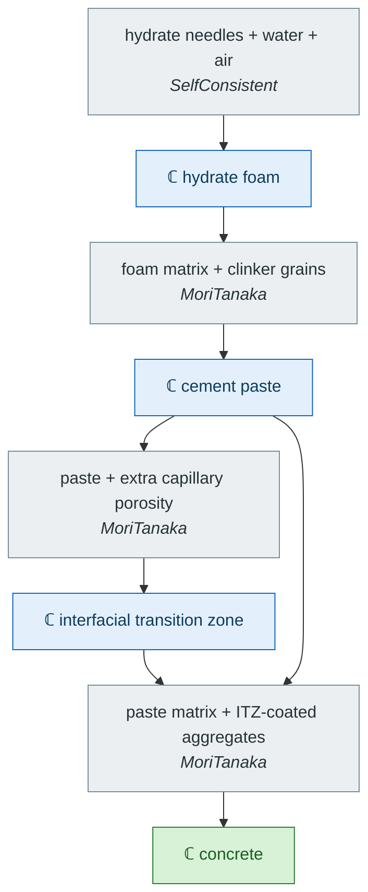

# [Multiscale models](@id man-multiscale)

A multiscale model chains homogenizations: the effective property computed at
one scale becomes a phase property at the next. `MeanFieldHomogenization` supports two
ways of writing that chain, and **both are fully supported** — they differ in
what is an object, not in what they compute.

The shape of such a chain, before any code — the four-scale cascade worked out
in [ITZ in concrete](@ref app-itz-concrete). What changes from one scale to the
next is the **morphology**, and therefore the scheme: self-consistent where no
phase surrounds the others, Mori–Tanaka where one does.



Two features of that chain drive the API below: a scale consumes only the
**effective tensor** of the scales beneath it — note that the cement paste feeds
*two* consumers — and the scales are otherwise independent, which is exactly what
makes the two writing styles equivalent.

## The cell abstraction

Everything `homogenize` accepts is an
[`AbstractHomogenizationCell`](@ref MeanFieldHomogenization.Core.AbstractHomogenizationCell):

| Cell | Morphology | Schemes |
| :--- | :--- | :--- |
| [`RVE`](@ref) | random, described through the Eshelby auxiliary problem | `Voigt`, `Reuss`, `Dilute`, `DiluteDual`, `MoriTanaka`, `Maxwell`, `PonteCastanedaWillis`, `SelfConsistent`, `AsymmetricSelfConsistent`, `DifferentialScheme` |
| [`Laminate`](@ref) | periodic stack of parallel layers, deterministic | `Laminated` (exact), `Voigt`, `Reuss` |
| [`ParticleAssembly`](@ref) | explicitly located inclusions — positions, not statistics | `ClusterModel`, `EquivalentInclusion` |

A scheme that a cell does not serve reports it explicitly rather than
dispatching elsewhere: `MoriTanaka` needs a matrix phase, so it does not apply
to a laminate; `Laminated` needs an ordered stack, so it does not apply to an
RVE; the two N-body schemes need positions, so they do not apply to either.
Any cell can be used at any level of a chain.

!!! note "Chaining an N-body estimate needs the anisotropic Green operator"
    A cluster or equivalent-inclusion estimate on a cubic array is **cubic, not
    isotropic** — its two shear constants differ. Using one as the *reference*
    of a further N-body scale therefore requires the interaction tensor in an
    anisotropic reference, which is what
    [`green_operator_aniso`](@ref) provides. Nothing extra to write: the
    dispatcher picks it up. It costs milliseconds where the isotropic closed
    form costs microseconds, and `green_nodes` (default 32) tunes its
    quadrature. See [Particle assemblies](@ref man-assemblies).

## Explicit chaining

The direct style: one function per scale, called in order, each handing its
result to the next.

```julia
# scale 0 — the hydrate foam
foam = RVE(:PORE)
add_matrix!(foam, Ellipsoid(1.0), Dict(:C => C_pore))
add_phase!(foam, :hyd, Spheroid(1.0, 0.02), Dict(:C => C_hyd);
           fraction = 0.7, symmetrize = :iso)
C_foam = homogenize(foam, SelfConsistent(), :C)

# scale 1 — the cement paste, built ON that result
paste = RVE(:FOAM)
add_matrix!(paste, Ellipsoid(1.0), Dict(:C => C_foam))
add_phase!(paste, :clinker, Ellipsoid(1.0), Dict(:C => C_clin); fraction = 0.2)
C_paste = homogenize(paste, MoriTanaka(), :C)
```

The order of the scales is explicit in the code, and the author controls
exactly what is recomputed. This is the style of most of the
[Applications](@ref app-cement-paste) chapters, and it stays the right choice
when a scale needs post-processing before the next one consumes it (a
projection, a strength criterion, a change of variables), or when the
intermediate result is itself the quantity of interest.

## Declarative chaining

The alternative: a property value may **be** another homogenization problem,
wrapped in [`Homogenized`](@ref). The whole multiscale model is then a single
object, and the evaluation order is deduced from the graph rather than
imposed.

```julia
foam = RVE(:PORE)
add_matrix!(foam, Ellipsoid(1.0), Dict(:C => C_pore))
add_phase!(foam, :hyd, Spheroid(1.0, 0.02), Dict(:C => C_hyd);
           fraction = 0.7, symmetrize = :iso)

paste = RVE(:FOAM)
add_matrix!(paste, Ellipsoid(1.0),
            Dict(:C => Homogenized(foam, SelfConsistent())))   # ← the seam
add_phase!(paste, :clinker, Ellipsoid(1.0), Dict(:C => C_clin); fraction = 0.2)

C_paste = homogenize(paste, MoriTanaka(), :C)   # resolves `foam` on the way
```

Both snippets return the same tensor, to the last bit.

### What the declarative form buys

**One object per model.** The chain can be stored, passed around, compared and
parameterized as a whole, instead of living in the control flow of a script.

**Sensitivities across every scale, without plumbing.**
[`NestedParameter`](@ref) addresses a scalar *inside* a nested cell, so
`derivative` / `gradient` / `jacobian` cross the whole chain in a single
`ForwardDiff` pass:

```julia
p = nested(:FOAM, :C, property(:hyd, :C, :shear))   # μ of the hydrates, two scales down
gradient(paste, MoriTanaka(), [p]; indexer = C -> k_mu(C)[2])
```

Written explicitly, the same derivative needs a hand-rolled closure over every
scale and, if the scales are to be differentiated jointly, explicit
`ForwardDiff.Tag` handling — which is exactly what
[Quasi-brittle strength](@ref app-strength) used to do.

**One inner cell, several properties.** `Homogenized(cell, scheme)` with no
`property` **inherits the key it is stored under**: the same object answers
`:C` with the inner effective stiffness and `:K` with the inner effective
conductivity. A coupled elastic/diffusion model therefore describes its
microstructure once instead of twice.

```julia
h = Homogenized(foam, SelfConsistent())
add_matrix!(paste, Ellipsoid(1.0), Dict(:C => h, :K => h))
```

### Cost, and the memoization

Within one `homogenize` call, each `(Homogenized, key)` pair is evaluated
**exactly once**, however many times a scheme reads the property. This matters
for the iterative schemes: `SelfConsistent` reads the phase properties once
per iteration, so without memoization a nested cell would be re-homogenized a
hundred times.

The cache is task-local and torn down when the call returns. Nothing is shared
between two evaluations — which is what keeps two nested `derivative` calls,
with different `ForwardDiff` tags, from ever seeing each other's values. When
no property is a `Homogenized`, the resolution is the identity and costs
nothing.

Cells nested more than `MeanFieldHomogenization.Core.MAX_NESTING` deep raise, rather than
looping: the usual cause is a cell nested inside itself.

## Choosing between the two

| | explicit | declarative |
| :--- | :--- | :--- |
| construction | one call per scale, in order | one object; order deduced |
| what is an object | each scale's *result* | the *model* |
| sensitivities | manual closure over the chain | `nested(...)` lens |
| several properties | one call per property per scale | one nested cell answers all keys |
| intermediate results | directly available | recomputed unless you ask for them |
| post-processing between scales | natural | do it explicitly instead |
| ageing viscoelasticity | supported | **not supported** (see below) |

Neither is deprecated. Use the explicit style when the scales need individual
attention, the declarative one when the model is the object of interest —
typically when it is to be differentiated, fitted or swept.

## Limitations

- **`Homogenized` inside an ALV chain is not supported.** `homogenize_alv`
  works on discretized Volterra operators; for a nested cell to take part, its
  inner result would have to be re-expressible as a
  [`ViscoLaw`](@ref). Chain ageing-viscoelastic scales explicitly. This applies
  to a [`ParticleAssembly`](@ref) exactly as it does to an `RVE`: the two
  N-body schemes have no ALV twin.
- The declarative form does not check scale separation. That remains the
  modeler's responsibility, exactly as in the explicit form.

## Writing a new cell type

A new cell subtypes
[`AbstractHomogenizationCell`](@ref MeanFieldHomogenization.Core.AbstractHomogenizationCell)
and provides:

- `validate_cell(cell)` — the structural check `homogenize` runs first;
- one `_evaluate(cell, scheme::HomogenizationScheme, ::Val{property}; kw...)`
  per supported scheme (type the scheme argument: leaving it untyped is
  ambiguous with the error-raising fallback);
- `cell_member_names`, `cell_container_property` and `cell_set_property` to
  take part in declarative nesting and in the parameter lenses.

`RVE` and `Laminate` are the two worked examples.
