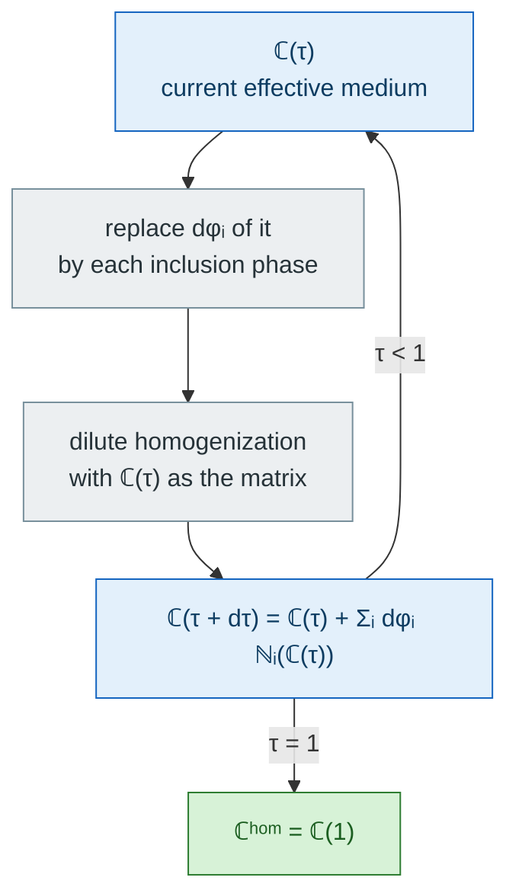

# [The differential scheme](@id th-differential-scheme)

The differential (or incremental) scheme builds the composite by
*repeated dilute incorporation*: an infinitesimal amount of each
inclusion phase is added to the current effective medium, which is
re-homogenized before the next increment. This page derives the
resulting ODE for an arbitrary number of phases and an arbitrary
incorporation trajectory ([norris1985](@cite)).

## Incorporation process

The construction is a loop, and the loop is the scheme: what distinguishes it
from Mori–Tanaka is not the dilute step — that step is the *same* — but the fact
that the reference medium is updated after each one.



Two things in that loop are worth naming before the algebra: the increments
``\mathrm d\varphi_i`` are taken out of the *current medium*, not out of the
original matrix, and the order in which the phases are grown is a free choice —
the **trajectory**. Both are what makes the scheme path-dependent.

The RVE holds a matrix (index `0`) and `N` inclusion phases, of final
volume fractions ``f_i^\infty``. Each phase is grown along a fictitious
incorporation time,

```math
f_i : [0, T] \to [0, f_i^\infty], \qquad f_i(0) = 0, \quad f_i(T) = f_i^\infty,
```

non-decreasing, the matrix taking up the rest,

```math
f_0(t) = 1 - \sum_{i=1}^{N} f_i(t) .
```

Between ``t`` and ``t + \mathrm dt``, a volume fraction
``\mathrm d\varphi_i`` of the **current medium** is *replaced* by phase
`i`. The ``\mathrm d\varphi_i`` are the increments the scheme actually
applies; the ``\mathrm d f_i`` are what the user prescribes. They
differ, because removing ``\sum_j \mathrm d\varphi_j`` of the current
medium also removes the phase `i` already present in it:

```math
\mathrm d f_i = \mathrm d\varphi_i - f_i \sum_{j=1}^{N} \mathrm d\varphi_j ,
\qquad 1 \le i \le N .
```

In matrix form, with ``\mathbf U = (1, \dots, 1)^{\mathsf T}``,

```math
[\mathrm d f] = \big(\mathbb 1 - [f]\,\mathbf U^{\mathsf T}\big)\,[\mathrm d\varphi] .
```

The matrix to invert is a rank-one update of the identity, so the
Sherman-Morrison formula gives the inverse in closed form:

```math
[\mathrm d\varphi] = \Big(\mathbb 1 + \frac{[f]\,\mathbf U^{\mathsf T}}{1 - \mathbf U^{\mathsf T}[f]}\Big)[\mathrm d f] ,
```

that is, component-wise,

```math
\dot\varphi_i = \dot f_i + \frac{f_i}{1 - \sum_j f_j} \sum_{j=1}^{N} \dot f_j
             = \dot f_i - \frac{f_i}{f_0}\,\dot f_0 .
```

This is exactly what the RHS of the scheme evaluates at every step
(`_diff_ode_rhs!` in `src/Schemes/differential.jl`); nothing else about
the trajectory enters the volume balance.

The derivation above assumes every phase occupies a finite volume.
Crack families do not, and the balance has to be extended — see the
section on cracks below.

## The ODE

The incremental step replaces ``\mathrm d\varphi_i`` of the current
medium by phase `i`, each increment being a *dilute* problem posed in
that medium:

```math
\mathbb C^{hom}(t + \mathrm dt) = \mathbb C^{hom}(t)
   + \sum_{i=1}^{N} \mathrm d\varphi_i \, \mathbb N_i\big(\mathbb C^{hom}(t)\big) ,
```

where ``\mathbb N_i`` is the size-independent **stiffness contribution**
of phase `i` in the current medium,

```math
\mathbb N_i = \mathbb B_i - \mathbb C^{hom} : \mathbb A_i ,
\qquad
\langle \boldsymbol\sigma \rangle_i = \mathbb B_i : \boldsymbol{E}^\infty ,
\quad
\langle \boldsymbol\varepsilon \rangle_i = \mathbb A_i : \boldsymbol{E}^\infty .
```

Written this way, ``\mathbb N_i`` needs only the phase's concentration
tensors — **not** a Hill tensor, and not even a uniform phase property.
It is therefore available for every inclusion family the package
supports (ellipsoids, cylinders, flat cracks, multi-layer spheres and
spheroids), which is why the differential scheme accepts all of them
without special-casing. See [Localization](localization.md).

Hence the ODE integrated by [`DifferentialScheme`](@ref):

```math
\frac{\mathrm d \mathbb C^{hom}}{\mathrm d t}
  = \sum_{i=1}^{N} \dot\varphi_i \, \mathbb N_i(\mathbb C^{hom})
  = \sum_{i=1}^{N} \Big(\dot f_i + \frac{f_i \sum_j \dot f_j}{1 - \sum_j f_j}\Big)\,
    \mathbb N_i(\mathbb C^{hom}) ,
```

started from ``\mathbb C^{hom}(0) = \mathbb C_0``. The package
parametrizes the incorporation time as ``\tau = t/T \in [0, 1]``.

### Compliance form

The same process written on the compliance uses the **compliance
contribution** ``\mathbb H_i`` of each phase:

```math
\frac{\mathrm d \mathbb S^{hom}}{\mathrm d t}
  = \sum_{i=1}^{N} \dot\varphi_i \, \mathbb H_i(\mathbb S^{hom}) ,
\qquad
\mathbb H_i = - \mathbb S^{hom} : \mathbb N_i : \mathbb S^{hom} .
```

The two forms are *exactly* equivalent: the second is the image of the
first under ``\mathbb S = \mathbb C^{-1}``, term by term. They are not
numerically identical, though — the solver controls its error on
whichever variable is integrated. The compliance form is better
conditioned for a medium that softens towards percolation (porous or
cracked), the stiffness form for one that stiffens. Both are available
through the `formulation` keyword and can be compared on the same RVE:

```julia
homogenize(rve, DifferentialScheme(), :C)                             # stiffness
homogenize(rve, DifferentialScheme(; formulation = :compliance), :C)  # compliance
```

### Cracks: a departure from the volume-replacement picture

Flat cracks do not fit the derivation above, and the difference is
physical rather than technical. A penny-shaped crack of radius `a` and
aperture `c` has, for an aspect ratio ``X = c/a \to 0``,

```math
f_c = \frac{4\pi}{3}\,\varepsilon_c X \;\longrightarrow\; 0 ,
\qquad
\varepsilon_c = \frac{\mathcal N_c\, a^3}{V} = \mathcal O(1) ,
```

(``\mathcal N_c`` cracks of that family in the volume ``V``)

so its **volume fraction vanishes asymptotically while its density stays
finite** — and it is the density, not the fraction, that measures the
mechanical effect. Three consequences for the scheme:

1. **The volume balance must be rewritten.** Opening a crack removes no
   current medium, so cracks do not appear in the sum
   ``\sum_j \mathrm d\varphi_j`` and

   ```math
   f_0 = 1 - \sum_{i \in \mathcal S} f_i
   ```

   whatever the crack densities (``\mathcal S`` = solid phases). They are
   nevertheless *diluted* by it: the piece of current medium that gets
   replaced by solid material takes the cracks it contained with it, and
   the incoming material has none. Writing ``\mathrm d\varphi_c^\varepsilon``
   for the density of cracks actually created in the current medium,

   ```math
   \mathrm d f_i = \mathrm d\varphi_i - f_i \sum_{j \in \mathcal S} \mathrm d\varphi_j ,
   \qquad
   \mathrm d \varepsilon_c = \mathrm d\varphi_c^\varepsilon
                           - \varepsilon_c \sum_{j \in \mathcal S} \mathrm d\varphi_j .
   ```

   Both lines are the single rank-one relation
   ``[\mathrm d g] = (\mathbb 1 - [g]\,\mathbf U_{\mathcal S}^{\mathsf T})[\mathrm d\varphi]``
   on the stacked amounts ``[g] = (f_i ; \varepsilon_c)``, where
   ``\mathbf U_{\mathcal S}`` carries a `1` on solid entries and a `0` on
   crack entries — the *only* change to the manuscript's derivation. The
   same Sherman-Morrison inverse follows, with the density playing the
   role of the fraction:

   ```math
   \dot\varphi_i = \dot f_i + \frac{f_i}{f_0} \sum_{j \in \mathcal S} \dot f_j ,
   \qquad
   \dot\varphi_c^\varepsilon = \dot\varepsilon_c
      + \frac{\varepsilon_c}{f_0} \sum_{j \in \mathcal S} \dot f_j ,
   ```

   and the crack term of the ODE is

   ```math
   \frac{\mathrm d \mathbb C^{hom}}{\mathrm d \tau} \mathrel{+}=
      \sum_c \dot\varphi_c^\varepsilon \,
             \Delta\mathbb C^{crack}_c(\mathbb C^{hom}) .
   ```

   The crack correction vanishes whenever no solid phase grows at the
   same `τ` — a crack-only RVE, or a [`Sequential`](@ref) trajectory in
   which the cracks come after the solids — and is what makes
   ``\varepsilon_c(\tau)`` mean the density *actually reached* at `τ`,
   consistently with ``f_i(\tau)`` for solids.

2. **There is no saturation from the volume side.** A solid phase is
   bounded by ``\sum_i f_i < 1``; a crack density is not, so nothing
   geometric stops the integration — `f₀` is still 1 at any density.
   The effective stiffness decays towards zero asymptotically in
   ``\varepsilon_c`` without a finite threshold, unlike the
   self-consistent scheme, because each infinitesimal crack increment is
   introduced into an already-degraded medium.

3. **The compliance form is the natural one.** As ``X \to 0`` the
   crack's strain concentration tensor diverges, so the stiffness
   contribution ``\mathbb N_c`` is a limit of a divergent quantity,
   while the compliance contribution ``\mathbb H_c`` — built from the
   crack-opening-displacement tensor, see [COD tensors](cod_tensors.md)
   — stays finite and is what the package actually computes:

   ```math
   \Delta \mathbb S^{crack}_c = \frac{4\pi}{3}\,\varepsilon_c\,\mathbb H_c ,
   \qquad
   \Delta \mathbb C^{crack}_c = -\,\mathbb C^{hom} : \Delta\mathbb S^{crack}_c : \mathbb C^{hom} ,
   ```

   with the Budiansky-O'Connell prefactor (`4π/3` for 3D penny and
   elliptic cracks, `π` for 2D ribbons). The stiffness form of the ODE
   therefore evaluates the crack term by passing through ``\mathbb H_c`` anyway;
   `formulation = :compliance` merely stops undoing that conversion,
   which is why it behaves better on heavily cracked media.

Apart from that, cracks follow the chosen trajectory exactly like solid
phases, through ``\varepsilon_c(\tau)``: `Proportional`, `Sequential`
and the explicit paths all apply to a `CrackDensity` amount, the target
being the final density instead of the final volume fraction.

## Trajectories

With a single inclusion phase the trajectory is immaterial: any
monotone ``f_1(\tau)`` traverses the same states, and only the final
fraction matters. With two or more phases, the *order of incorporation*
is a modeling choice — the effective property at `τ = 1` depends on it.
Three cases, following the same order as the derivation above.

### 1. Homothetic growth

All phases grow proportionally, ``f_i(t) = \lambda(t)\, f_i^\infty``
with ``\lambda(0) = 0``, ``\lambda(T) = 1`` (the default
[`Proportional`](@ref), where ``\lambda(\tau) = \tau``). Then
``f_0 = 1 - \lambda(1 - f_0^\infty)`` and

```math
\dot\varphi_i = \frac{\dot\lambda\, f_i^\infty}{1 - \lambda\,(1 - f_0^\infty)} ,
\qquad
\varphi_i = -\ln\!\big(1 - \lambda(1 - f_0^\infty)\big)\,
             \frac{f_i^\infty}{1 - f_0^\infty} .
```

This closed form is a useful check on the volume balance alone,
independently of any tensor algebra; the single-phase case reduces to
the classical ``\varphi = -\ln(1 - f)``.

### 2. Successive phases

Each phase is grown to completion before the next one starts —
[`Sequential`](@ref), given the incorporation order. Phase `i` owns a
contiguous slice of `τ` and is frozen outside it.

### 3. Arbitrary trajectory

The user prescribes ``f_i(\tau)`` for every inclusion phase and
``f_0 = 1 - \sum_i f_i`` follows — [`Path`](@ref) for callables
(differentiated by `ForwardDiff`) or [`CustomPath`](@ref) for tabulated
values (piecewise-linear):

```julia
DifferentialScheme(; trajectory = Path(:I1 => τ -> τ^2, :I2 => τ -> 2τ - τ^2))
```

### The three, side by side

For two phases the trajectory is a curve in the ``(f_1, f_2)`` plane. All four
curves below start at the origin and end at the same target
``(f_1^\infty, f_2^\infty) = (0.25, 0.20)`` — so they describe the *same*
material, and they will not give the same effective stiffness:

```@setup diffpaths
# Drawn in a `@setup` block: the trajectories are the point, not the `plot!`
# calls that draw them.
using Plots
gr()  # headless backend; GKSwstype is set to "100" in make.jl

f1∞, f2∞ = 0.25, 0.20
τ = range(0, 1; length = 201)

p = plot(; xlabel = "f₁", ylabel = "f₂", framestyle = :box, legend = :topleft,
    size = (620, 430), aspect_ratio = 1, xlims = (-0.01, 0.30), ylims = (-0.01, 0.30))

# Proportional: the straight line to the target.
plot!(p, f1∞ .* τ, f2∞ .* τ; lw = 2.5, c = :black, label = "Proportional")

# Sequential (:I1 then :I2), and the reverse order — two sides of the rectangle.
plot!(p, [0, f1∞, f1∞], [0, 0, f2∞]; lw = 2.5, c = :orange,
    label = "Sequential (1 then 2)")
plot!(p, [0, 0, f1∞], [0, f2∞, f2∞]; lw = 2.5, c = :seagreen, ls = :dash,
    label = "Sequential (2 then 1)")

# An arbitrary Path: f₁ ∝ τ², f₂ ∝ 2τ − τ².
plot!(p, f1∞ .* τ .^ 2, f2∞ .* (2τ .- τ .^ 2); lw = 2.5, c = :red, ls = :dot,
    label = "Path(τ², 2τ − τ²)")

scatter!(p, [f1∞], [f2∞]; m = :star5, ms = 9, c = :black, label = "target")
nothing # hide
```

```@example diffpaths
p # hide
```

They all agree in the dilute limit — near the origin every curve is tangent to
its own straight line and the first-order term is the same — and they separate
like ``f`` at finite fractions. The spread is a *feature* of the scheme, not a
numerical artifact: it is what makes the differential scheme able to represent a
processing history, and it is measured in
[Comparing loading-path trajectories](../tutorials/differential_loading_paths.md).

## Conduction and viscoelasticity

The derivation never used the tensor order: replacing
``(\mathbb C, \mathbb N)`` by ``(\boldsymbol{K}, \underline{N}_K)`` gives the
conduction / diffusion scheme, and the compliance form becomes the
resistivity form. Both orders are implemented.

In ageing linear viscoelasticity the same ODE holds on the discrete
Volterra block matrices, the products being Volterra products
(`differential_alv` for the relaxation tensor, `differential_alv_order2`
for conduction) — see [Viscoelasticity](viscoelasticity.md). One
restriction is specific to ALV: the ALV Hill kernel is built for an
isotropic reference, and the reference of the differential scheme is its
*running* medium, so every phase must keep that medium isotropic
(spherical inclusions, multi-layer spheres, or any shape with
`symmetrize = :iso`). The ODE raises an explicit error otherwise.

## Numerical resolution

The ODE is integrated by `OrdinaryDiffEq.solve`, adaptive `Tsit5` by default;
the algorithm and its tolerances are user-facing — see
[Homogenization schemes](@ref man-schemes) for the keywords.

Two things about it are theory rather than plumbing.

*The state is sized by the running estimate, not by the matrix.* It carries the
canonical components in the smallest symmetry class that estimate can stay in —
two numbers for an isotropic medium, five to eight for a transversely isotropic
one, the full Mandel matrix otherwise. A phase whose contribution is less
symmetric drags the estimate out of the matrix's class at the first step (a
crack, or simply an aligned spheroid, whose ``\mathbb A_\mathrm{dil}`` is
transversely isotropic even between two isotropic materials), so the scheme
probes each contribution once before integrating.

*The residue algorithm cannot be used here.* When the running estimate is
anisotropic from the first step, the Hill tensors are evaluated by cubature:
the acoustic polynomial of the residue method degenerates precisely at the
isotropic starting point of the integration. That is what `method = :auto`
selects, and an explicit `method = :residues` on such an RVE raises an error
saying so.
