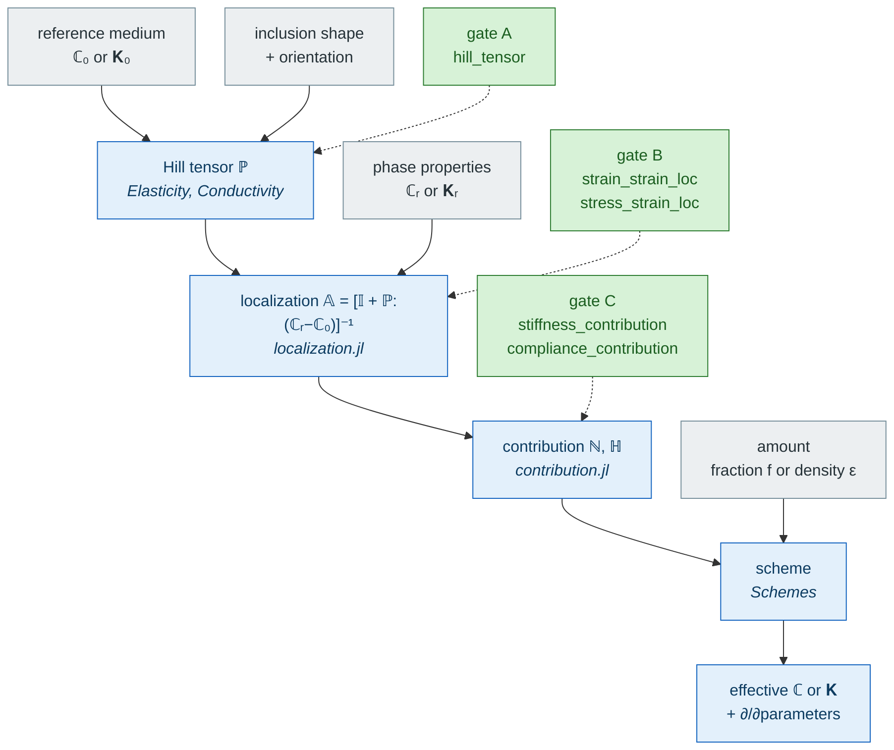

# [Theory — reading path](@id th-index)

`MeanFieldHomogenization` computes effective properties of heterogeneous materials by
mean-field homogenization. This section states the theory it implements, in the
order in which it is built. Every page is self-contained on notation
([Notation and conventions](notation.md)) and every formula is either cited or
derived on the page.

The order below is the dependency chain, and it is worth reading in that order.
It starts from the Eshelby problem and the tensors it produces, then the schemes
assembled from them. Then come the three independent ways that one-inclusion
picture is *generalized* — a richer morphological pattern in place of the
ellipsoid, a different physics, a different time dependence — followed by
periodic homogenization, which is a different construction rather than a
generalization, and finally the N-body models, which drop the one-site
assumption altogether.

## Foundations: the chain, in one paragraph

An **inclusion** embedded in an infinite reference medium responds to a remote
load in a way entirely captured by one object, the **Hill polarization tensor**
``\mathbb{P}`` — this is [Eshelby's result](eshelby_problem.md), and
``\mathbb{P}`` depends only on the inclusion *shape* and the reference *moduli*
([Hill polarization tensors](hill_tensors.md)). From ``\mathbb{P}`` follows the
**localization tensor**, which says how much of the remote load each phase
actually sees, and hence each phase's **contribution** to the effective
stiffness ([Localization](localization.md)).

## The chain, in one picture

Everything the package does is one pipeline, read top to bottom. The **gray**
boxes are what you supply — each entering at the stage that needs it — the
**blue** ones what the package computes, and the **green** ones on the right
the three places where you can plug in your own physics without touching the
library.

**The three green gates are the extension mechanism.** A morphology
`MeanFieldHomogenization` knows nothing about becomes a first-class citizen of *every*
scheme by answering one of them — implement the lowest you can reach and the
package derives the rest algebraically. Four routes already use them:

| Route | Gate | Where the answer comes from |
| :--- | :---: | :--- |
| ellipsoids, cylinders, cracks | A | closed forms, quadrature or residues |
| [composite spheres and spheroids](@ref MeanFieldHomogenization.LayeredSpheres) | B | the Hervé–Zaoui recurrences — a layered pattern has no Hill tensor |
| [finite elements](@ref man-fe-inclusions) | B / COD | a `Ferrite` or `Gridap` solve of the Eshelby problem |
| [neural surrogates](@ref man-neural-inclusions) | A / B | a trained network, differentiable in the morphology |
| [your own](@ref man-custom-inclusions) | A, B or C | a formula, a solver, a table — anything callable |

Cracks and flat objects follow the same chain with ``\mathbb H`` in place of
``\mathbb N`` and a density in place of a volume fraction; transport is the same
picture at tensor order 2, and ageing viscoelasticity the same picture with
Volterra products in place of tensor products. The contract is written up in
[Adding a new inclusion](@ref dev-adding-inclusion).

## Homogenization schemes

Assembling those contributions under an assumption about how phases interact
gives a **homogenization scheme** — dilute, Mori–Tanaka, self-consistent,
differential, and the bounds ([Homogenization schemes](homogenization.md)).

| Page | What it adds |
| :--- | :----------- |
| [Homogenization schemes](homogenization.md) | the scheme catalog, each as one assumption on the reference medium, and the bounds |
| [Differential scheme](differential_scheme.md) | incorporation as an ODE in a fictitious time, and what a crack — which has no volume to replace — does to it |

The differential scheme is a scheme like the others, differing only in that its
assembly is an integration rather than a closed form; it is grouped here rather
than treated as a specialization of its own.

## The generalized Eshelby problem: morphological patterns

A composite pattern has **no Hill tensor** — the strain inside it is not
uniform, so Eshelby's result does not apply as such. What does exist, and is all
any scheme needs, is its average concentration tensor, obtained by solving the
*generalized* Eshelby problem for that pattern. Any morphology admitting that
treatment belongs in this group; two are implemented.

| Page | Pattern |
| :--- | :------ |
| [Layered sphere](layered_sphere.md) | a *composite* inclusion: no Hill tensor exists, the response is assembled by a radial recurrence |
| [Layered spheroid](layered_spheroid.md) | the same for confocal spheroids, where imperfect interfaces couple harmonic degrees |

## Cracks

A crack is a degenerate ellipsoid rather than a composite pattern: it keeps the
Eshelby framework and loses its volume, which is what forces a different
descriptor.

| Page | Specialization |
| :--- | :------------- |
| [Crack opening displacement](cod_tensors.md) | the flat-inclusion limit: a crack has no volume, so it is described by ``\boldsymbol{B}`` and ``\mathbb{H}`` instead of a volume fraction |
| [Thermal cracks](thermal_cracks.md) | the same limit for scalar transport |

## Extension to conductivity

| Page | What it adds |
| :--- | :----------- |
| [Extension to conductivity](conductivity.md) | the order-4 ↔ order-2 dictionary stated once — Hooke against Fourier, Fick, Darcy and Ohm — what transposes untouched, and the two things that genuinely differ |

## Extension to viscoelasticity

Two distinct extensions, and the distinction matters: for a **non-ageing**
material a transform maps the problem onto an elastic one, so nothing new has to
be solved; for an **ageing** one no such map exists, and it is the Eshelby
problem itself that must be generalized.

| Page | What it adds |
| :--- | :----------- |
| [The Laplace-Carson route](laplace_carson.md) | the correspondence principle: a non-ageing problem solved as an elastic one, transform by transform |
| [Ageing linear viscoelasticity](viscoelasticity.md) | moduli become Volterra operators; the algebra of the chain is unchanged |

## Periodic homogenization

Not a morphological pattern, and not an inclusion problem at all: the laminate
result is the closed form of a *periodic* homogenization problem, reached by
interface algebra rather than by an Eshelby argument. It is grouped on its own
for that reason.

| Page | What it adds |
| :--- | :----------- |
| [Laminate](laminate.md) | a periodic stack: no inclusion at all, the interface algebra replaces the Hill tensor |

## N-body models

These are the only pages that drop the one-site assumption: instead of averaging
the interaction between inclusions, they resolve it pair by pair, and therefore
need to know *where* the inclusions are.

| Page | What it adds |
| :--- | :----------- |
| [Interaction tensors](interaction_tensors.md) | the two-inclusion tensor ``\mathbb{T}^{ab}``, its Green operator, its closed forms — and the sign convention both models follow |
| [The cluster model](cluster_model.md) | the mean strain of every inclusion, resolved inside a cluster [molinari1996](@cite) |
| [The equivalent inclusion method](eim.md) | the same physics as a variational Galerkin problem, with rigorous bounds [brisard2014](@cite) |

## Appendices

| Page | Role |
| :--- | :--- |
| [The finite Eshelby cell](corrected_cell.md) | a numerical device supporting the finite-element inclusions: the inclusion is solved on a *finite* cell and the truncation bias removed by its own dipole far field. Written in the language of [localization](localization.md) and [crack opening displacement](cod_tensors.md), so it is read after both |
| [Elliptic integrals](elliptic_integrals.md) | the special functions the closed forms need |

## Where the two physics meet

The Eshelby framework applies verbatim to elasticity (order-4 tensors) and to
scalar transport — heat conduction, diffusion, electric conduction, Darcy flow
(order-2 tensors). The documentation treats them in parallel rather than in
separate sections, because with the convention
``\boldsymbol{\sigma} \equiv -\underline{q}`` fixed in
[Elasticity and transport: one set of formulas](@ref th-notation-sigma-q) the
algebra is not merely analogous but *identical, symbol for symbol*:

| | Elasticity | Transport |
| :--- | :--- | :--- |
| property | stiffness ``\mathbb{C}`` | conductivity ``\boldsymbol{K}`` |
| Hill tensor | ``\mathbb{P}(\boldsymbol{A},\mathbb{C})`` (order 4) | ``\boldsymbol{P}(\boldsymbol{A},\boldsymbol{K})`` (order 2) |
| Eshelby tensor | ``\mathbb{S} = \mathbb{P}:\mathbb{C}`` | ``\boldsymbol{s} = \boldsymbol{P}\cdot\boldsymbol{K}`` |
| crack descriptor | COD tensor ``\boldsymbol{B}``, compliance ``\mathbb{H}`` | COD scalar ``b``, resistivity ``\boldsymbol{R}`` |

One asymmetry is worth knowing in advance: for an **arbitrarily anisotropic**
matrix the order-2 Hill tensor has a *closed form* (via a square-root
transformation), whereas the order-4 one requires numerical cubature. This is
why the conductivity paths in `MeanFieldHomogenization` are analytical far more often than
the elastic ones.

## Relation to the Echoes manual

`MeanFieldHomogenization` is a pure-Julia reimplementation of the Eshelby/Hill machinery of
the [Echoes manual](https://jfbarthelemy.github.io/echoes/), and the
Hill-tensor pages follow its appendix closely — same expressions, same
conventions, same bibliography. Two families of difference are flagged
explicitly wherever they occur:

- **extensions**: infinite cylinders and 2-D plane strain as first-class
  inclusion types, an analytical transversely isotropic path, automatic
  differentiation and symbolic number types throughout;
- **conventions that genuinely differ**: the crack opening displacement tensor
  ``\boldsymbol{B}`` and the compliance ``\mathbb{H}`` are the notable case.
  `MeanFieldHomogenization` computes ``\boldsymbol{B}`` first and derives ``\mathbb{H}``
  from it, where Echoes computes ``\mathbb{H}`` directly and never forms
  ``\boldsymbol{B}``. The competing normalizations are named and compared in
  [Crack opening displacement](cod_tensors.md).
