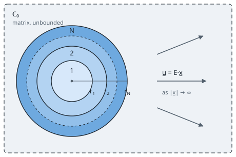

# [Layered sphere — bulk + shear recurrences and imperfect interfaces](@id th-layered-sphere)

!!! info "Before this page"
    [Localization and contribution tensors](@ref th-localization), whose strain
    concentration tensor is what a pattern without a Hill tensor supplies
    instead, and [Homogenization schemes](@ref th-homogenization), which
    consume it.

[`LayeredSphere`](@ref) is an `n`-layer isotropic spherical composite
inclusion in an infinite isotropic matrix, with per-layer localization, global
contribution tensors and layer / sphere / cumulative averages. The bulk and
shear recurrences follow [herve1993](@citet) (generalizing the three-phase model
of [christensenLo1979](@citet)); imperfect interfaces follow
[herveLuanco2014](@cite) — `PerfectInterface` plus one primal/dual pair per
physics:

| Elasticity (primal / dual)                   | Conductivity (primal / dual)                    |
| :------------------------------------------- | :---------------------------------------------- |
| `SpringInterface(kn, kt)`                    | `KapitzaInterface(ρ)`                           |
| `MembraneInterface(κs, μs)` surface elasticity [dormieux2016](@cite) | `SurfaceConductiveInterface(ks)` [barthelemyBignonnetIJES2020](@cite) |

## 1. Convention

Radii are stored in ascending order from the center,

```math
r_0 = 0\text{ (implicit)} < r_1 < r_2 < \cdots < r_N,
```

with **layer ``k`` occupying** ``r_{k-1} \le r < r_k``.  Layer 1 is the
core, layer ``N`` is the outermost shell, and the composite sphere is
embedded in an infinite matrix for ``r > r_N``.



That is the whole problem the recurrences below solve: a concentric pattern in
an unbounded reference medium ``\mathbb C_0``, loaded by a remote uniform
strain. Because the strain is **not** uniform inside such a pattern, it has no
Hill tensor at all; what it does have is a volume-averaged concentration
tensor, and that is what every scheme consumes.

The three-phase model of [christensenLo1979](@citet) is one
*use* of this solution rather than a variant of it — take ``N = 2`` and let the
reference medium be the unknown effective one, and the fixed point is their
result. That is a property of the scheme, not of the pattern, so it lives with
the schemes.

An interactive view of the layered geometry is in
[The inclusion zoo](@ref man-inclusion-gallery).

Moduli ``(\mathbb C_1, \ldots, \mathbb C_N)`` are `TensISO{4,3}`
(elasticity) or `TensISO{2,3}` (conductivity).  Interface conditions
at each radius ``r_k`` are specified in an `NTuple{N, AbstractInterface}`
(default all `PerfectInterface`).

## 2. Bulk (spherical) recurrence — Hervé-Zaoui 1993

Under a purely hydrostatic remote strain, the displacement in layer
``k`` is ``u_r^{(k)}(r) = A_k r + B_k / r^2``, where ``k_k`` and ``\mu_k``
denote the bulk and shear moduli of the layer. To stay regular in the
**incompressibility limit** ``k_k \to \infty``, the implementation propagates
the **field-valued state vector** ``\mathbf s(r) = (u_r, \sigma_{rr})``
directly, with the intra-layer transfer

```math
\mathbf T(r_{\mathrm{out}}, r_{\mathrm{in}}; k, \mu) =
\begin{pmatrix}
\alpha\,\dfrac{r_{\mathrm{out}}}{r_{\mathrm{in}}} + \beta\,\left(\dfrac{r_{\mathrm{in}}}{r_{\mathrm{out}}}\right)^{\!2}
& \dfrac{r_{\mathrm{out}} - r_{\mathrm{in}}^{3}/r_{\mathrm{out}}^{2}}{3k + 4\mu}\\[6pt]
4\mu\beta\left(\dfrac{1}{r_{\mathrm{in}}} - \dfrac{r_{\mathrm{in}}^{2}}{r_{\mathrm{out}}^{3}}\right)
& \alpha\left(\dfrac{r_{\mathrm{in}}}{r_{\mathrm{out}}}\right)^{\!3} + \beta
\end{pmatrix},
```

where ``\alpha = 4\mu/(3k+4\mu) \in [0,1]`` and ``\beta = 3k/(3k+4\mu) \in [0,1]`` with
``\alpha + \beta = 1``.  Every entry stays finite as ``k \to \infty`` (hence also for
``\nu \to 1/2``), and the per-layer bulk localization ``\alpha_k = A_k/A_\infty``
degenerates smoothly (``\alpha_k \to 0`` for an incompressible core).

The entry-point at ``r = 0^+`` is written in the "pressure amplitude"
parameterization ``P_1 = 3k_1 A_1``, so that

```math
u_r(r_1^-) = \frac{r_1}{3k_1}\,P_1 \xrightarrow{k_1 \to \infty} 0,\qquad
\sigma_{rr}(r_1^-) = P_1.
```

## 3. Interface jump matrices

Each interface type provides a 2×2 (bulk) jump matrix
``\mathbf J(r)`` such that
``\mathbf s(r_k^+) = \mathbf J \cdot \mathbf s(r_k^-)``, on the state
``(u_r, \sigma_{rr})`` in elasticity and ``(\hat T, \hat q_n)`` in conduction (§4). A jump is
always the outer value minus the inner one, ``[\![x]\!] = x(r_k^+) - x(r_k^-)``. A spring interface is
parametrized by its normal and tangential stiffnesses ``k_n``, ``k_t``, whose
inverses ``s_n = 1/k_n``, ``s_t = 1/k_t`` are the compliances, a membrane by its
surface bulk and shear moduli ``\kappa^{\mathrm s}``, ``\mu^{\mathrm s}``, a
Kapitza interface by its thermal resistance ``\rho`` and a surface-conductive one
by its surface conductance ``k^{\mathrm s}``.

```math
\begin{aligned}
\text{Perfect:} &\quad \mathbf J = \mathbb 1,\\
\text{Spring:} &\quad \mathbf J = \begin{pmatrix}1 & s_n \\ 0 & 1\end{pmatrix}
\quad\text{(the bulk problem uses } s_n\text{ only)},\\
\text{Membrane:} &\quad \mathbf J = \begin{pmatrix}1 & 0 \\ 4\kappa^{\mathrm s}/r^{2} & 1\end{pmatrix}
\quad\text{(the bulk problem uses } \kappa^{\mathrm s}\text{ only)},\\
\text{Kapitza:} &\quad \mathbf J = \begin{pmatrix}1 & -\rho \\ 0 & 1\end{pmatrix},\\
\text{Surface-conductive:} &\quad \mathbf J = \begin{pmatrix}1 & 0 \\ -n(n{+}1)k^{\mathrm s}/r^{2} & 1\end{pmatrix}.
\end{aligned}
```

`SpringInterface` and `KapitzaInterface` encode a **primal
discontinuity** (displacement / temperature jump), while
`MembraneInterface` and `SurfaceConductiveInterface` encode a **dual
discontinuity** (traction / flux jump).  All limit to
`PerfectInterface` when their compliance goes to zero.

The minus sign of the Kapitza matrix is that of the dictionary
``\boldsymbol\sigma \equiv -\underline q`` of [Conventions](@ref th-notation-sigma-q). The Kapitza law is
the exact analog of the spring law ``[\![u_r]\!] = s_n\,\sigma_{rr}``, namely
``[\![T]\!] = \rho\,\sigma_n``, and the state carries the physical outward normal flux
``\hat q_n``, with ``\underline q = -k\,\nabla T``: hence ``[\![T]\!] = -\rho\,q_n``. Heat crossing the
resistance outward leaves the inner side hotter than the outer one. With ``+\rho``
the interface would be a negative resistance, raising the conductance of the
sphere it is meant to lower.

## 4. Conductivity recurrence (Y₁ harmonic)

Under a remote uniform temperature gradient, the temperature field
has a Y₁ dependence, ``T = \hat T(r)\,(\underline n\cdot\underline e)`` with ``\hat T = A r + B/r^2``.
The state vector ``\mathbf s(r) = (\hat T, \hat q_n)``, ``\hat q_n = -k\,\partial_r\hat T`` being the
amplitude of the outward flux, propagates
through a 2×2 transfer matrix ``\mathbf T = \mathbf M(r_{\mathrm{out}})\,\mathbf M(r_{\mathrm{in}})^{-1}``
with ``\mathbf M(r) = \begin{pmatrix} r & 1/r^2 \\ -k & 2k/r^3 \end{pmatrix}``, ``k``
being here the conductivity of the layer.

Interface jumps for conductivity are given above (Kapitza primal,
SurfaceConductive dual, matching the structural pattern of their
elastic analogs).  The per-layer gradient localization
``\alpha_k = A_k/A_\infty`` reduces, in the single-layer case, to the classical
``3k_0/(2k_0 + k_1)`` of Maxwell-type composites.

## 5. Type genericity & incompressibility

The recurrence consists of small-size matrix arithmetic over the
element type; it is exercised with `Float64`, `BigFloat`,
`ForwardDiff.Dual`, `SymPy.Sym`, and `Symbolics.Num`.  Symbolically,

```julia
using SymPy; @syms κ₀ μ₀ κ₁ μ₁
s = LayeredSphere((Sym(1),), (TensISO{3}(3κ₁, 2μ₁),))
simplify(MeanFieldHomogenization.LayeredSpheres._bulk_localization(s, κ₀, μ₀)[1])
# → (3κ₀ + 4μ₀) / (3κ₁ + 4μ₀)
```

and the derivative with respect to any modulus or radius is obtained
by wrapping the computation in `ForwardDiff.derivative` /
`ForwardDiff.gradient`.

## 6. Deviatoric (shear) recurrence — `Y₂`-harmonic 4×4 state vector

The bulk recurrence of §2 covers a hydrostatic remote strain only; the
deviatoric part of the load calls for a second recurrence, on a four-component
state vector.

Under a remote pure-deviatoric strain, the displacement field in an
isotropic layer has the axisymmetric form
``u_r = U(r)\,P_2(\cos\theta)``, ``u_\theta = W(r)\,\mathrm dP_2(\cos\theta)/\mathrm d\theta``, and the
four linearly-independent Navier solutions at ``\ell = 2`` are parametrized
by the power-law exponents ``n \in \{1, 3, -4, -2\}`` with material-
dependent ``U/W`` ratios derived directly from the Navier characteristic
equation (using ``x = k/\mu``):

| Mode | Radial dependence | ``(U, W)``                                  |
| :--: | :---------------- | :------------------------------------------ |
|  1   | ``r``             | ``(2r, r)`` — uniform deviatoric strain      |
|  2   | ``r^3``           | ``(6(3x-2)\,r^3,\ (15x+11)\,r^3)``           |
|  3   | ``r^{-4}``        | ``(3/r^4,\ -1/r^4)``                         |
|  4   | ``r^{-2}``        | ``(3(x+1)/r^2,\ 1/r^2)``                     |

The corresponding traction amplitudes are obtained from Hooke's law
``\sigma_{ij} = \lambda\,\delta_{ij}\,\varepsilon_{kk} + 2\mu\,\varepsilon_{ij}``:

```math
\begin{aligned}
\sigma_{rr}\text{ amp} &= (\lambda+2\mu)\,U' + \frac{2\lambda}{r}(U - 3W),\\[2pt]
\sigma_{r\theta}\text{ amp} &= \mu\bigl(W' + (U-W)/r\bigr).
\end{aligned}
```

The state vector ``\mathbf S(r) = (U, W, \sigma_{rr}, \sigma_{r\theta})`` combines
displacement and physical traction amplitudes; this form is continuous
across every perfect interface and rational in ``(k, \mu, r)``, so the
recurrence is **type-generic** (supports `Float64`, `BigFloat`,
`ForwardDiff.Dual`, `SymPy.Sym`, `Symbolics.Num`) and remains regular
in the incompressibility limit ``k \to \infty``.

Interface jumps at ``r_k``:

- **Perfect**: identity.
- **Spring**: ``[\![U]\!] = s_n\,\sigma_{rr} = \sigma_{rr}/k_n``,
  ``[\![W]\!] = s_t\,\sigma_{r\theta} = \sigma_{r\theta}/k_t``, the traction being
  continuous.
- **Membrane**: a surface-elastic shell of moduli ``(\kappa^{\mathrm s}, \mu^{\mathrm s})``
  generates a jump in the tractions driven by the surface-stress divergence.

Seeding at ``r_1^-`` uses the two regular modes (``a_1 = 1, b_1 = 0``
and ``a_1 = 0, b_1 = 1``; the two singular amplitudes ``c_1 = d_1 = 0``
are forced by regularity at the origin).  Propagating both probes and
solving a 2×2 linear system for the matrix-side far-field
``(a_\infty, b_\infty) = (1, 0)`` yields the per-layer amplitudes.

The layer localization is **not** the mode-1 amplitude alone.  Mode 2 has
an ``r^3`` displacement profile, so it integrates to a non-zero deviatoric
strain over a shell of finite thickness, whereas modes 3 and 4 average to
zero pointwise:

```math
\beta_k = a_k + b_k\,\frac{21}{5}\,\frac{3k_k + \mu_k}{\mu_k}\,
      \frac{r_k^5 - r_{k-1}^5}{r_k^3 - r_{k-1}^3}.
```

Dropping the mode-2 term is invisible on degenerate configurations
(vanishing core, core ≡ shell, single layer) and wrong by 1–50 % on a
genuine multi-layer stack.

For ``N = 1`` the recurrence reduces to the classical Eshelby single-
sphere result; for ``N \ge 2`` it reproduces the core-shell effective shear
modulus of [christensenLo1979](@citet) and passes the Eshelby consistency tests
(``N = 2`` with core ≡ shell ↔ single-layer of radius ``r_N``, etc.).

## [7. Averages and interface jumps](@id th-layered-sphere-jumps)

### 7.1 Averages over the material

Three volume-average flavors are provided:

- [`layer_strain_average`](@ref)`(sphere, C₀, ε∞, k)` — mean strain in
  layer ``k`` (bulk + deviatoric parts).
- [`sphere_strain_average`](@ref)`(sphere, C₀, ε∞)` — mean strain in
  the whole composite.
- [`cumulative_strain_average`](@ref)`(sphere, C₀, ε∞, r)` — mean
  strain inside the ball of radius ``r``.

All three cover the deviatoric part for any ``N \ge 1`` via the shear
recurrence above. They average the field over the **material** of the layers,
which is what a local criterion needs. A spring interface adds strain that
belongs to no layer, and the concentration tensor of the whole sphere has to
count it.

### 7.2 The strain carried by a displacement jump

Over a ball ``B`` of radius ``R``, the divergence theorem applied layer by layer
gives

```math
\frac{1}{|B|}\int_B \boldsymbol\varepsilon\,\mathrm dV
= \frac{1}{|B|}\oint_{\partial B^-}\underline u\otimes^{\mathrm s}\underline n\,\mathrm dS
- \frac{1}{|B|}\sum_{r_k < R}\oint_{S_k}[\![\underline u]\!]\otimes^{\mathrm s}\underline n\,\mathrm dS,
```

with ``S_k`` the interface of radius ``r_k``, ``\underline n`` its outward normal and
``[\![\underline u]\!] = \underline u^+ - \underline u^-``. The left-hand side is the average over the
material, ``\sum_k f_k\,\langle\boldsymbol\varepsilon\rangle_k``. The strain of the ball seen from outside is the
first term on the right, read on the outer side of ``\partial B``: it carries the
opening of every interface. The two coincide only when no interface opens.

The strain average rule ``\boldsymbol E = \sum_i f_i\,\langle\boldsymbol\varepsilon\rangle_i`` requires each opening to
be assigned to some phase. The concentration tensor of a composite sphere
assigns to the sphere the openings of its inner interfaces, and of its outer
one by default. This is also the convention of Echoes, of
[`LayeredSpheroid`](@ref MeanFieldHomogenization.LayeredSpheroids.LayeredSpheroid)
and of the laminates.

On each harmonic the surface integral reduces to an amplitude. For the
spherical part, ``\underline u = u_r(r)\,\underline n`` and
``\oint u_r\,\underline n\otimes\underline n\,\mathrm dS = \tfrac{4\pi}{3}r^2u_r\,\boldsymbol 1``. For the deviatoric part, with
``u_r = U P_2(\cos\theta)``, ``u_\theta = W\,\mathrm dP_2/\mathrm d\theta`` and the remote strain of
mode 1, ``\boldsymbol\varepsilon^{\infty} = 2\underline e_3\otimes\underline e_3 - \underline e_1\otimes\underline e_1 - \underline e_2\otimes\underline e_2``,

```math
\oint u_3\,n_3\,\mathrm dS
= r^2\!\int\!\big(U P_2\cos^2\theta + 3W\cos^2\theta\sin^2\theta\big)\,\mathrm d\Omega
= \frac{8\pi r^2}{15}\,(U + 3W),
```

since both angular integrals equal ``8\pi/15``. Dividing by ``|B| = 4\pi R^3/3`` and
by ``\varepsilon^{\infty}_{33} = 2`` gives the weight of the ``\mathbb K`` part. Mode 1,
``(U, W) = (2r, r)``, then averages to 1 on its own ball, and modes 3 and 4 to
zero on any shell, as §6 requires. The interface of radius ``r_k`` therefore
adds to the concentration of a ball of radius ``R``

```math
\Delta\alpha_k = \frac{r_k^2}{R^3}\,[\![u_r]\!]_k,
\qquad
\Delta\beta_k = \frac{r_k^2}{5R^3}\,\big([\![U]\!]_k + 3[\![W]\!]_k\big),
\qquad
\Delta\alpha^{\mathrm{cond}}_k = \frac{r_k^2}{R^3}\,[\![\hat T]\!]_k,
```

per unit remote amplitude, on ``\mathbb J``, on ``\mathbb K`` and in conduction. The
jumps are those of §3 and §6: ``[\![u_r]\!] = s_n\,\sigma_{rr}`` in the spherical harmonic,
``[\![U]\!] = s_n\,\sigma_{rr}`` and ``[\![W]\!] = s_t\,\sigma_{r\theta}`` between amplitudes in the deviatoric
one, and ``[\![\hat T]\!] = -\rho\,\hat q_n``. The traction and the flux are continuous across a primal
interface, so the average stress and the average flux are unchanged. A
jump is strain without stress, and it lowers the contribution tensor by
``\mathbb C_0:\Delta\mathbb A``.

A single grain of bulk modulus ``k_{\mathrm s}`` bonded by a normal spring ``k_n`` gives
a check in closed form. Under a hydrostatic stress ``p\,\boldsymbol 1``, the grain strains by
``\varepsilon = p/3k_{\mathrm s}`` in every direction and the interface opens by ``p/k_n``. The sphere seen from
outside therefore strains by ``\varepsilon + p/(k_n R)``, which is the response of a
homogeneous grain of modulus

```math
k^{\mathrm{eq}} = \frac{k_{\mathrm s}}{1 + 3k_{\mathrm s}/(k_n R)}.
```

Its dilute concentration ``(3k_0 + 4\mu_0)/(3k^{\mathrm{eq}} + 4\mu_0)`` is what the
interface term restores. In conduction, the same reasoning gives
``k^{\mathrm{eq}} = k_1/(1 + \rho k_1/R)`` for a Kapitza resistance.

### 7.3 Which interfaces an average counts

| Call | Inner interfaces | Outer interface ``r_N`` | Echoes |
|:--|:--|:--|:--|
| `strain_strain_loc(sphere, C₀, C₀)` | counted | counted | `eE` |
| `strain_strain_loc(sphere, C₀, C₀; external = false)` | counted | not counted | `sphere_eE(n-1, external=False)` |
| `strain_strain_loc(sphere, C₀; layer = k)` | — | — | `layer_eE(k-1, external=False)` |
| `strain_strain_loc(sphere, C₀; layer = k, external = true)` | — | ``r_k`` counted | `layer_eE(k-1)` |
| `strain_strain_loc(sphere, C₀; layer = k, internal = true)` | ``r_{k-1}`` counted | — | `layer_eE(k-1, internal=True)` |
| `layer_strain_average`, `sphere_strain_average` | — | — | |

`external` and `internal` keep the meaning they have in Echoes; only the
default of the per-layer form differs, the material average. With
`external = true` on every layer, the shells partition the sphere:
``\sum_k f_k\,\mathbb A_k = \mathbb A_\Omega``. The same keyword moves the surface stress
of an outer membrane out of [`stress_strain_loc`](@ref), so that
``\mathbb N = \mathbb A_{\sigma\varepsilon} - \mathbb C_0:\mathbb A_\Omega`` holds for either value. Conduction
follows the same rules through [`gradient_gradient_loc`](@ref) and
[`flux_gradient_loc`](@ref). The schemes use the defaults.

These tensors reproduce Echoes to ten digits, with spring interfaces inside
and outside the sphere, under Mori–Tanaka and the self-consistent scheme, and
with Kapitza interfaces in conduction. In conduction they also match the
spherical limit of the confocal spheroid, computed independently.


## [8. Pointwise fields](@id th-layered-sphere-pointwise)

The recurrences above already carry everything needed to evaluate the field
**at a point**, in any layer and in the matrix; only the reconstruction was
missing.  Write ``\underline n = \underline x/r``,
``\boldsymbol p = \underline n\otimes\underline n``,
``\boldsymbol q = \boldsymbol 1 - \boldsymbol p``.

**Spherical part.** ``\underline u = f(r)\,\underline n`` with
``f = \tilde A r + \tilde B/r^2``, hence
``\boldsymbol\varepsilon = f'\,\boldsymbol p + (f/r)\,\boldsymbol q``.

**Deviatoric part.** The general — non-axisymmetric — ``\ell = 2`` solution is

```math
\underline u = g(r)\,(\boldsymbol\varepsilon^{\infty\mathrm d}\cdot\underline n)
             + h(r)\,(\underline n\cdot\boldsymbol\varepsilon^{\infty\mathrm d}\cdot\underline n)\,\underline n,
```

which is the ``u_r = U P_2``, ``u_\theta = W\,\mathrm dP_2/\mathrm d\theta`` convention
above through ``U = 2(g+h)``, ``W = g``.  Differentiating with
``\partial n_i/\partial x_j = (\delta_{ij} - n_i n_j)/r`` gives, with
``s = \underline n\cdot\boldsymbol\varepsilon^{\infty\mathrm d}\cdot\underline n``,

```math
\boldsymbol\varepsilon = \frac{g}{r}\,\boldsymbol\varepsilon^{\infty\mathrm d}
 + G_2\,(\boldsymbol\varepsilon^{\infty\mathrm d}\cdot\underline n\otimes\underline n)^{\mathrm s}
 + G_3\,s\,\boldsymbol p + G_4\,s\,\boldsymbol 1,
\qquad
\begin{aligned}
G_2 &= g' - g/r + 2h/r,\\
G_3 &= h' - 3h/r,\\
G_4 &= h/r.
\end{aligned}
```

Every generator is transversely isotropic about ``\underline n`` — the
configuration is rotation-invariant about the center — so the pointwise
localization tensor ``\mathbb A(\underline x)``, defined by
``\boldsymbol\varepsilon(\underline x) = \mathbb A(\underline x):\boldsymbol\varepsilon^\infty``,
is a `TensTI{4,T,6}`: six Walpole coefficients and an axis, with **no major
symmetry**.

Averaging ``\mathbb A(\underline x)`` over directions and over a shell returns exactly
the ``(\alpha_k, \beta_k)`` above — mode 1 contributes ``a_k``, modes 3 and 4
contribute nothing pointwise, and mode 2 contributes
``7 b_k r^2 (3k_k+\mu_k)/\mu_k``, whose shell average is the ``21/5`` factor.
[`shell_localization`](@ref) exposes that identity from the same cached
amplitudes, so the pointwise and averaged routes cannot drift apart.

The transport problem is the ``Y_1`` analog: ``T = f(r)\,(\underline
n\cdot\nabla T^\infty)`` and
``\nabla T = [\,f'\,\boldsymbol p + (f/r)\,\boldsymbol q\,]\cdot\nabla T^\infty``,
a second-order transversely isotropic tensor.

Everything is validated pointwise against the C++ reference (Echoes'
`loc_eE`, `loc_eS`, `loc_sE`, `loc_sS`) to ``10^{-14}``, perfect, spring and
Gurtin–Murdoch membrane interfaces alike.

See the worked example with figures:
[n-layer sphere: pointwise fields](@ref tut-layered-sphere-local-fields).

## Where to go next

The next page, [Layered spheroid](@ref th-layered-spheroid), solves the same
problem in conduction for confocal spheroidal layers, on which an imperfect
interface couples the harmonic degrees that a sphere keeps apart. The
per-layer localization tensors of §7 are computed on a random multilayer in the
tutorial
[n-layer sphere: volume-averaged localization tensors](@ref tut-layered-sphere),
and the syntax of a layered inclusion is in
[Layered inclusions](@ref man-layered).
