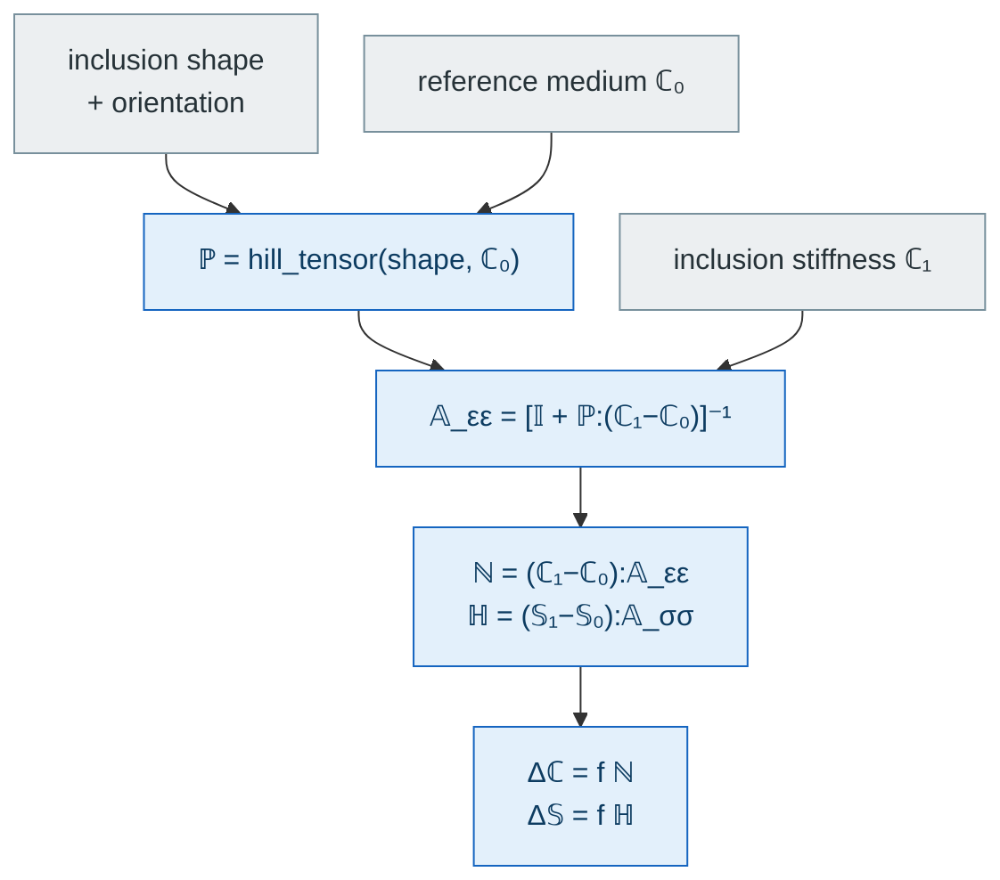

# [Localization and contribution tensors](@id th-localization)

MeanFieldHomogenization exposes the four **dilute localization tensors** of the
Eshelby problem, together with the size-independent **stiffness and
compliance contribution tensors** of Kachanov–Sevostianov.

Everything on this page is one chain, and each link is a separate entry point —
which is what makes it possible to plug a morphology in halfway through
([custom inclusions](@ref man-custom-inclusions)):



## Pivot formula

For an inclusion of shape tensor ``\boldsymbol A`` and stiffness
``\mathbb C_1`` embedded in an infinite matrix of stiffness ``\mathbb C_0``,
the strain–strain localization tensor is

```math
\mathbb A_{\varepsilon\varepsilon} = \bigl[\,\mathbb I +
\mathbb P(\boldsymbol A, \mathbb C_0) :
(\mathbb C_1 - \mathbb C_0)\,\bigr]^{-1},
```

where ``\mathbb P`` is the Hill polarization tensor
([`hill_tensor`](@ref)) and ``\mathbb I`` is the symmetric identity
4-tensor.  The three other localization tensors follow algebraically:

```math
\mathbb A_{\sigma\varepsilon} = \mathbb C_1 : \mathbb A_{\varepsilon\varepsilon},\qquad
\mathbb A_{\varepsilon\sigma} = \mathbb A_{\varepsilon\varepsilon} : \mathbb S_0,\qquad
\mathbb A_{\sigma\sigma} = \mathbb C_1 : \mathbb A_{\varepsilon\varepsilon} : \mathbb S_0,
```

with ``\mathbb S_0 = \mathbb C_0^{-1}``.  The four functions exposed by
MeanFieldHomogenization are:

| Function                                     | Return value                               |
| :------------------------------------------- | :----------------------------------------- |
| [`strain_strain_loc`](@ref)`(incl, C₁, C₀)`  | ``\mathbb A_{\varepsilon\varepsilon}``     |
| [`stress_strain_loc`](@ref)`(incl, C₁, C₀)`  | ``\mathbb A_{\sigma\varepsilon}``          |
| [`strain_stress_loc`](@ref)`(incl, C₁, C₀)`  | ``\mathbb A_{\varepsilon\sigma}``          |
| [`stress_stress_loc`](@ref)`(incl, C₁, C₀)`  | ``\mathbb A_{\sigma\sigma}``               |

## Contribution tensors

The **stiffness contribution tensor** ([kachanov2018](@cite)) is

```math
\mathbb N = (\mathbb C_1 - \mathbb C_0) : \mathbb A_{\varepsilon\varepsilon},
```

and its dilute-scheme volume average is

```math
\Delta\mathbb C_\mathrm{eff} = f \,\mathbb N,
```

for a dilute family of volume fraction ``f``.  The dual **compliance
contribution tensor** is

```math
\mathbb H = (\mathbb S_1 - \mathbb S_0) : \mathbb A_{\sigma\sigma},\qquad
\Delta\mathbb S_\mathrm{eff} = f\,\mathbb H.
```

Functions: [`stiffness_contribution`](@ref),
[`compliance_contribution`](@ref), with density helpers
[`delta_stiffness`](@ref) and [`delta_compliance`](@ref).

All of the above is *one-site*: the inclusion feels its neighbors only through
the reference medium. Resolving the pairwise interaction explicitly replaces
``\mathbb P`` by the [two-inclusion interaction tensor](@ref th-interaction)
``\mathbb T^{ab}``, of which ``\mathbb P`` is the self term — see the
[N-body schemes](@ref th-nbody).

## Cracks (Kachanov convention)

For flat cracks the crack-density convention (Budiansky–O'Connell) is used instead of a
volume fraction.  The same entry points apply, with the density
``\varepsilon`` replacing ``f``, and the compliance contribution built from the
crack-opening-displacement tensor ``\boldsymbol B`` and the crack normal
``\underline n`` ([Crack opening displacement](cod_tensors.md)):

```math
\mathbb H = \tfrac{3}{4}\,
  \underline n \stackrel{s}{\otimes} \boldsymbol B \stackrel{s}{\otimes} \underline n
\quad\text{(elliptic)},
\qquad
\mathbb H = \tfrac{2}{\pi}\,
  \underline n \stackrel{s}{\otimes} \boldsymbol B \stackrel{s}{\otimes} \underline n
\quad\text{(ribbon)},
\qquad
\mathbb N = -\,\mathbb C_0 : \mathbb H : \mathbb C_0 .
```

- `compliance_contribution(crack, C₀)` returns the size-independent
  ``\mathbb H``;
- `stiffness_contribution(crack, C₀)` returns ``\mathbb N`` (first order in the
  density, provided for API symmetry);
- `delta_compliance(crack, H, ε)` and `delta_stiffness(crack, N, ε)`
  apply the appropriate ``4\pi/3`` or ``\pi`` geometric prefactor.

## Conductivity (2nd-order transport)

Every routine above has a 2-tensor analog, triggered by dispatch on
`::AbstractTens{2,3}` matrices:

| Elasticity                           | Conductivity                           |
| :----------------------------------- | :------------------------------------- |
| `strain_strain_loc`                  | [`gradient_gradient_loc`](@ref)        |
| `stress_strain_loc`                  | [`flux_gradient_loc`](@ref)            |
| `strain_stress_loc`                  | [`gradient_flux_loc`](@ref)            |
| `stress_stress_loc`                  | [`flux_flux_loc`](@ref)                |
| `stiffness_contribution`             | [`conductivity_contribution`](@ref)    |
| `compliance_contribution` (ellipsoid)| [`resistivity_contribution`](@ref)     |
| `delta_stiffness`                    | [`delta_conductivity`](@ref)           |
| `delta_compliance` (ellipsoid)       | [`delta_resistivity`](@ref)            |

## Type-genericity

All four localization and both contribution tensors are generic in the element
type; the only requirement is that [`hill_tensor`](@ref) supports it.

## Extending to user-defined inclusions

A concrete subtype of `AbstractInclusion` inherits the four localization and
the contribution tensors as soon as it provides [`hill_tensor`](@ref). When
``\mathbb P`` has no convenient closed form (e.g. `LayeredSphere`), override
[`strain_strain_loc`](@ref) instead — the rest is derived algebraically.

See the developer guide [Adding a new inclusion](../developer/adding_inclusion.md)
for a step-by-step recipe.
