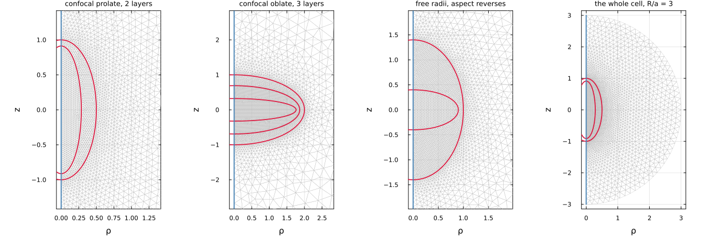
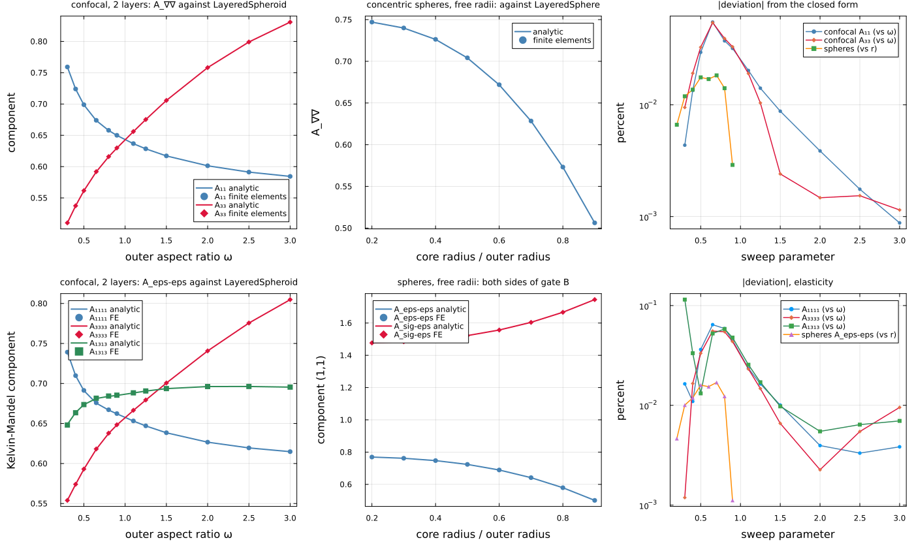
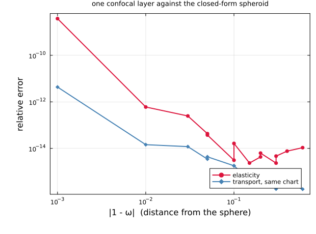

# [A layered spheroid, meshed](@id tut-axi-layered-spheroid)

`N` nested coaxial spheroids in an isotropic matrix, solved by Fourier
axisymmetric finite elements — and checked against the two closed forms this
package already carries. The method is
[the finite Eshelby cell](@ref th-corrected-cell); how to call it is
[Finite-element inclusions](@ref man-fe-inclusions).

!!! note "This page is static"
    The figures and the numbers are produced once by
    `scripts/fe/make_layered_spheroid_figures.jl` and committed. No finite
    element runs at documentation-build time: the documentation environment
    carries neither Ferrite nor gmsh, on purpose.

## Why mesh a body that has a closed form

Because most of them do not. The confocal multilayer spheroid has an analytic
solution — [`LayeredSpheroid`](@ref MeanFieldHomogenization.LayeredSpheroid),
in both physics — and a nest of spheroids with **freely chosen** semi-axes has
none. The finite-element cell covers both, which means the case with a closed
form is not a demonstration but a **calibration**: it is where the solver can be
told it is right, on a body whose answer is known.

So this page does the two in order. First the slices with an exact answer, to
fix how much to trust the cell. Then the geometry no closed form reaches.

## The geometry is the analytic type's, not a transcription of it

Layers are given by their **semi-axes**, per layer, ascending: the same
`(axis_radii, disk_radii)` pair
[`LayeredSpheroid`](@ref MeanFieldHomogenization.LayeredSpheroid) takes, in the
same order. One call produces them and both inclusions consume them:

```julia
using MeanFieldHomogenization, TensND
import Ferrite, FerriteGmsh, Gmsh                    # the backend

ar, dr = confocal_layer_radii(2.0, 1.0, (0.3, 0.7))  # ω = 2, core 30 % of the volume
K = (TensISO{3}(5.0), TensISO{3}(2.0))               # core, then shell

fe  = FEAxiLayeredSpheroid(ar, dr, K)
ana = LayeredSpheroid(ar, dr, K)                     # the same body, in closed form
```

That matters more than it looks. A cross-check is only worth something if the
two solvers are handed the *same* body; describing the geometry twice — once as
`(focal, q)` and once as semi-axes — is how a comparison ends up measuring a
transcription error and calling it a discretization error.

## The mesh



Being two-dimensional, this is the **whole** computational domain and not a
slice of one. Each layer boundary is drawn in crimson from its own closed form
rather than from the mesh, and the revolution axis in blue. The first three
panels are zoomed on the inclusion; the fourth is the same first case at full
extent, showing where the matrix ends and the corrected boundary condition acts.

The third panel is the one to look at: an **oblate core inside a prolate
shell**. It is nested, it is axisymmetric, and no confocal family contains it —
confocal spheroids share their foci, so the outer layer is always rounder than
the core. That panel is what the finite elements are for.

| geometry | layers | cells | worst layer volume error |
|---|---:|---:|---:|
| confocal prolate, 2 layers | 2 | 5985 | 4.8e-04 |
| confocal oblate, 3 layers | 3 | 7947 | 7.2e-04 |
| free radii, aspect reverses | 2 | 7550 | 9.4e-04 |

The volume column is the check that is available on **any** geometry, confocal
or not: each layer's meshed volume of revolution against the closed form
``4\pi a^2 c/3``. What is left is the linear triangle's chord against a curved
boundary, and it falls with refinement.

## Against the two closed forms

The space of nested spheroids is a two-parameter family per layer, and it is
crossed by **two** independent exact slices which meet only at the equal-radii
sphere:



The left panel sweeps the outer aspect ratio from ``\omega = 0.3`` to ``3``,
**oblate through the sphere to prolate**, against
[`LayeredSpheroid`](@ref MeanFieldHomogenization.LayeredSpheroid). Both branches
of that solution are exercised on one curve, and deliberately: the oblate branch
runs the whole computation in complex arithmetic — the substitution
``c \to -i\bar c``, ``q \to i\tau`` — and relies on an exact cancellation of the
imaginary part, which is the delicate half. A prolate-only comparison validates
the easy one. The two components cross at ``\omega = 1``, where the body is a
sphere and the response is isotropic; nothing in the cell enforces that.

The middle panel is **concentric spheres of arbitrary radii**, against
[`LayeredSphere`](@ref MeanFieldHomogenization.LayeredSphere). This slice is not
confocal at all, which is what makes it valuable: it covers an arbitrary layer
count and freely chosen radii without assuming the confocal relation anywhere.

The top row is conduction and the bottom row elasticity; the right-hand panels
collect the deviations. Everything is below ``1.1\times10^{-3}``, with medians
around ``10^{-4}``, over the whole sweep in both physics:

Two layers. Conduction: `k₁/k₀ = 5`, `k₂/k₀ = 2`. Elasticity: `E₁/E₀ = 4`, `ν₁ = 0.2`, `E₂/E₀ = 1.5`, `ν₂ = 0.3`, `ν₀ = 0.25`.

| slice | worst deviation | median deviation |
|---|---:|---:|
| confocal, `A₁₁`, ω ∈ [0.3, 3] | 5.5e-04 | 1.3e-04 |
| confocal, `A₃₃`, ω ∈ [0.3, 3] | 5.4e-04 | 1.0e-04 |
| spheres, free radii | 1.8e-04 | 1.4e-04 |
| confocal, `A₁₁₁₁`, ω ∈ [0.3, 3] | 6.4e-04 | 1.6e-04 |
| confocal, `A₃₃₃₃`, ω ∈ [0.3, 3] | 5.6e-04 | 1.5e-04 |
| confocal, `A₁₃₁₃`, ω ∈ [0.3, 3] | 1.1e-03 | 1.7e-04 |
| confocal, `𝔸_σε` — no reference | — | — |
| spheres, elasticity, `𝔸_εε` | 1.7e-04 | 1.2e-04 |
| spheres, elasticity, `𝔸_σε` | 9.5e-05 | 7.4e-05 |

Two panels are worth a second look. The conduction components **cross at**
``\omega = 1``, where the body is a sphere and the response is isotropic —
nothing in the cell enforces that, so the crossing is a free control. And the
bottom-middle panel carries **both sides of gate B**: the inclusion is
heterogeneous, so ``\mathbb A_{\sigma\varepsilon}`` is not
``\mathbb C_1 : \mathbb A_{\varepsilon\varepsilon}`` for any single
``\mathbb C_1`` — it is measured on the same solve, and it agrees with
`LayeredSphere` to ``9.5\times10^{-5}``.

### What this comparison found in the analytic solution

The elastic sweep above covers the sphere, and for a while it could not. A
one-layer confocal spheroid **is** a homogeneous spheroid, so the closed-form
Eshelby result is its answer and the confocal machinery has to reproduce it at
every aspect ratio. It did not: the error went from ``3\times10^{-15}`` at
``|1-\omega| \ge 0.3`` to a **total loss** at ``10^{-3}``, while conduction on
the identical chart stayed at ``10^{-15}``.



One confocal layer is a homogeneous spheroid, so the closed-form Eshelby result is the reference and the confocal machinery must reproduce it exactly. Transport does, everywhere. Elasticity does not, once the chart degenerates (`focal → 0`, `q → ∞`).

| `ω` | elasticity | transport, same chart |
|---|---:|---:|
| 0.999 | 3.8e-09 | 4.3e-12 |
| 0.990 | 6.0e-13 | 1.4e-14 |
| 0.970 | 2.5e-13 | 1.2e-14 |
| 0.950 | 4.3e-14 | 3.5e-15 |
| 0.900 | 3.1e-15 | 1.8e-15 |
| 0.850 | 2.3e-15 | 4.5e-16 |
| 0.800 | 4.3e-15 | 7.7e-16 |
| 0.700 | 2.3e-15 | 1.8e-16 |
| 0.600 | 7.6e-15 | 3.5e-16 |
| 1.050 | 3.7e-14 | 4.4e-15 |
| 1.100 | 1.6e-14 | 1.8e-15 |
| 1.200 | 6.3e-15 | 9.9e-16 |
| 1.300 | 4.7e-15 | 3.5e-16 |
| 1.600 | 1.1e-14 | 1.8e-16 |

### Against the closed forms

Two layers. Conduction: `k₁/k₀ = 5`, `k₂/k₀ = 2`. Elasticity: `E₁/E₀ = 4`, `ν₁ = 0.2`, `E₂/E₀ = 1.5`, `ν₂ = 0.3`, `ν₀ = 0.25`.

| slice | worst deviation | median deviation |
|---|---:|---:|
| confocal, `A₁₁`, ω ∈ [0.3, 3] | 5.5e-04 | 1.3e-04 |
| confocal, `A₃₃`, ω ∈ [0.3, 3] | 5.4e-04 | 1.0e-04 |
| spheres, free radii | 1.8e-04 | 1.4e-04 |
| confocal, `A₁₁₁₁`, ω ∈ [0.3, 3] | 6.4e-04 | 1.6e-04 |
| confocal, `A₃₃₃₃`, ω ∈ [0.3, 3] | 5.6e-04 | 1.5e-04 |
| confocal, `A₁₃₁₃`, ω ∈ [0.3, 3] | 1.1e-03 | 1.7e-04 |
| confocal, `𝔸_σε` — no reference | — | — |
| spheres, elasticity, `𝔸_εε` | 1.7e-04 | 1.2e-04 |
| spheres, elasticity, `𝔸_σε` | 9.5e-05 | 7.4e-05 |

The cause was not the geometry and not the layer coupling — one layer already
showed it, and both the prolate and the oblate family failed. The columns of the
elastic system are amplitudes of Papkovich–Neuber potentials at the interface,
so a growing mode of degree ``n`` scales like ``q^n`` and a decaying one like
``q^{-n-1}``. As the spheroid approaches a sphere the focal distance goes to
zero and ``q \to \infty``, so the column magnitudes span ``q^{2n+1}`` — about
``10^{25}`` at ``\omega = 0.999`` with degrees up to nine, and the solve has
nothing left to work with.

The degeneracy is in the basis's **normalization**, not in the problem: as
``q \to \infty`` the spheroidal harmonics tend to spherical ones, which are
perfectly independent. So the solve now scales each column to unit norm before
the factorization — a change of unknowns, exact in exact arithmetic, and the
scaling that minimizes the 2-norm condition number over all diagonal choices to
within ``\sqrt n``. Columns only: equilibrating rows would reweight an
overdetermined least squares and change *which* solution comes back.

| ``\|1-\omega\|`` | before | after |
|---:|---:|---:|
| ``3\times10^{-1}`` | `3e-15` | `2e-15` |
| ``10^{-1}`` | `1.6e-3` | `3e-15` |
| ``5\times10^{-2}`` | `5.4e-2` | `4e-14` |
| ``10^{-2}`` | `7.7e-1` | `6e-13` |
| ``10^{-3}`` | `1.0e+0` | `4e-9` |

A residual limit remains at ``|1-\omega| = 10^{-4}``, where the spread reaches
``q^{19} \approx 10^{35}`` and even the transport branch is only at
``8\times10^{-10}``. Past what a diagonal scaling can repair, and stated rather
than hidden.

Nothing caught this before: the failure changes no strain-side result away from
the sphere, it is invisible in transport, and no test covered the elastic
near-sphere limit. It surfaced because a finite-element cell was asked the same
question about the same body — which is the whole reason to have two independent
routes, and there is now a regression test on the one-layer oracle at every
aspect ratio.

## Replaying it with your own radii

This is the part the closed forms do not cover, and the whole reason for the
type. Two things to know, and one to be honest about.

**The two ways in.** `confocal_layer_radii` for the calibrated slice, and a bare
pair of semi-axis tuples for anything else:

```julia
# Confocal — the slice with an analytic answer.
ar, dr = confocal_layer_radii(0.5, 1.0, (0.4, 0.6))     # oblate, ω = 0.5
FEAxiLayeredSpheroid(ar, dr, K)

# Free radii — an oblate core in a prolate shell, three layers, whatever you like.
FEAxiLayeredSpheroid((0.4, 1.0, 1.4), (0.9, 0.95, 1.0), (k₁, k₂, k₃))
```

`axis_radii` are the semi-axes along the revolution axis and `disk_radii` those
across it, ascending, core first. Get the order wrong and nothing is silently
wrong: the nesting check refuses it.

```julia
julia> FEAxiLayeredSpheroid((0.5, 1.4), (1.1, 1.0), K)
ERROR: ArgumentError: layers 1 and 2 are not nested: layer 1 is
(disk 1.1, axis 0.5) and layer 2 is (disk 1.0, axis 1.4). Both semi-axes must
grow outwards — a wider core inside a narrower shell is not a nest, whatever
the other semi-axis does.
```

Two coaxial concentric ellipses are nested if and only if **both** semi-axes
grow outwards, so [`check_nested_spheroids`](@ref MeanFieldHomogenization.check_nested_spheroids)
is two comparisons per layer. It is worth doing rather than trusting: a
violation is not a wrong answer but a self-intersecting geometry, which gmsh
rejects from deep inside its own pipeline with a message naming neither the
layer nor the semi-axis.

The growth has to be **strict**. Two coinciding boundaries pass every
containment argument and carry no volume, but they cannot be meshed: the element
size is capped at a fraction of each layer's thickness, so a zero-thickness layer
asks for a zero-sized element. A sphere is still a perfectly good layer — that is
`a == c` *within* one layer, which is unrestricted.

**The mesh knobs, in order of importance.** `radius_ratio` before `nradial`:
what remains after the dipole correction is *truncation*, not discretization.

```julia
FEAxiLayeredSpheroid(ar, dr, K; opts = FEAxiMeshOptions(; nradial = 16, radius_ratio = 6.0))
```

`nradial` sets the element size from the outer transverse semi-axis, and the
mesher then **caps it per layer** against that layer's own thickness — a thin
shell is resolved whether you asked for it or not, because an element spanning a
whole layer leaves that layer unmeshed while the mesh still looks reasonable.
Probe the size before solving on a geometry you have not tried:

```julia
r = fe_axi_mesh_report(fe)
r.ncells, r.ncells_by_layer, r.volume_error
```

`volume_error` is the largest relative departure of a meshed layer's volume of
revolution from its closed form, so it is the one number that catches a layer
the mesh failed to resolve — and it is available whether or not the geometry has
an analytic solution.

**What still validates a case with no analytic counterpart**, listed so nobody
believes they are without a net:

* each layer's meshed volume against ``4\pi a^2 c/3``, closed form for any
  semi-axes — `layer_volumes` gives the exact side;
* transverse isotropy about the revolution axis, which holds structurally at any
  refinement and is therefore free;
* the coherence limits: equal moduli across the layers must return the
  homogeneous spheroid, whose Hill tensor is a closed form, and the package
  agrees to ``3\times10^{-5}`` on a geometry the confocal family does not
  contain;
* mesh convergence, and the ``R/a`` sweep, which is the only test that proves
  the sign of the dipole correction — a wrong sign leaves exactly *twice* the
  truncation bias instead of none, and reads as a mesh that will not converge.

**And what is not guaranteed.** Off the two exact slices there is no reference,
only convergence. In particular a nest whose layers have genuinely different
aspect ratios has no closed form in this package and, as far as we know,
nowhere else.

## It has to arrive in a scheme

Which is the point of all of it. The inclusion is heterogeneous, so it enters
through gate B with **both** localization tensors, and both come out of one
solve:

```julia
C₀ = iso_stiffness(0.6667, 0.4)                       # E = 1, ν = 0.25
Cs = (iso_stiffness(2.2, 1.67), iso_stiffness(1.1, 0.77))
fe = FEAxiLayeredSpheroid((0.6, 1.0), (0.36, 0.6), Cs)

rve = RVE()
add_phase!(rve, :m, Ellipsoid(1.0), Dict(:C => C₀); fraction = :rest)
add_phase!(rve, :incl, fe, Dict(:C => C₀); fraction = 0.15,
           symmetrize = IsoSymmetrize())
homogenize(rve, MoriTanaka(), :C)
```

Two things in that snippet are not decoration.

The phase property is a **placeholder and is ignored**: the constituents live in
the geometry object, so pass the matrix's own stiffness and nothing is lost.

`IsoSymmetrize()` is **not optional** on the iterative schemes. `SelfConsistent`,
`AsymmetricSelfConsistent` and `DifferentialScheme` re-evaluate the inclusion in
their own running estimate, which for an oriented spheroid is transversely
isotropic — and the dipole boundary condition is the closed-form *isotropic*
field, so the cell refuses an anisotropic reference. The failure is a refusal
far from the call site, not a wrong number. One-shot schemes are unaffected.

`Voigt` and `Reuss` work without any extra input, because the internal volume
fractions are a closed form of the semi-axes;
[`layer_fractions`](@ref MeanFieldHomogenization.layer_fractions) returns them.
And the bounds do bracket the estimates, which is checked in the suite rather
than assumed.

## What is not implemented

**Imperfect interfaces.** The axisymmetric formulation has no displacement- or
temperature-jump term at all — the only jump in the package is the
three-dimensional crack's — so a spring, membrane, Kapitza or surface-conductive
layer is refused **by name** at construction rather than accepted and ignored:

```julia
julia> FEAxiLayeredSpheroid(ar, dr, K; interfaces = (KapitzaInterface(0.1), PerfectInterface{Float64}()))
ERROR: ArgumentError: layer 1 carries a KapitzaInterface, and the axisymmetric
finite-element cell implements `PerfectInterface` only. …
```

That is the next piece of work, and it is a whole one: a new backend generic,
node duplication on the interface trace, and the local normal/tangent frame
along a curved meridian. Note that the analytic side is not complete either —
[`LayeredSpheroid`](@ref MeanFieldHomogenization.LayeredSpheroid) supports
Kapitza and surface-conductive interfaces in conduction, but
**`PerfectInterface` only** in elasticity — so an imperfect interface on a
spheroid in elasticity is a case with no reference at all, which is exactly where
the finite elements would stop calibrating and start providing.

!!! warning "And an equivalent thin layer is not an ellipse"
    The tempting shortcut is to replace the interface by a thin coating that the
    mesher can already handle. It does not work as stated, and the reason is
    geometric rather than numerical: an imperfect interface carries a **uniform**
    resistance per unit area, so its equivalent layer must have **constant
    thickness** — and the inner boundary of a constant-thickness coating on an
    ellipse is the *offset curve*, which is neither confocal, nor similar, nor an
    ellipse at all. See [barthelemyBignonnetIJES2020](@cite), whose subject is
    precisely the notion of an equivalent particle.

    Shrinking both semi-axes by the same amount does give an ellipse, but its
    normal distance to the original varies along the meridian, so the equivalent
    resistance is not uniform and the comparison measures nothing. Doing it
    properly needs the mesher to accept an arbitrary profile per layer, and a
    validity limit: an inward offset of distance `t` self-intersects once `t`
    exceeds the smallest radius of curvature, ``\min(c^2/a,\, a^2/c)``.

**Sensitivities.** The solve runs in `Float64` and memoizes on the reference
medium, so a derivative with respect to a layer radius would come back a silent
zero; the type raises instead. A trained surrogate is the route, as it is for
[the concave pores](@ref app-concave-pores).

## See also

* [The finite Eshelby cell](@ref th-corrected-cell) — the correction, and why
  the solid declination uses both outputs of its fixed point.
* [Finite-element inclusions](@ref man-fe-inclusions) — the shared syntax.
* [The confocal layered spheroid](@ref th-layered-spheroid) — the closed form
  this page is calibrated against.
* [Concave pores](@ref app-concave-pores) — the axisymmetric cavity, and the
  same cell with one region instead of `N`.
