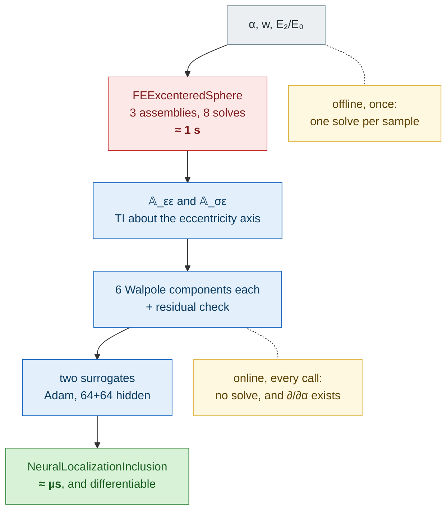

```@meta
EditURL = "../../../../scripts/85_neural_excentered_sphere.jl"
```

# Replacing a finite-element solve by a neural surrogate

The [ellipsoid pilot](neural_inclusion.md) proved the machinery against a
closed form. This is the case it exists for: the **sphere with an off-center
core** of [adessinaIJES2017](@cite), whose localization tensors have no
analytic expression and come out of an axisymmetric Fourier finite-element
solve ([`FEExcenteredSphere`](@ref)).

There, a surrogate is not a curiosity. One finite-element evaluation is three
assemblies and eight solves; an iterative scheme changes its reference medium
at every iteration, so the memoization does not help; and the solve refuses to
be differentiated at all — it runs in `Float64` and memoizes on the reference
medium, so a derivative with respect to the eccentricity would come back as a
silent zero.

## §1 What is learned, and why the features are ratios

The morphology is **heterogeneous**: it has no Hill tensor, so it enters
through gate B with *both* localization tensors,
``\mathbb A_{\varepsilon\varepsilon}`` and ``\mathbb A_{\sigma\varepsilon}``. Two surrogates,
one per tensor, sharing one finite-element solve per sample.



**Six components, not five.** A localization tensor is *not* major-symmetric,
so the transversely isotropic form it needs has six Walpole components
(`ℓ₃ ≠ ℓ₄`), against five for a Hill tensor. The classes `StrainLocTI` and
`StressLocTI` carry exactly that. Eight would be wrong too: `ℓ₇` and `ℓ₈` are
antisymmetric in an index pair and vanish identically for a tensor mapping
symmetric strains to symmetric stresses.

**The axis is not the shape's.** The morphology is a *sphere*: its outer shape
says nothing about the direction the response is transversely isotropic about.
The convention is the package's usual one — column 3 of the inclusion basis —
and a wrong choice does not pass silently, since the label extraction measures
the projection residual.

**The features are contrast ratios.** The homogeneity that gate A exploits,
``\mathbb P(\lambda\mathbb C_0) = \mathbb P(\mathbb C_0)/\lambda``, does *not*
transfer: a heterogeneous inclusion carries its constituents inside itself, so
scaling ``\mathbb C_0`` alone changes the contrast. What is exact is the
**simultaneous** scaling of the reference medium and of every constituent,

```math
\mathbb A_{\varepsilon\varepsilon}(\lambda\mathbb C_0, \lambda\mathbb C_1, \lambda\mathbb C_2)
  = \mathbb A_{\varepsilon\varepsilon}, \qquad
\mathbb A_{\sigma\varepsilon}(\lambda\,\cdot) = \lambda\,\mathbb A_{\sigma\varepsilon},
```

verified to ``3\cdot10^{-15}`` and ``9\cdot10^{-14}``. Ratios are therefore the
complete and minimal material parametrization, and
``\mathbb A_{\sigma\varepsilon}/(2\mu_0)`` is the dimensionless quantity the second
network predicts.

## §2 The training run

Three features over the box below, all Poisson ratios fixed at 0.2 and a stiff
old aggregate at ``E_1/E_0 = 3.5``, as in the paper:

| Feature | Meaning | Range |
|---|---|---|
| `:eccentricity` | ``\alpha = d/(a-a_c)``, 1 being tangency | ``[0,\ 0.8]`` |
| `:core_fraction` | ``w``, old aggregate over whole inclusion | ``[0.2,\ 0.7]`` |
| `:log_mu_ratio_2` | ``\log(E_2/E_0)``, quality of the adhered mortar | ``[\log 0.1,\ \log 2]`` |

**Not run here** — it costs 1500 finite-element solves, about half an hour.
`scripts/nn/train_excentered.jl` is that run; this page loads its output.

```julia
import Ferrite, FerriteGmsh, Gmsh          # the teacher
import Lux, Optimisers, Zygote             # the optimizer

geometry(x) = FEExcenteredSphere(
    1.0, (C1, ce(exp(x[3]) * E0, 0.2));
    core_fraction = x[2], eccentricity = x[1], nradial = 18, radius_ratio = 4.0
)

## One solve returns *both* tensors, so the two label matrices are filled in a
## single pass rather than by calling `generate_dataset` twice.
A, B = fe_axi_localization(geometry(x), C0)
```


````@example neural_excentered_sphere
using MeanFieldHomogenization
using TensND
using LinearAlgebra
using Printf
using Plots

gr()
default(; left_margin = 5Plots.mm, bottom_margin = 5Plots.mm)

const NI = MeanFieldHomogenization.NeuralInclusions
````

## §3 Using it

The same three lines as any other inclusion. The morphology parameters are
passed as `shape_params` — they are the surrogate's features *and* the fields
the sensitivity API differentiates — and the constituents as `properties`,
which back both the contrast features and the `Voigt`/`Reuss` bounds.

````@example neural_excentered_sphere
ce(E, ν) = iso_stiffness(E / (3 * (1 - 2ν)), E / (2 * (1 + ν)))

const NU = 0.2
const E0 = 20.0                       # fresh cement paste, GPa
const C0 = ce(E0, NU)
const C1 = ce(3.5 * E0, NU)           # old natural aggregate

strain_s = load_surrogate(model_path("excentered_sphere_strain"))
stress_s = load_surrogate(model_path("excentered_sphere_stress"))

@printf(
    "surrogate of 𝔸_εε : %s, worst held-out error %.2e\n",
    join(NI.layer_widths(strain_s.net), "→"), worst_error(strain_s.provenance)
)
@printf(
    "surrogate of 𝔸_σε : %s, worst held-out error %.2e\n",
    join(NI.layer_widths(stress_s.net), "→"), worst_error(stress_s.provenance)
)

function nn_rca(α, w, e2)
    C2 = ce(e2 * E0, NU)
    return NeuralLocalizationInclusion(
        (1.0, 1.0, 1.0);
        strain = strain_s, stress = stress_s,
        shape_params = (; eccentricity = α, core_fraction = w),
        fractions = (w, 1 - w), properties = (C1, C2),
        guard = :error,
    )
end

println()
check_inclusion_interface(nn_rca(0.4, 0.5, 0.4))
````

## §4 Against the finite elements


Committed, like everything measured against the teacher: a documentation build
must not mesh anything. `scripts/nn/make_excentered_figures.jl` produces both
the figure and the table below.

````@example neural_excentered_sphere
for f in ("excentered_report.md", "excentered_comparison.md")
    path = joinpath(NI.MODEL_DIR, f)
    isfile(path) && print(read(path, String), "\n")
end
````

## §5 In a scheme

Gate B with both tensors means the contributions take the exact heterogeneous branch,
``\mathbb N = \mathbb A_{\sigma\varepsilon} - \mathbb C_0:\mathbb A_{\varepsilon\varepsilon}``,
and every scheme that consumes them works.

````@example neural_excentered_sphere
function rve_of(incl, f)
    r = RVE(:paste)
    add_matrix!(r, Ellipsoid(1.0), Dict(:C => C0))
    add_phase!(r, :rca, incl, Dict(:C => C0); fraction = f)
    return r
end

iso(C) = MeanFieldHomogenization.Core.isotropify(C)

println("\n  Recycled-aggregate mortar, f = 0.4, w = 0.5, E₁/E₀ = 3.5, ν = 0.2")
println("  Mori-Tanaka, effective Young modulus E_eff/E₀\n")
@printf "  %8s %10s %10s %10s\n" "E₂/E₀" "α = 0" "α = 0.4" "α = 0.8"
for e2 in (0.1, 0.25, 0.5, 1.0, 2.0)
    vals = map((0.0, 0.4, 0.8)) do α
        C = homogenize(rve_of(nn_rca(α, 0.5, e2), 0.4), MoriTanaka(), :C)
        k, μ = k_mu(iso(C))
        9k * μ / (3k + μ) / E0
    end
    @printf "  %8.2f %10.4f %10.4f %10.4f\n" e2 vals...
end
````

The eccentricity stiffens the composite while the shell is the weak phase — the
eccentric pattern short-circuits part of the soft mortar — and the effect
changes sign once the shell is stiffer than the paste. That is the physical
content of the finite-element study, reproduced here at microsecond cost.

## §6 The gain

Two numbers, measured on this machine. The finite-element figure is the *cold*
one, since an iterative scheme changes its reference medium at every iteration
and never hits the cache.

````@example neural_excentered_sphere
const N_EVAL = 2000
incl = nn_rca(0.4, 0.5, 0.4)
strain_strain_loc(incl, C0, C0)                  # warm up the compilation
t_nn = @elapsed for _ in 1:N_EVAL
    strain_strain_loc(incl, C0, C0)
end

@printf(
    "\n  %d surrogate evaluations : %.3f s  (%.1f µs each)\n",
    N_EVAL, t_nn, 1.0e6t_nn / N_EVAL
)
println("  the finite-element figure it replaces is in the table of §4.")
````

## §7 What the finite elements cannot do

The surrogate is smooth in its inputs, so `ForwardDiff` reaches the
**eccentricity** — a morphology parameter — straight through the scheme.
`MeanFieldHomogenization.FiniteElements` refuses the same request outright, and rightly:
its solve would silently return zero.

````@example neural_excentered_sphere
idx = C -> get_array(C)[1, 1, 1, 1]

println("\n  ∂C₁₁₁₁/∂α through a Mori-Tanaka estimate, f = 0.4, w = 0.5, E₂/E₀ = 0.4")
println("  ", "-"^58)
@printf "  %8s %16s %16s\n" "α" "AD" "finite differences"
for α in (0.1, 0.3, 0.5, 0.7)
    d = derivative(
        rve_of(nn_rca(α, 0.5, 0.4), 0.4), MoriTanaka(),
        geometry(:rca, :shape_params, 1); indexer = idx
    )
    h = 1.0e-5
    fd = (
        idx(homogenize(rve_of(nn_rca(α + h, 0.5, 0.4), 0.4), MoriTanaka())) -
            idx(homogenize(rve_of(nn_rca(α - h, 0.5, 0.4), 0.4), MoriTanaka()))
    ) / (2h)
    @printf "  %8.2f %16.6f %16.6f\n" α d fd
end
````

The two columns agree, and neither is zero: the sensitivity of the effective
stiffness to how far off center the old aggregate sits is now a quantity one
can compute — and optimize against.

---

*This page was generated using [Literate.jl](https://github.com/fredrikekre/Literate.jl).*

